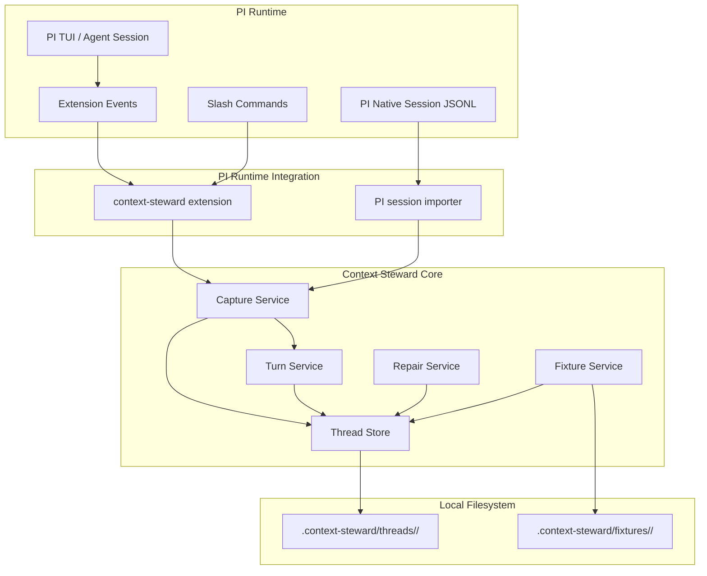
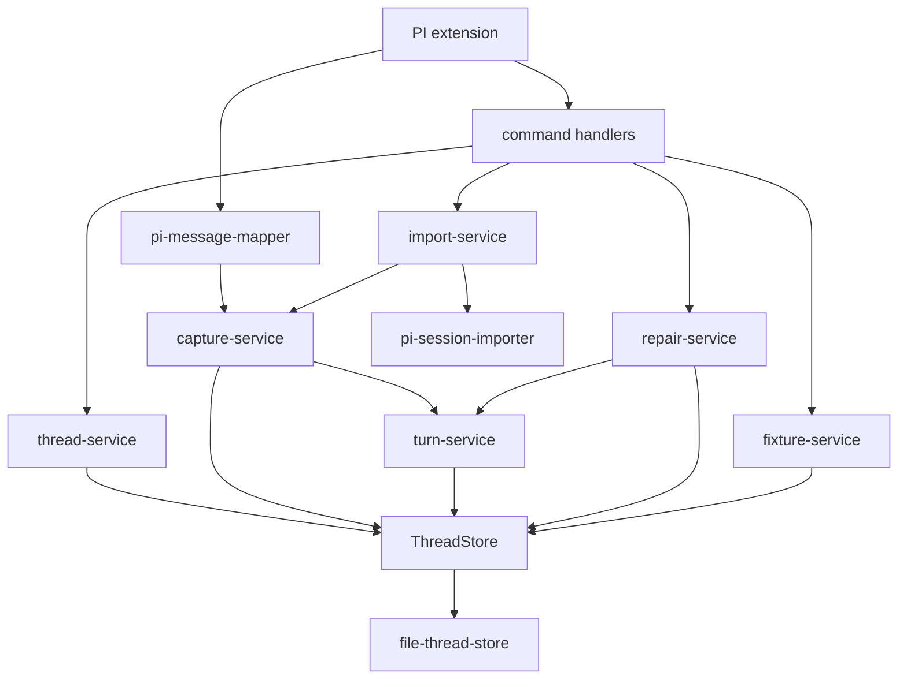
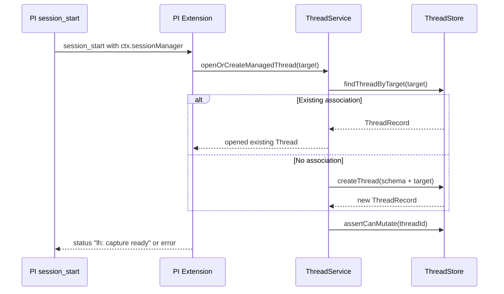
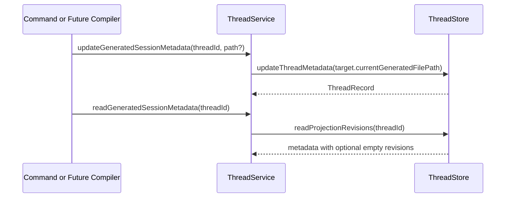
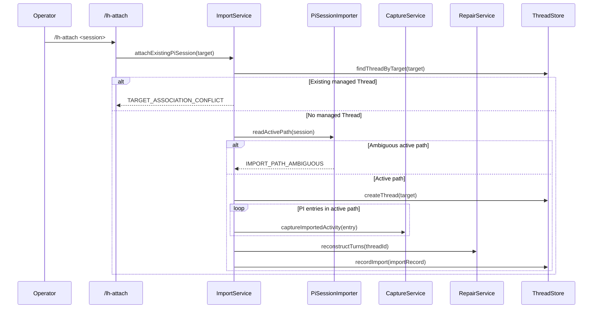
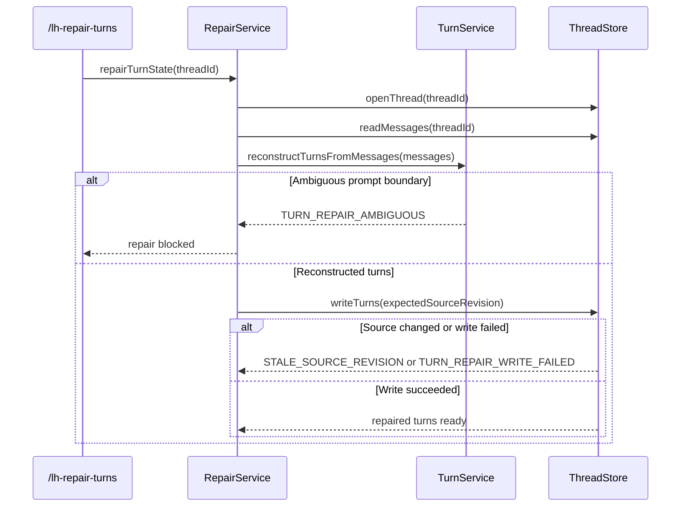
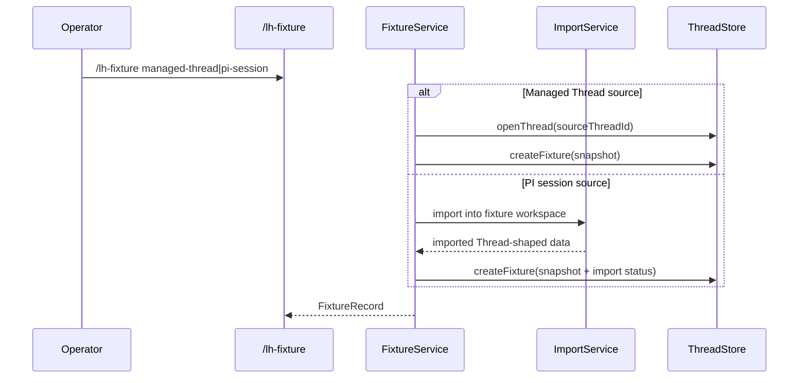

# Technical Design: Session Context Store

## Purpose

This document translates Epic 1, Session Context Store, into implementable architecture for PI Long Horizon. It is the implementation source of truth for the canonical Thread store, live PI capture adapter, attach/import flow, turn repair behavior, generated-session metadata, and real-session fixture creation.

The design serves three consumers:

| Audience | Value |
|---|---|
| Reviewers | Validate that Feature 1 fits the PRD and technical architecture before code exists. |
| Developers | Build from concrete modules, interfaces, schemas, and flow contracts. |
| Story technical sections | Pull exact targets, test mappings, and verification gates into published stories. |

Output uses the two-document configuration:

- `tech-design.md`: decisions, context, system view, module architecture, interfaces, flow design, verification gates, and work breakdown.
- `test-plan.md`: complete TC-to-test mapping, mock strategy, fixture strategy, and test-count reconciliation.

The full TC matrix lives in `test-plan.md` so this index remains navigable while still preserving the complete confidence chain.

## Spec Validation

The epic is implementation-ready. Every AC maps to implementation work, every AC has testable TCs, and the data contracts are specific enough to produce TypeScript interfaces and store schemas. The design does not need to return to BA before drafting.

The main work is not resolving ambiguity in the functional spec. It is making design-time choices that the epic intentionally deferred: exact file schemas, PI event mapping, duplicate detection, turn-state write semantics, command surfaces, and fixture format.

| Issue | Spec Location | Resolution | Status |
|---|---|---|---|
| Turn records are mutable state over immutable messages, but the architecture names `turns.jsonl`. | Architecture Thread Store Layout; Epic AC-3, AC-6 | Store source messages as append-only JSONL. Store turns as current canonical state in `turns.json` written atomically with optimistic source-revision checks. This preserves message immutability and makes repair authoritative without requiring a turn-event resolver. | Resolved - clarified |
| Exact PI event identifiers for duplicate finalized activity depend on PI event payloads available during dogfooding. | Tech Design Question 7; TC-2.1f | Use a deterministic `targetEventKey` composed from PI session id, session entry id when available, PI message role/kind, timestamp, and content fingerprint. Prefer PI `SessionEntry.id` or stable target message ids during import. Dogfooding must confirm which field is stable in live `message_end` events. | Resolved - implementation confirmation needed |
| ProjectionRevision appears in Feature 1 data contracts, but full projection behavior is Feature 3. | AC-4.1, AC-4.2; ProjectionRevision Metadata | Feature 1 creates minimal projection metadata read/write support only: current generated file path and optional revision summaries. It does not compile, archive, reload, or validate generated PI session content. | Resolved - clarified |
| PI fork handling is out of scope, but PI exposes session tree and fork events. | Epic Out of Scope; Architecture Fork And Attach Posture | Feature 1 records attach/import and prevents duplicate target associations. Fork-created child Threads remain deferred; session fork events may be observed only to avoid corrupting the active Thread. | Resolved - clarified |

## Context

PI Long Horizon starts with a simple but unforgiving requirement: before the system can smooth, chunk, summarize, or project long-running work, it needs a complete source record. Feature 1 is that record. It gives the Context Steward a canonical Thread that is independent of PI's native session JSONL while still being fed by PI runtime events. Later features can only be as good as this substrate. If message order, actor identity, typed parts, or turn membership are unreliable here, every downstream memory layer inherits the mistake.

The existing repo is intentionally small. It has a TypeScript ESM setup, `tsx` helper scripts, PI packages at `0.74.0`, and one extension under `.pi/extensions/thinking-level.ts`. There is no existing Context Steward store or command surface. That means this design establishes most of the application structure from scratch, but it should still follow the repo's current shape: strict TypeScript, PI extension entrypoints, local filesystem storage, and no extra runtime service.

The technical architecture settles the larger world. Context Steward Core owns canonical Thread state. PI Runtime Integration adapts PI extension events and commands into that core. Context Navigator, Background Maintenance, and Projection Compiler arrive later, but they depend on Feature 1's records being stable, target-neutral, ordered, schema-versioned, and repairable. This design keeps the feature inside those inherited surfaces rather than creating a parallel product architecture.

The most important design choice is the split between immutable source records and repairable derived state. Messages are append-only source records. Turns are prompt-bounded groupings over those records, so they can be reconstructed when missing or stale. The store therefore uses append-only `messages.jsonl` for source records and atomically rewritten state files for records whose current value matters: `thread.json`, `actors.json`, `turns.json`, `imports.json`, and `projections.json`. This differs slightly from the architecture's illustrative `turns.jsonl` filename, but it fits the domain better and preserves the architecture's real invariant: explicit ordering and active-record semantics.

No new npm dependencies are required. Tests can use Node's built-in test runner through the already-installed `tsx` loader, and production storage can use Node's `fs/promises`, `path`, and `crypto.randomUUID()`. Avoiding new packages keeps Feature 1 focused on domain shape and PI integration rather than dependency churn.

## Tech Design Questions

The epic asks thirteen questions for this phase. The answers below are binding for Feature 1 unless implementation discovers a PI field mismatch; any mismatch should be recorded as a design deviation before changing behavior.

| # | Answer |
|---|---|
| 1 | Exact schemas are defined in "Record Schemas". The store uses `.context-steward/index.json`, plus per-thread `thread.json`, `actors.json`, `messages.jsonl`, `turns.json`, `imports.json`, `projections.json`, and fixture metadata files. |
| 2 | Live capture uses PI `message_end` as the source of finalized user, assistant, and toolResult messages. `turn_start` and `turn_end` are captured only as runtime notes when they affect lifecycle/readiness; they do not define canonical turn boundaries. `session_start`, `session_before_switch`, `session_shutdown`, and command context session fields provide target association metadata. |
| 3 | An agent-addressed prompt is a PI user message from `message_end` or imported `SessionMessageEntry.message.role === "user"` that is not a runtime-only/custom message and is intended for the agent context. For live input, `before_agent_start`/`input` may provide helpful metadata, but the stored source message comes from finalized `message_end`. |
| 4 | Reasoning is represented as `Part.partType = "reasoning"`. Text reasoning is stored in `content.text`. Redacted or signature-only reasoning stores `content.redacted = true`, `content.thinkingSignature`, and target metadata, without inventing hidden text. |
| 5 | Runtime notes captured in Feature 1 are session lifecycle, capture failures, import/repair status, turn-health blockers, generated-path changes, and PI session replacement/fork warnings. Tool execution streaming updates are not runtime notes unless they affect capture or repair state. |
| 6 | Target metadata stores PI session id, session file path, cwd, current generated PI file path, source PI entry ids, tool call ids, model/provider ids, response ids, and original PI role/content type. This is enough for Feature 3 to compile PI-compatible output without treating generated files as canonical source. |
| 7 | Duplicate detection uses `targetEventKey`. Prefer PI session entry id for imports and any stable message/session identifier exposed during live capture. When absent, derive a fingerprint from target session id, PI role, timestamp, message shape, and content hash. |
| 8 | The store uses a per-thread write queue in-process plus optimistic `sourceRevision` and `messageHighWatermark` checks on disk. Import and repair capture an expected revision before writing and fail with explicit statuses if source state changed. |
| 9 | Unmapped PI records are never silently dropped. Import records an issue with source entry id/range, stores mappable content where safe, marks import `partial`, and marks affected turn state `repair_needed`; if the active path itself is ambiguous, import rejects before appending. |
| 10 | Extension commands are `/lh-attach`, `/lh-turn-health`, `/lh-repair-turns`, `/lh-fixture`, and `/lh-status`. They report concise human text in PI and return structured command result objects from the core service for tests. |
| 11 | Active linear PI path comes from `SessionManager.getBranch()` using the current leaf. If a raw PI session is read without a resolvable leaf/path, import reports `IMPORT_PATH_AMBIGUOUS` and appends nothing. |
| 12 | Fixtures are normal Thread-shaped directories under `.context-steward/fixtures/<fixture-id>/` with the same record files plus `fixture.json`. Later Navigator and projection tests can open them through the same `ThreadStore` read interface. |
| 13 | Schema policy is strict. Supported version is `context-steward.thread.v1`. `thread.json` records `schemaVersion`, `createdSchemaVersion`, and `lastMigratedSchemaVersion`. Readers may read older known versions if a migration exists; mutations reject unknown or future versions with `UNSUPPORTED_SCHEMA_VERSION`. Feature 1 does not implement automatic migrations beyond v1 initialization. |

## System View

Feature 1 touches two inherited top-tier surfaces directly and prepares data for three others. Context Steward Core owns the records and store rules. PI Runtime Integration owns event and command adaptation. Context Navigator, Background Maintenance, and Projection Compiler are consumers that do not receive full behavior yet, but their future needs shape the health and metadata contracts.



### Top-Tier Surfaces

| Surface | Source | This Epic's Role |
|---|---|---|
| Context Steward Core | Inherited from technical architecture | Primary implementation surface. Owns Thread, Actor, Message, Part, Turn, ImportRecord, ProjectionRevision metadata, health checks, repair, and fixtures. |
| PI Runtime Integration | Inherited from technical architecture | Adapts PI extension lifecycle, `message_end`, session metadata, and slash commands into Context Steward Core operations. |
| Context Navigator | Inherited downstream consumer | Not implemented beyond core read/status return types. Feature 2 will build readable traversal from these records. |
| Background Maintenance | Inherited downstream consumer | Not implemented. Feature 1 exposes turn readiness so smoothing/chunking can block on missing or incomplete turns later. |
| Projection Compiler | Inherited downstream consumer | Not implemented. Feature 1 records current generated file path and optional projection metadata only. |

### External Contracts

The external contracts are local boundaries rather than network APIs. Tests should exercise Context Steward Core through public service methods and command handlers while controlling PI payloads and filesystem state.

| Boundary | Direction | Contract | Feature 1 Handling |
|---|---|---|---|
| PI extension events | PI to steward | `message_end`, lifecycle, session, and command context payloads from `@earendil-works/pi-coding-agent` | Map finalized messages into canonical records; capture lifecycle/status notes only when relevant. |
| PI native session JSONL | PI file to steward | `SessionManager` entries and active branch path | Import active path into canonical Thread; reject ambiguous paths. |
| Local filesystem | Steward to disk | `.context-steward` directory with atomic metadata writes and append-only message writes | Persist records with schema version and source revisions. |
| Operator commands | Human to steward | Slash commands in PI extension | Expose attach/import, health, repair, fixture creation, and status. |
| Later maintenance consumers | Core to future features | Turn health and source ranges | Report `ready`, `repair_needed`, `repair_failed`, or `unknown` before smoothing/chunking/smart compact. |

### Error Contract

Errors are returned as structured `StewardResult<T>` objects from core services and rendered by commands as concise PI notifications. Tests assert on codes and record effects, not on human prose.

```typescript
export interface StewardIssue {
  code: StewardErrorCode;
  message: string;
  threadId?: string;
  targetRuntime?: "pi";
  targetSessionId?: string;
  sourceRange?: SourceRange;
  cause?: string;
}

export type StewardResult<T> =
  | { ok: true; value: T; issues?: StewardIssue[] }
  | { ok: false; issues: StewardIssue[] };
```

Codes come from the epic: `UNSUPPORTED_SCHEMA_VERSION`, `TARGET_ASSOCIATION_CONFLICT`, `STORE_UNAVAILABLE`, `CAPTURE_APPEND_FAILED`, `CAPTURE_DUPLICATE_EVENT`, `UNMAPPED_PART_TYPE`, `IMPORT_SOURCE_UNREADABLE`, `IMPORT_PATH_AMBIGUOUS`, `IMPORT_PARTIAL`, `TURN_STATE_MISSING`, `TURN_STATE_INCOMPLETE`, `TURN_REPAIR_AMBIGUOUS`, `TURN_REPAIR_WRITE_FAILED`, and `FIXTURE_CREATE_FAILED`. The design also uses `STALE_SOURCE_REVISION` as a Feature 1 technical code for TC-6.5c; command rendering may describe it as stale repair input.

```typescript
export const STEWARD_ERROR_CODES = [
  "UNSUPPORTED_SCHEMA_VERSION",
  "TARGET_ASSOCIATION_CONFLICT",
  "STORE_UNAVAILABLE",
  "CAPTURE_APPEND_FAILED",
  "CAPTURE_DUPLICATE_EVENT",
  "UNMAPPED_PART_TYPE",
  "IMPORT_SOURCE_UNREADABLE",
  "IMPORT_PATH_AMBIGUOUS",
  "IMPORT_PARTIAL",
  "TURN_STATE_MISSING",
  "TURN_STATE_INCOMPLETE",
  "TURN_REPAIR_AMBIGUOUS",
  "TURN_REPAIR_WRITE_FAILED",
  "FIXTURE_CREATE_FAILED",
  "STALE_SOURCE_REVISION",
] as const;

export type StewardErrorCode = (typeof STEWARD_ERROR_CODES)[number];
```

### Runtime Prerequisites

| Prerequisite | Where Needed | How to Verify |
|---|---|---|
| Node.js 24 LTS | Local + CI | `node --version` |
| npm lockfile install | Local + CI | `npm ci` |
| TypeScript strict NodeNext | Local + CI | `npm run typecheck` |
| PI packages 0.74.0 | Local | `npm ls @earendil-works/pi-coding-agent` |
| ChatGPT OAuth for dogfooding | Local PI run | `npm run login` |
| Writable project directory | Store tests + dogfood | Create and remove `.context-steward/.write-test` |

## Architecture Decisions

The table below names the few design choices that shape almost everything else in the feature. Feature 1 looks storage-heavy on paper, but the real architectural questions are about authority: which records are immutable, where uniqueness is enforced, and what happens when source capture succeeds but derived state falls behind. Those are the choices future features will inherit.

| Decision | Choice | Rationale | ACs |
|---|---|---|---|
| Store root | `.context-steward/` under project cwd by default | Keeps dogfood data inspectable and project-scoped. Can become configurable later. | AC-1.1 |
| Message storage | Append-only `messages.jsonl` | Messages are source truth and must not mutate during turn updates or repair. | AC-2.3, AC-6.3 |
| Turn storage | Current-state `turns.json` with atomic rewrite | Turn state is repairable derived grouping. Snapshot reads are simpler and safer than replaying turn events. | AC-3, AC-6 |
| Root association index | Global `.context-steward/index.json` maps target session keys to active thread ids | "One active canonical Thread per PI session" must be enforced across all threads, not inferred from one thread at a time. | AC-1.1b, AC-5.1c, AC-5.6c |
| Source revision | Increment `thread.sourceRevision` on every source-message append/import | Enables rapid-event ordering, stale repair detection, and import/capture conflict checks. | AC-2.1e, AC-5.6c, AC-6.5c |
| Duplicate detection | `targetEventKey` index in thread metadata | Prevents repeated finalized PI events from creating duplicate source records. | AC-2.1f |
| Import/projection ownership | `imports.json` and `projections.json` are source-of-truth collections; `thread.json` keeps only lightweight summaries | Avoids duplicating canonical collections between files while still making thread status fast to read. | AC-4, AC-5 |
| Partial capture degradation | If message append succeeds and turn write fails, source capture remains committed, thread turn state is degraded to `repair_needed`, and capture returns success-with-issues | Feature 1 must prefer preserving source truth over pretending derived state is healthy. | AC-2.3, AC-3, AC-6.4 |
| PI mapping | Map PI LLM message roles to canonical message kinds and typed parts | Keeps canonical records target-neutral while preserving target metadata. | AC-2.1, AC-2.2 |
| Commands | PI extension commands delegate to core services | Command tests can exercise public entry points; core remains usable by future CLI/UI. | AC-5, AC-6, AC-7 |
| Dependencies | No new npm packages | Existing Node, TypeScript, and `tsx` are enough for implementation and tests. | NFR portability |

## Module Boundaries

The repo has no existing Context Steward modules, so these paths are new except for the extension directory pattern. The structure nests under the architecture surfaces and keeps PI-specific logic out of canonical domain modules.

```text
src/
  context-steward/
    domain/
      records.ts                 # NEW: canonical Thread/Actor/Message/Part/Turn schemas
      errors.ts                  # NEW: StewardIssue, codes, result helpers
      ids.ts                     # NEW: ids, fingerprints, source range helpers
    store/
      thread-store.ts            # NEW: ThreadStore interface
      file-thread-store.ts       # NEW: filesystem implementation and atomic writes
      schema-version.ts          # NEW: supported-version gate
    services/
      thread-service.ts          # NEW: create/open, target metadata, actor declarations
      capture-service.ts         # NEW: append finalized activity and update turns
      turn-service.ts            # NEW: prompt-boundary grouping and health checks
      import-service.ts          # NEW: PI session import orchestration
      repair-service.ts          # NEW: rebuild turns from messages
      fixture-service.ts         # NEW: create Thread-shaped fixtures
    pi/
      pi-message-mapper.ts       # NEW: PI AgentMessage to canonical Message parts
      pi-session-importer.ts     # NEW: SessionManager active-path reader
      pi-extension.ts            # NEW: registers handlers and commands
    commands/
      command-results.ts         # NEW: operator-facing command result formatting
    test/
      fixtures.ts                # NEW: canonical and PI fixture builders
      temp-store.ts              # NEW: temp filesystem test helper
.pi/extensions/
  context-steward.ts             # NEW: thin extension re-export/entrypoint
tests/
  context-steward/
    *.test.ts                    # NEW: service and command tests
```

### Module Responsibility Matrix

The responsibility matrix is the quickest way to answer "where does AC-X live?" but it only works if the module seams feel inevitable. The split here follows the architecture's inherited surfaces: PI-specific concerns stop at `src/context-steward/pi/`, persistence rules live in `store/`, and anything that could later be reused by Navigator or Background Maintenance stays in `services/` and `domain/`.

| Module | Status | Responsibility | Dependencies | ACs Covered |
|---|---|---|---|---|
| `domain/records.ts` | New | TypeScript record vocabulary and validation shapes for Thread, Actor, Message, Part, Turn, ImportRecord, ProjectionRevision, FixtureRecord | none | AC-1.1 to AC-7.4 |
| `domain/errors.ts` | New | Shared error codes, result objects, issue helpers | none | AC-1.1c, AC-2.4, AC-5 errors, AC-6.5, AC-7.1c |
| `store/thread-store.ts` | New | Persistence interface with explicit ordering, source revision, schema gate, and optimistic writes | records, errors | AC-1.1 to AC-6.5 |
| `store/file-thread-store.ts` | New | Local filesystem implementation, JSONL append, atomic JSON writes, duplicate index persistence | Node fs/path | AC-1.1 to AC-7.4 |
| `services/thread-service.ts` | New | Create/open Thread, target association, actor declaration, target metadata | ThreadStore | AC-1.1 to AC-1.4, AC-4 |
| `services/capture-service.ts` | New | Capture finalized canonical activity, assign source order, detect duplicate target events, update active turn | ThreadService, TurnService, ThreadStore | AC-2, AC-3 |
| `services/turn-service.ts` | New | Agent-addressed prompt detection, open/close turn lifecycle, pre-turn range reporting, health checks | ThreadStore | AC-3, AC-6.1, AC-6.4 |
| `services/import-service.ts` | New | Attach/import existing PI sessions into new Threads and continue live capture association | PI importer, CaptureService, RepairService | AC-5 |
| `services/repair-service.ts` | New | Reconstruct turn state from messages using prompt boundaries and source revision guards | TurnService, ThreadStore | AC-6 |
| `services/fixture-service.ts` | New | Create Thread-shaped fixtures from managed Threads or PI session imports | ThreadStore, ImportService | AC-7 |
| `pi/pi-message-mapper.ts` | New | Map PI `AgentMessage`/`Message` shapes to canonical Message and Part records | PI types | AC-2.1, AC-2.2, AC-5.3 |
| `pi/pi-session-importer.ts` | New | Read PI native sessions through `SessionManager`, resolve active branch path, expose importable entries | PI SessionManager | AC-5.1, AC-5.2 |
| `pi/pi-extension.ts` | New | Register PI `message_end` handler and operator commands | PI ExtensionAPI, services | AC-2, AC-5, AC-6, AC-7 |
| `.pi/extensions/context-steward.ts` | New | Project extension entrypoint that delegates to `src/context-steward/pi/pi-extension.ts` | pi-extension | AC-2, AC-5, AC-6, AC-7 |

### Component Interaction

At runtime the feature is deliberately narrow: the PI extension adapts events and commands, the services own domain behavior, and the store owns durability. That separation matters for testing too. We want command and capture tests to exercise the real service graph, while keeping the only fake boundaries at PI payload/session input and optional UI notifications.



The critical mock boundary is outside Context Steward Core. Tests should mock or fake PI payload/session input and use temp filesystem stores. They should not mock `turn-service` when testing `capture-service`, and should not mock `capture-service` when testing command flows. Internal wiring is part of the behavior.

## Record Schemas

The three records that carry the most architectural weight are `ThreadRecord`, `TurnRecord`, and `ImportRecord`. `ThreadRecord` is the mutable control plane for one managed line of work. `TurnRecord` is the repairable derived grouping that downstream maintenance will rely on. `ImportRecord` explains where a Thread's pre-capture history came from and whether that import was complete or lossy. The surrounding records are simpler, but these three are why the store cannot just be "append JSONL and hope."

The TypeScript interfaces below are the copy-ready starting point for `src/context-steward/domain/records.ts`. Validation can begin as lightweight type guards and evolve later; the important v1 requirement is that all record shapes are explicit and schema-versioned.

```typescript
export const THREAD_SCHEMA_VERSION = "context-steward.thread.v1" as const;

export type TargetRuntime = "pi";
export type ActorType = "human" | "agent" | "system" | "tool" | "runtime" | "steward";
export type MessageKind = "prompt" | "response" | "tool_result" | "runtime_event" | "unknown";
export type PartType =
  | "text"
  | "reasoning"
  | "tool_call"
  | "tool_result"
  | "runtime_note"
  | "image_ref"
  | "file_ref"
  | "unknown";

export interface SourceRange {
  fromSourceOrder: number;
  toSourceOrder: number;
}

export interface StewardRootIndex {
  schemaVersion: typeof THREAD_SCHEMA_VERSION;
  threadByTargetKey: Record<string, string>;
}

export interface ThreadRecord {
  threadId: string;
  schemaVersion: typeof THREAD_SCHEMA_VERSION;
  createdSchemaVersion: typeof THREAD_SCHEMA_VERSION;
  lastMigratedSchemaVersion: typeof THREAD_SCHEMA_VERSION;
  createdAt: string;
  updatedAt: string;
  sourceRevision: number;
  messageHighWatermark: number;
  target: ThreadTargetMetadata;
  importSummary: {
    count: number;
    lastImportedAt?: string;
    lastImportStatus?: "complete" | "partial" | "failed";
  };
  projectionSummary: {
    count: number;
    currentGeneratedFilePath?: string;
    lastRevisionStatus?: "available" | "stale" | "failed" | "unknown";
  };
  status: {
    turnState: "ready" | "repair_needed" | "repair_failed" | "unknown";
  };
  indexes: {
    targetEventKeys: Record<string, string>;
  };
}

export interface ThreadTargetMetadata {
  runtime: TargetRuntime;
  sessionId?: string;
  sessionFilePath?: string;
  cwd?: string;
  currentGeneratedFilePath?: string;
}

export interface ActorRecord {
  actorId: string;
  actorType: ActorType;
  displayName?: string;
  targetMetadata?: Record<string, unknown>;
}

export interface MessageRecord {
  messageId: string;
  threadId: string;
  sourceOrder: number;
  sourceRevision: number;
  actorId: string;
  actorType: ActorType;
  messageKind: MessageKind;
  createdAt?: string;
  capturedAt: string;
  parts: PartRecord[];
  targetMetadata?: PiTargetMetadata;
}

export interface PartRecord {
  partId: string;
  partOrder: number;
  partType: PartType;
  content: string | Record<string, unknown>;
  targetMetadata?: Record<string, unknown>;
}

export interface TurnRecord {
  turnId: string;
  threadId: string;
  turnOrder: number;
  lifecycleStatus: "open" | "closed";
  repairStatus: "ready" | "repair_needed" | "repair_failed" | "unknown";
  initiatingMessageId: string;
  messageIds: string[];
  sourceRange: SourceRange;
  openedAt?: string;
  closedAt?: string;
  sourceRevision: number;
  repairMetadata?: RepairMetadata;
}

export interface RepairMetadata {
  repairedAt?: string;
  sourceRevisionChecked?: number;
  sourceRange?: SourceRange;
  failureCode?: StewardErrorCode;
  failureReason?: string;
}

export interface ImportRecord {
  importId: string;
  sourceRuntime: TargetRuntime;
  sourceSessionId?: string;
  sourcePath?: string;
  activePathReference?: string;
  importedAt: string;
  importedMessageCount: number;
  importedSourceRange?: SourceRange;
  status: "complete" | "partial" | "failed";
  issues?: StewardIssue[];
}

export interface ProjectionRevisionRecord {
  revisionId: string;
  threadId: string;
  targetRuntime: TargetRuntime;
  generatedFilePath: string;
  createdAt: string;
  sourceStateReference?: string;
  status: "available" | "stale" | "failed" | "unknown";
}

export interface FixtureRecord {
  fixtureId: string;
  fixtureName?: string;
  sourceType: "managed_thread" | "pi_session";
  sourceThreadId?: string;
  sourceSessionId?: string;
  sourcePath?: string;
  sourceRange?: SourceRange;
  createdAt: string;
  threadShape: "thread_shaped_data";
  importStatus?: "complete" | "partial" | "failed";
  repairStatus: "ready" | "repair_needed" | "repair_failed" | "unknown";
  status: "available" | "failed";
  issues?: StewardIssue[];
}
```

`thread.json` is not the source of truth for imports or projection revisions. It carries summaries so health/status reads stay cheap, while `imports.json` and `projections.json` retain the full collections. That keeps ownership crisp: source collections live in their own files, thread state holds only the fields needed to decide whether the thread is safe to mutate or consume.

### PI Target Metadata

PI-specific fields stay under metadata so canonical consumers can ignore them. The mapper should preserve what PI exposes without requiring all fields to exist.

```typescript
export interface PiTargetMetadata {
  runtime: "pi";
  sessionId?: string;
  sessionFilePath?: string;
  sessionEntryId?: string;
  targetEventKey?: string;
  piRole?: "user" | "assistant" | "toolResult" | string;
  turnIndex?: number;
  toolCallId?: string;
  toolName?: string;
  provider?: string;
  api?: string;
  model?: string;
  responseId?: string;
  stopReason?: string;
  imported?: boolean;
  rawType?: string;
}
```

PI mapping is one of the few places this feature directly touches target-specific shape, so it needs to be explicit in more than prose. The canonical store is intentionally target-neutral, but the adapter is not; it must preserve enough PI detail for deduplication, later projection work, and import diagnostics.

#### PI Role to Message Kind

| PI role | Canonical `messageKind` |
|---|---|
| `user` | `prompt` |
| `assistant` | `response` |
| `toolResult` | `tool_result` |
| extension/runtime synthetic note | `runtime_event` |

#### PI Content to Part Type

| PI content | Canonical `partType` |
|---|---|
| text block | `text` |
| thinking/reasoning block | `reasoning` |
| tool call block | `tool_call` |
| tool result block payload | `tool_result` |
| runtime lifecycle/status payload | `runtime_note` |
| image block or image content | `image_ref` |
| file reference content | `file_ref` |
| unmapped content | `unknown` |

## Store Interface

The store interface is where the design becomes executable. It has to answer two different needs at once: simple enough for stories to implement without inventing contract details, and explicit enough that concurrency and uniqueness behavior are not left to folklore. Every named type below is defined in this section so story authors and implementers do not have to guess.

`ThreadStore` is the main internal boundary. The file implementation is replaceable later, but the interface must preserve ordering and source-revision behavior.

```typescript
export interface ThreadTargetRef {
  runtime: "pi";
  sessionId?: string;
  sessionFilePath?: string;
}

export type TargetSessionKey = string;

export interface TargetSessionKeySet {
  canonicalKey: TargetSessionKey;
  aliasKeys: TargetSessionKey[];
}

export function deriveTargetSessionKeys(target: ThreadTargetRef): TargetSessionKeySet;

export interface CreateThreadInput {
  thread: ThreadRecord;
  targetRef: ThreadTargetRef;
}

export interface ThreadSnapshot {
  thread: ThreadRecord;
  actors: ActorRecord[];
  messages: MessageRecord[];
  turns: TurnRecord[];
  imports: ImportRecord[];
  projections: ProjectionRevisionRecord[];
}

export interface ThreadStore {
  createThread(input: CreateThreadInput): Promise<StewardResult<ThreadRecord>>;
  openThread(threadId: string): Promise<StewardResult<ThreadSnapshot>>;
  findThreadByTarget(target: ThreadTargetRef): Promise<StewardResult<ThreadRecord | undefined>>;
  assertCanMutate(threadId: string): Promise<StewardResult<ThreadRecord>>;

  upsertActor(threadId: string, actor: ActorRecord): Promise<StewardResult<ActorRecord>>;
  listActors(threadId: string): Promise<StewardResult<ActorRecord[]>>;

  appendMessage(input: AppendMessageInput): Promise<StewardResult<MessageRecord>>;
  readMessages(threadId: string, range?: SourceRange): Promise<StewardResult<MessageRecord[]>>;

  readTurns(threadId: string): Promise<StewardResult<TurnRecord[]>>;
  writeTurns(input: WriteTurnsInput): Promise<StewardResult<TurnRecord[]>>;

  updateThreadMetadata(input: UpdateThreadMetadataInput): Promise<StewardResult<ThreadRecord>>;
  recordImport(threadId: string, record: ImportRecord): Promise<StewardResult<ThreadRecord>>;
  readProjectionRevisions(threadId: string): Promise<StewardResult<ProjectionRevisionRecord[]>>;
  writeProjectionRevision(record: ProjectionRevisionRecord): Promise<StewardResult<ProjectionRevisionRecord>>;

  createFixture(input: CreateFixtureInput): Promise<StewardResult<FixtureRecord>>;
}

export interface AppendMessageInput {
  threadId: string;
  actor: ActorRecord;
  message: Omit<MessageRecord, "sourceOrder" | "sourceRevision" | "capturedAt"> & {
    capturedAt?: string;
  };
  targetEventKey?: string;
}

export interface UpdateThreadMetadataInput {
  threadId: string;
  expectedSourceRevision?: number;
  patch: Partial<Pick<ThreadRecord, "target" | "status" | "importSummary" | "projectionSummary" | "updatedAt">>;
}

export interface WriteTurnsInput {
  threadId: string;
  expectedSourceRevision: number;
  expectedMessageHighWatermark: number;
  turns: TurnRecord[];
  turnState: ThreadRecord["status"]["turnState"];
}

export interface CreateFixtureInput {
  fixture: FixtureRecord;
  snapshot: ThreadSnapshot;
}
```

`appendMessage` is the only operation that advances `sourceRevision` and `messageHighWatermark`. `writeTurns` refuses to mark state ready when its expected revision no longer matches the Thread. That is the specific guard that satisfies stale repair detection and prevents import/live capture overlap from silently corrupting turn state.

The interface also makes global uniqueness explicit. `createThread` and `findThreadByTarget` work against a root association index, not only the current thread directory. That is how Feature 1 enforces "one active canonical Thread per PI session" without requiring callers to scan the whole store on every attach or session start.

### Target Session Key Contract

The root association index is only reliable if every caller derives the same key for the same PI target. Feature 1 therefore fixes one derivation rule instead of leaving "target-session-key" as an informal phrase.

| Case | Key Rule |
|---|---|
| `sessionId` present | Canonical key is `pi:session-id:<sessionId>` |
| `sessionId` absent and `sessionFilePath` present | Canonical key is `pi:session-file:<realpath(sessionFilePath)>` |
| Both present | Canonical key is `pi:session-id:<sessionId>` and alias key is `pi:session-file:<realpath(sessionFilePath)>` |

`index.json` stores the canonical key and any alias keys for the same thread id. That keeps one PI session from being associated twice when one code path knows the session id and another only has the session file path.

Recovery behavior is also explicit:

| Situation | Required Behavior |
|---|---|
| Thread creation succeeds but `index.json` update fails before any source messages are appended | Return failure, best-effort remove the newly created empty thread directory, and leave no active association in `index.json`. |
| Thread creation succeeds and cleanup also fails | Return failure, leave the thread directory unassociated, and let startup reconciliation report it as an orphaned managed thread. |
| Startup sees a thread whose target metadata implies a missing key and no competing mapping exists | Rebuild the missing canonical key and aliases automatically. |
| Startup sees one key pointing to a missing thread or competing threads claiming the same target | Report a conflict, do not auto-pick a winner, and block new association writes until the conflict is resolved. |

This contract protects TC-1.1b, TC-5.1c, and TC-5.6c from ambiguity under attach/start races and partial failures.

### File Layout

```text
.context-steward/
  index.json
  threads/
    <thread-id>/
      thread.json
      actors.json
      messages.jsonl
      turns.json
      imports.json
      projections.json
  fixtures/
    <fixture-id>/
      fixture.json
      thread.json
      actors.json
      messages.jsonl
      turns.json
      imports.json
      projections.json
```

`index.json` is the global source of truth for target association. It stores target-session-key to thread-id mappings and is updated atomically with thread creation and association changes. `imports.json` and `projections.json` are the source-of-truth collections for import and projection metadata; `thread.json` keeps only summaries.

`ThreadTargetMetadata.currentGeneratedFilePath` is the active runtime-association field: the path PI should currently treat as the generated session artifact for this thread. `projectionSummary.currentGeneratedFilePath` mirrors the latest generated output known from the projection collection so fast status reads can answer "what was the last recorded output?" without loading `projections.json`. When the two fields differ, `target.currentGeneratedFilePath` wins for active PI association.

JSON state writes use a temp file plus rename in the same directory. Message appends are serialized through the per-thread write queue in-process. On startup, `file-thread-store` rebuilds any missing duplicate index from existing messages before mutation and cleans up stale temp files that were never renamed into place.

### Write Queue Lifecycle

The per-thread write queue is created lazily the first time a thread is opened for mutation. Live PI `message_end` capture, attach/import, and repair all submit work through that queue so source-order assignment and atomic writes are serialized inside one process. The queue is drained before command completion for attach/import and repair paths that need a stable postcondition. If PI shuts down mid-queue, already-committed appends remain valid source records and any unfinished derived-state writes leave `thread.status.turnState` at `repair_needed` rather than pretending the snapshot is current.

### Filesystem Failure Handling

The store has to be explicit about crash and disk failure behavior because it is the authority for source history. If disk space runs out before a message append is flushed, the append fails and capture returns `CAPTURE_APPEND_FAILED`; no source record is claimed. If a message append succeeds but a later turn-state write fails, the store records the source message, degrades turn readiness to `repair_needed`, and returns success with issues so callers know source truth is intact but derived state is not. If a temp metadata file is left behind from a prior crash, startup cleanup removes or ignores it after verifying that the committed target file is newer.

## Flow Design

### Flow 1: Source Thread Initialization

**Covers:** AC-1.1 to AC-1.4, AC-4.1 to AC-4.2

When PI starts with the steward active, the extension needs a canonical Thread before any finalized messages can be stored. The thread is associated with a PI target, but it is not the PI session file. That distinction appears again in target metadata and tests because later projection work must treat PI files as outputs or import sources, never source truth.



Primary test coverage:

| Test file | TCs |
|---|---|
| `thread-store.test.ts` | TC-1.1a through TC-1.4b |
| `thread-store.test.ts` | TC-4.1a through TC-4.2c |

Skeleton requirements:

| What | Path | Signature |
|---|---|---|
| Thread service | `src/context-steward/services/thread-service.ts` | `export async function openOrCreateManagedThread(input: ManagedThreadInput, store: ThreadStore): Promise<StewardResult<ThreadRecord>>` |
| Store interface | `src/context-steward/store/thread-store.ts` | `export interface ThreadStore { createThread(...): Promise<StewardResult<ThreadRecord>>; }` |
| File store | `src/context-steward/store/file-thread-store.ts` | `export class FileThreadStore implements ThreadStore { constructor(rootDir: string) }` |

### Flow 2: Live PI Activity Capture

**Covers:** AC-2.1 to AC-2.4, AC-3.1 to AC-3.5

Live capture is synchronous in the PI event path, but it must remain small: map the finalized event, append the source message, and update turn state. No smoothing, chunking, summarization, or projection work runs here. The normal path starts with `message_end`, because that is PI's finalized message event and can include user, assistant, and toolResult messages.

```mermaid
sequenceDiagram
    participant PI as PI message_end
    participant Ext as PI Extension
    participant Mapper as PI Mapper
    participant Capture as CaptureService
    participant Turn as TurnService
    participant Store as ThreadStore

    PI->>Ext: message_end(event.message)
    Ext->>Mapper: mapFinalizedMessage(event, ctx)
    Mapper-->>Ext: CanonicalActivity
    Ext->>Capture: captureFinalizedActivity(activity)
    Capture->>Store: appendMessage(actor, message, targetEventKey)
    alt Duplicate target event
        Store-->>Capture: CAPTURE_DUPLICATE_EVENT
    else Append succeeded
        Store-->>Capture: MessageRecord with sourceOrder
        Capture->>Turn: applyCapturedMessage(message)
        Turn->>Store: writeTurns(expectedSourceRevision)
        alt turn write fails
            Store-->>Capture: TURN_STATE_INCOMPLETE issue
            Capture->>Store: updateThreadMetadata(turnState=repair_needed)
            Capture-->>Ext: success with issues; source captured, turn state degraded
        else turn write succeeds
            Store-->>Capture: Turn snapshot updated
        end
    end
```

Canonical turn rules are deliberately larger than PI's internal turns. A PI user prompt opens a canonical turn. Assistant messages, toolResult messages, and relevant runtime notes join that open turn until the next agent-addressed prompt closes it and opens the next. Activity before the first prompt is stored but remains outside turn membership.

This is also where the feature's most important asymmetry shows up. Source capture and turn-state maintenance happen in one flow, but they are not equal. If a source message has been committed, the steward must not roll it back just because turn-state persistence failed afterward. The right outcome is "source captured, derived state degraded," not "capture failed." That is the state downstream maintenance and operator commands need to see.

Primary test coverage:

| Test file | TCs |
|---|---|
| `capture-service.test.ts` | TC-2.1a through TC-2.4b |
| `turn-service.test.ts` | TC-3.1a through TC-3.5b |

Skeleton requirements:

| What | Path | Signature |
|---|---|---|
| PI mapper | `src/context-steward/pi/pi-message-mapper.ts` | `export function mapPiMessageEnd(input: PiMessageEndInput): StewardResult<CanonicalActivity>` |
| Capture service | `src/context-steward/services/capture-service.ts` | `export async function captureFinalizedActivity(input: CaptureActivityInput): Promise<StewardResult<CaptureActivityResult>>` |
| Turn service | `src/context-steward/services/turn-service.ts` | `export function applyCapturedMessageToTurns(input: ApplyTurnInput): StewardResult<TurnRecord[]>` |

### Flow 3: Generated PI Session Target Metadata

**Covers:** AC-4.1 to AC-4.2

Feature 1 records the target path that later smart compact will write and PI will load. It does not generate that file. The distinction matters because a Thread can have no generated file yet and still be a valid source record, and source ordering must always come from `messages.jsonl`.



Primary test coverage:

| Test file | TCs |
|---|---|
| `thread-store.test.ts` | TC-4.1a through TC-4.2c |

Skeleton requirements:

| What | Path | Signature |
|---|---|---|
| Target metadata functions | `src/context-steward/services/thread-service.ts` | `export async function updateGeneratedSessionMetadata(input: GeneratedSessionMetadataInput): Promise<StewardResult<ThreadRecord>>` |
| Projection metadata store | `src/context-steward/store/thread-store.ts` | `readProjectionRevisions(threadId: string): Promise<StewardResult<ProjectionRevisionRecord[]>>` |

### Flow 4: Attach and Import Existing PI Sessions

**Covers:** AC-5.1 to AC-5.6

Attach/import is the bridge for sessions that began before steward capture. It reads the active PI path, maps prior entries into canonical records, reconstructs turns with the same prompt-boundary rules, records import metadata, and then associates future live capture with the imported Thread. If PI's active path cannot be identified, import appends nothing.



Primary test coverage:

| Test file | TCs |
|---|---|
| `import-service.test.ts` | TC-5.1a through TC-5.6c |

Skeleton requirements:

| What | Path | Signature |
|---|---|---|
| Import service | `src/context-steward/services/import-service.ts` | `export async function attachExistingPiSession(input: AttachPiSessionInput): Promise<StewardResult<AttachPiSessionResult>>` |
| PI importer | `src/context-steward/pi/pi-session-importer.ts` | `export async function readPiActivePath(input: PiSessionImportInput): Promise<StewardResult<PiImportEntry[]>>` |
| Attach command | `src/context-steward/pi/pi-extension.ts` | `pi.registerCommand("lh-attach", { handler: async (args, ctx) => ... })` |

### Flow 5: Turn Health and Repair

**Covers:** AC-6.1 to AC-6.5

Repair exists because turn state is derived from messages. The repair service reads source messages in order, identifies agent-addressed prompt boundaries, and writes a complete current turn snapshot. It does not change message content, message order, actor identity, or typed parts. If source messages changed while repair was running, the write fails and readiness remains blocked.



Primary test coverage:

| Test file | TCs |
|---|---|
| `repair-service.test.ts` | TC-6.1a through TC-6.5c |

Skeleton requirements:

| What | Path | Signature |
|---|---|---|
| Health check | `src/context-steward/services/turn-service.ts` | `export function checkTurnHealth(snapshot: ThreadSnapshot): TurnHealthReport` |
| Repair service | `src/context-steward/services/repair-service.ts` | `export async function repairTurnState(input: RepairTurnStateInput): Promise<StewardResult<RepairTurnStateResult>>` |
| Commands | `src/context-steward/pi/pi-extension.ts` | `/lh-turn-health` and `/lh-repair-turns` |

### Flow 6: Real-Session Fixtures

**Covers:** AC-7.1 to AC-7.4

Fixtures package real source behavior for later features. A fixture is not a screenshot or custom test blob. It is a normal Thread-shaped directory plus `fixture.json`, so Feature 2 Navigator and Feature 3 projection tests can read it through the same store interface.



Primary test coverage:

| Test file | TCs |
|---|---|
| `fixture-service.test.ts` | TC-7.1a through TC-7.4b |

Skeleton requirements:

| What | Path | Signature |
|---|---|---|
| Fixture service | `src/context-steward/services/fixture-service.ts` | `export async function createRealSessionFixture(input: CreateRealSessionFixtureInput): Promise<StewardResult<FixtureRecord>>` |
| Fixture command | `src/context-steward/pi/pi-extension.ts` | `pi.registerCommand("lh-fixture", { handler: async (args, ctx) => ... })` |

## Interface Definitions

### Core Services

```typescript
/**
 * Opens or creates the managed Thread bound to one PI target session.
 *
 * Used by: `thread-service.ts`, PI `session_start`, attach/import association checks
 * Covers: TC-1.1a, TC-1.1b, TC-1.2a, TC-1.3a, TC-1.3b
 */
export interface ManagedThreadInput {
  target: ThreadTargetMetadata;
  now?: () => Date;
}

/**
 * Captures one finalized canonical activity into immutable source history and
 * updates prompt-bounded turn state if possible.
 *
 * Used by: `capture-service.ts`
 * Covers: TC-2.1a through TC-2.4b, TC-3.1a through TC-3.5b
 */
export interface CaptureActivityInput {
  store: ThreadStore;
  threadId: string;
  activity: CanonicalActivity;
}

/**
 * Canonical activity produced by the PI adapter before persistence.
 *
 * Used by: `pi-message-mapper.ts`, `capture-service.ts`
 * Covers: TC-2.2a through TC-2.2c, TC-5.3a through TC-5.3c
 */
export interface CanonicalActivity {
  actor: ActorRecord;
  messageKind: MessageKind;
  createdAt?: string;
  parts: PartRecord[];
  targetMetadata: PiTargetMetadata;
  targetEventKey?: string;
}

/**
 * Result of a finalized capture attempt.
 *
 * `turnStateOutcome = "repair_needed"` is the explicit partial-success state
 * where the source message was committed but turn-state persistence degraded.
 */
export interface CaptureActivityResult {
  message: MessageRecord;
  turns: TurnRecord[];
  duplicate: boolean;
  turnStateOutcome: "updated" | "repair_needed" | "not_applicable";
}

When `duplicate` is `true`, `CaptureActivityResult.message` is the already-persisted message matched by `targetEventKey`. The service still returns success because the Thread already contains the correct source record; no new source record is appended and `turnStateOutcome` is `not_applicable`.

/**
 * Turn health summary returned to commands and maintenance prerequisites.
 *
 * Used by: `turn-service.ts`, `repair-service.ts`, `/lh-turn-health`
 * Covers: TC-3.5b, TC-6.1a through TC-6.4c
 */
export interface TurnHealthReport {
  status: "ready" | "repair_needed" | "repair_failed" | "unknown";
  issues: StewardIssue[];
  uncoveredRanges: SourceRange[];
  preTurnRanges: SourceRange[];
}

/**
 * Rebuild request for prompt-bounded turn state from immutable messages.
 *
 * Used by: `repair-service.ts`
 * Covers: TC-6.2a through TC-6.5c
 */
export interface RepairTurnStateInput {
  store: ThreadStore;
  threadId: string;
  range?: SourceRange;
}

export interface RepairTurnStateResult {
  turns: TurnRecord[];
  health: TurnHealthReport;
}

/**
 * Metadata update for the generated PI session file path.
 *
 * Used by: `thread-service.ts`
 * Covers: TC-4.1a through TC-4.2c
 */
export interface GeneratedSessionMetadataInput {
  store: ThreadStore;
  threadId: string;
  generatedFilePath?: string;
  revision?: ProjectionRevisionRecord;
}

/**
 * Attach/import request for an unmanaged PI session.
 *
 * Used by: `import-service.ts`, `/lh-attach`
 * Covers: TC-5.1a through TC-5.6c
 */
export interface AttachPiSessionInput {
  store: ThreadStore;
  target: ThreadTargetRef;
  sessionFilePath: string;
  now?: () => Date;
}

export interface AttachPiSessionResult {
  thread: ThreadRecord;
  importedMessages: number;
  importedSourceRange?: SourceRange;
  importRecord: ImportRecord;
  health: TurnHealthReport;
}

export interface CreateRealSessionFixtureInput {
  store: ThreadStore;
  source:
    | { type: "managed_thread"; threadId: string }
    | { type: "pi_session"; sessionFilePath: string; sessionId?: string };
  fixtureName?: string;
  now?: () => Date;
}

/**
 * In-memory turn application input used between capture and store persistence.
 *
 * Used by: `turn-service.ts`
 * Covers: TC-3.1a through TC-3.5b
 */
export interface ApplyTurnInput {
  existingTurns: TurnRecord[];
  capturedMessage: MessageRecord;
}
```

### PI Mapping

```typescript
export interface PiMessageEndInput {
  message: import("@earendil-works/pi-agent-core").AgentMessage;
  ctx: import("@earendil-works/pi-coding-agent").ExtensionContext;
  imported?: boolean;
  sessionEntryId?: string;
}

export interface PiImportEntry {
  sessionEntryId: string;
  parentId: string | null;
  timestamp: string;
  message: import("@earendil-works/pi-agent-core").AgentMessage;
}

export interface PiSessionImportInput {
  sessionFilePath: string;
  sessionId?: string;
}
```

The mapper treats PI `role: "user"` as canonical `messageKind: "prompt"`, PI `role: "assistant"` as `response`, and PI `role: "toolResult"` as `tool_result`. Assistant `content` blocks map to `text`, `reasoning`, and `tool_call` parts. ToolResult `content` blocks map to `text` or `image_ref` parts inside a `tool_result` message, with tool call id and tool name in metadata.

### Commands

```typescript
export interface CommandResult {
  ok: boolean;
  title: string;
  summary: string;
  issues: StewardIssue[];
  threadId?: string;
  fixtureId?: string;
}

export function formatCommandResult(result: CommandResult): string;
```

Command handlers should call core services and then use `ctx.ui.notify(formatCommandResult(...), result.ok ? "info" : "error")`. They should not perform direct filesystem or PI mapping work.

## Testing Strategy

The feature's test pyramid is narrower than a UI-heavy product, but not simpler. The riskiest behavior is not rendering or user input. It is persistence correctness under partial failure and replay. That is why the testing strategy leans so hard on temp directories, import fixtures, and command/service entry points rather than microscopic unit tests with mocked stores.

Feature 1 uses service-mock testing. Tests enter at core services and command handlers, exercise internal modules together, and control only external boundaries: PI payload/session readers and the filesystem root.

| Layer | Mock? | Why |
|---|---|---|
| PI extension event payloads | Yes | External runtime boundary; tests create representative payloads. |
| PI native session files | Yes | External file format; use fixture JSONL and `SessionManager`-shaped entries. |
| Local filesystem | Temp dir, not mocked in most store tests | File behavior is core risk; use real temp dirs for confidence. |
| Context Steward services | No | Internal behavior under test. |
| PI TUI UI notifications | Yes | Command rendering boundary; assert structured results and notification type. |

Test files and complete TC mapping are in `test-plan.md`. Expected count is 78 TC-mapped tests plus 13 non-TC decided tests, for 91 planned tests.

## Verification Scripts

The repo currently has only `typecheck`. Feature 1 should add scripts before implementation stories begin:

```json
{
  "scripts": {
    "test": "node --import tsx --test \"tests/**/*.test.ts\"",
    "red-verify": "npm run typecheck",
    "verify": "npm run typecheck && npm run test",
    "green-verify": "npm run verify && npm run guard:no-test-changes",
    "verify-all": "npm run verify && npm run test:integration",
    "test:integration": "node --import tsx --test \"tests/**/*.integration.test.ts\"",
    "guard:no-test-changes": "git diff --name-only --exit-code -- 'tests/**/*.test.ts' 'tests/**/*.integration.test.ts'"
  }
}
```

`green-verify` assumes the Red checkpoint has been committed before Green work starts. If a story runner does not use commit checkpoints, the guard should be replaced with an equivalent baseline-file guard in that story's technical section.

## Work Breakdown

The epic's story breakdown is a good planning spine, but the implementation chunks are slightly more compositional. Story 1 and Story 4 share the same persistence foundation. Stories 2 and 3 belong together because capture and turn lifecycle are one runtime seam. The mapping below is explicit so story publication can shard the design without inventing relationships later.

| Chunk | Primary Story Mapping |
|---|---|
| Chunk 0 | Story 0 |
| Chunk 1 | Story 1 + Story 4 |
| Chunk 2 | Story 2 + Story 3 |
| Chunk 3 | Story 5 |
| Chunk 4 | Story 6 |
| Chunk 5 | Story 7 plus command surfaces used across Stories 5-7 |

### Chunk 0: Foundation

**Scope:** Domain records, result/error helpers, id/fingerprint helpers, temp-store test utilities, package verification scripts.

**ACs:** Supports all ACs.

**TCs:** None directly; enables all tests.

**Non-TC decided tests:** 2 tests for id/fingerprint determinism and schema-version constants.

**Test count:** 0 TC + 2 non-TC. Running total: 2.

### Chunk 1: Thread, Actor, Message, and Target Metadata Store

**Scope:** FileThreadStore, thread create/open, target association, schema gate, actor upsert, append-only message append/read, minimal projection metadata.

**ACs:** AC-1.1 to AC-1.4, AC-2.3, AC-4.1 to AC-4.2.

**TCs:** TC-1.1a through TC-1.4b, TC-2.3a through TC-2.3b, TC-4.1a through TC-4.2c.

**Relevant Tech Design Sections:** [System View](#system-view), [Architecture Decisions](#architecture-decisions), [Record Schemas](#record-schemas), [Store Interface](#store-interface), [Flow 1: Source Thread Initialization](#flow-1-source-thread-initialization), [Flow 3: Generated PI Session Target Metadata](#flow-3-generated-pi-session-target-metadata).

**Non-TC decided tests:** Atomic metadata rewrite survives failed temp write; duplicate index rebuild from existing messages.

**Test count:** 17 TC + 2 non-TC. Running total: 21.

### Chunk 2: Live PI Activity Capture and Turn Lifecycle

**Scope:** PI mapper for finalized messages, capture service, duplicate detection, source ordering, prompt-bounded turn lifecycle, pre-turn reporting.

**ACs:** AC-2.1 to AC-2.4, AC-3.1 to AC-3.5.

**TCs:** TC-2.1a through TC-3.5b.

**Relevant Tech Design Sections:** [Flow 2: Live PI Activity Capture](#flow-2-live-pi-activity-capture), [PI Target Metadata](#pi-target-metadata), [PI Mapping](#pi-mapping), [Testing Strategy](#testing-strategy).

**Non-TC decided tests:** Reasoning signature-only block is preserved without invented text; tool execution lifecycle events are ignored unless represented by finalized messages or relevant runtime notes; message append success plus turn write failure degrades thread turn state to `repair_needed` without losing the source message.

**Test count:** 22 TC + 3 non-TC. Running total: 46.

### Chunk 3: Attach and Import Existing PI Sessions

**Scope:** PI session importer, active branch path resolution, imported canonical messages, import metadata, imported turn reconstruction, post-import live capture association.

**ACs:** AC-5.1 to AC-5.6.

**TCs:** TC-5.1a through TC-5.6c.

**Relevant Tech Design Sections:** [Flow 4: Attach and Import Existing PI Sessions](#flow-4-attach-and-import-existing-pi-sessions), [Store Interface](#store-interface), [Record Schemas](#record-schemas), [PI Mapping](#pi-mapping).

**Non-TC decided tests:** Import dry-run reports planned active path without writing; partial import issue order is stable for snapshots.

**Test count:** 16 TC + 2 non-TC. Running total: 64.

### Chunk 4: Turn Health and Repair

**Scope:** Turn health check, maintenance readiness, reconstruction from prompt boundaries, ambiguous boundary detection, stale source revision guard.

**ACs:** AC-6.1 to AC-6.5.

**TCs:** TC-6.1a through TC-6.5c.

**Relevant Tech Design Sections:** [Flow 5: Turn Health and Repair](#flow-5-turn-health-and-repair), [Store Interface](#store-interface), [Architecture Decisions](#architecture-decisions), [Core Services](#core-services).

**Non-TC decided tests:** Repair over a selected source range does not rewrite unaffected turns; health report sorts ranges by source order.

**Test count:** 14 TC + 2 non-TC. Running total: 80.

### Chunk 5: Real-Session Fixtures and Commands

**Scope:** Fixture service, fixture directory format, `/lh-attach`, `/lh-turn-health`, `/lh-repair-turns`, `/lh-fixture`, `/lh-status` command handlers and command result formatting.

**ACs:** AC-7.1 to AC-7.4, command exposure for AC-5 and AC-6.

**TCs:** TC-7.1a through TC-7.4b.

**Relevant Tech Design Sections:** [Flow 6: Real-Session Fixtures](#flow-6-real-session-fixtures), [Commands](#commands), [Testing Strategy](#testing-strategy).

**Non-TC decided tests:** Command formatter returns concise success and error summaries; `/lh-status` reports active Thread id and turn status.

**Test count:** 9 TC + 2 non-TC. Running total: 91.

### Count Reconciliation

The epic contains 78 TCs. Chunk totals count each TC once by the module/chunk where the behavior is primarily verified:

| Chunk | TC Tests | Non-TC Tests | Total |
|---|---:|---:|---:|
| Chunk 0 | 0 | 2 | 2 |
| Chunk 1 | 17 | 2 | 19 |
| Chunk 2 | 22 | 3 | 25 |
| Chunk 3 | 16 | 2 | 18 |
| Chunk 4 | 14 | 2 | 16 |
| Chunk 5 | 9 | 2 | 11 |
| Total | 78 | 13 | 91 |

The authoritative one-to-one TC mapping in `test-plan.md` lists the same 78 primary TC tests. Command coverage that overlaps store/service behavior is counted as non-TC coverage unless a story deliberately makes the command the primary test entry point.

## Deferred Items

| Item | Related AC | Reason Deferred | Future Work |
|---|---|---|---|
| Full Context Navigator views | AC-6 health outputs | Feature 2 owns readable traversal and derived-state dashboards. | Feature 2 |
| Smooth turn records | AC-6.4 | Feature 1 only blocks readiness for missing turn state. | Feature 3/4 |
| Chunk/job/projection compilation schemas | AC-4 | Feature 1 stores only generated-session target metadata. | Feature 3 |
| PI fork child Thread creation | Architecture Fork And Attach | Epic explicitly excludes v1 fork handling for Feature 1. | Future feature |
| Database store | All | PRD defers Convex/database persistence. | Future direction |

## Open Questions

| # | Question | Owner | Blocks | Resolution |
|---|---|---|---|---|
| Q1 | Which stable identifier is available in live PI `message_end` events for duplicate detection: session entry id, response id, or only message payload fields? | Tech Lead during implementation | Chunk 2 | Use content fingerprint fallback until dogfooding confirms the best stable field. |
| Q2 | Does `SessionManager.getBranch()` always identify the active linear path for imported sessions in the target PI version? | Tech Lead during implementation | Chunk 3 | If not, `pi-session-importer` must first try explicit leaf/session-file association metadata from PI and otherwise report `IMPORT_PATH_AMBIGUOUS` before appending. |

## Related Documentation

- PRD: `/Users/leemoore/code/pi-long-horizon/docs/spec-build/prd.md`
- Technical Architecture: `/Users/leemoore/code/pi-long-horizon/docs/spec-build/technical-architecture.md`
- Epic: `/Users/leemoore/code/pi-long-horizon/docs/spec-build/epics/session-context-store/epic.md`
- Test Plan: `/Users/leemoore/code/pi-long-horizon/docs/spec-build/epics/session-context-store/test-plan.md`
