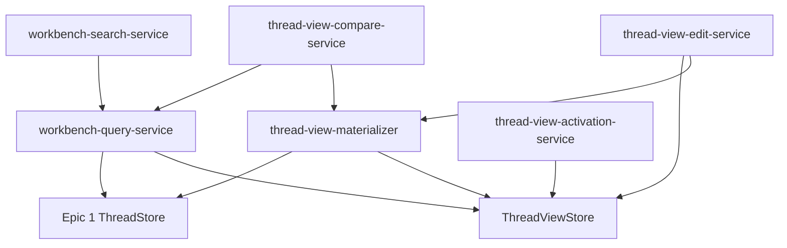
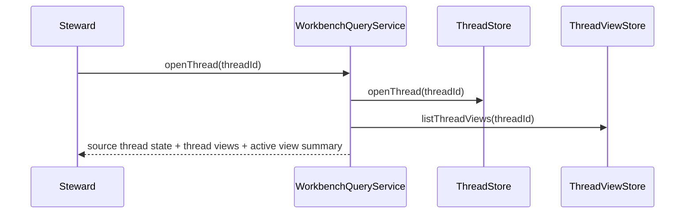
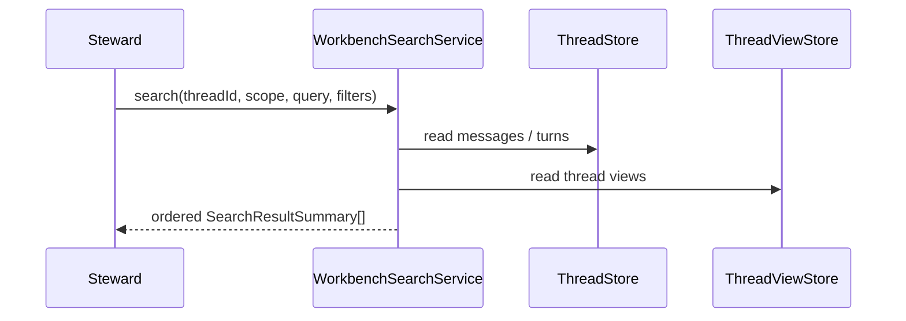
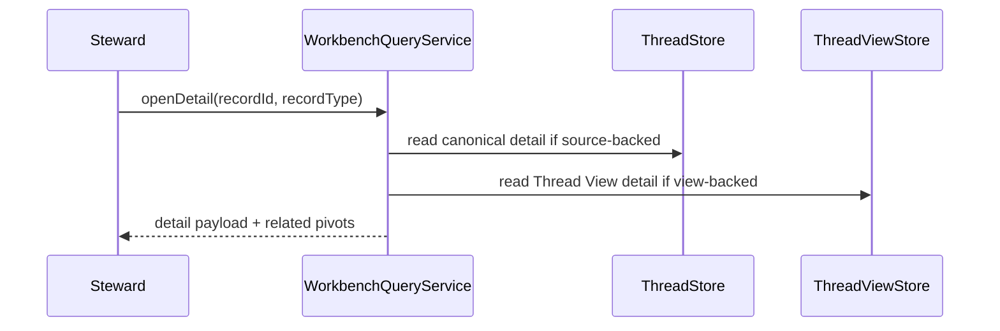
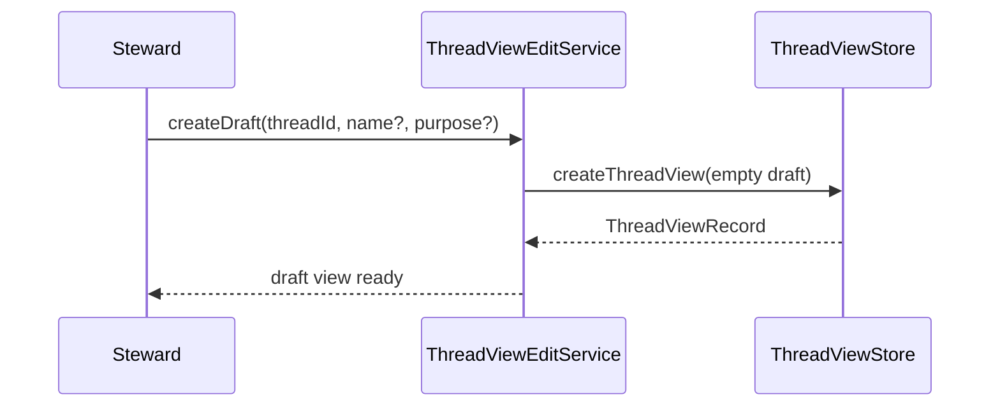
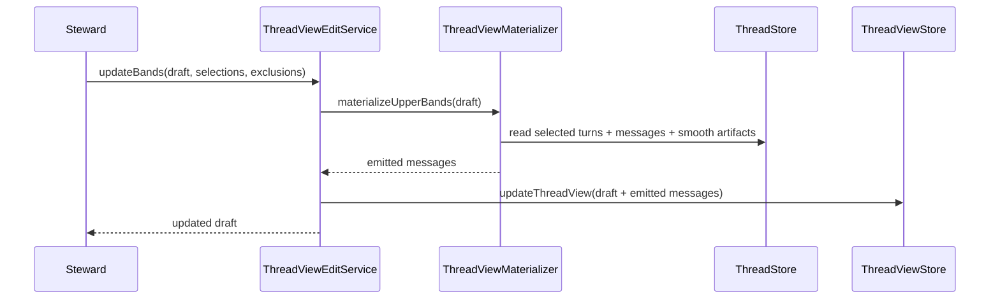
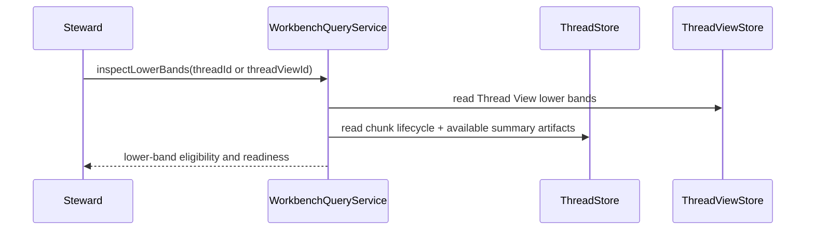

# Technical Design: Context Workbench

## Purpose

This document translates Epic 2, Context Workbench, into implementable architecture for PI Long Horizon. It is the implementation source of truth for Thread View persistence, workbench search and inspection, banded Thread View composition, draft/active/archived view lifecycle, and view activation behavior.

The design serves three consumers:

| Audience | Value |
|---|---|
| Reviewers | Validate that Feature 2 fits the PRD, technical architecture, and Epic before code exists. |
| Developers | Build from concrete module boundaries, records, interfaces, and flow contracts. |
| Story technical sections | Pull exact targets, test mappings, and verification gates into published stories. |

Output uses the two-document configuration:

- `tech-design.md`: decisions, context, system view, module architecture, interfaces, flow design, verification gates, and work breakdown
- `test-plan.md`: complete TC-to-test mapping, mock strategy, fixture strategy, and chunk breakdown with test counts

The full TC matrix lives in `test-plan.md` so this index stays navigable while still preserving the complete confidence chain.

## Spec Validation

The epic is designable. The main behaviors are clear, the band model is explicit enough to shape records and flows, and the Thread View concept is now concrete enough to implement against.

The key design work is not discovering what the feature does. It is making a small number of implementation decisions that the epic intentionally leaves open:

- how Thread Views persist alongside Epic 1 Thread state
- how active/draft/archived view state is enforced
- how band selections and emitted messages are stored
- how search and skim outputs are computed
- how Thread Views relate to the existing `ProjectionRevisionRecord` concept

| Issue | Spec Location | Resolution | Status |
|---|---|---|---|
| Thread View is a new primary concept, while Epic 1 already has `ProjectionRevisionRecord`. | Epic 2 Onboarding Context; Epic 1 ProjectionRevision Metadata | Thread View becomes the primary curated-context record. Projection revisions remain output metadata records. Feature 2 links them but does not collapse them into one record family. | Resolved - clarified |
| Search is functional in the epic but not tied to an implementation shape. | Epic AC-2.1 to AC-2.4 | Search is implemented as query + metadata-filter services over file-backed Thread and Thread View records. Summary rows are computed on demand. | Resolved - clarified |
| The epic names four bands but only upper-band composition is fully operational in this feature. | Epic AC-5, AC-6 | Feature 2 fully supports upper-band composition and lower-band awareness. Lower-band chunk workflows remain minimal and defer full control-plane behavior to Feature 3. | Resolved - clarified |
| The epic allows Thread View curation but does not define abandonment semantics beyond archival. | Epic AC-4.5 | Draft deletion remains out of scope. Archival is the only abandonment path in Feature 2. | Resolved - clarified |

## Context

Feature 1 established that PI Long Horizon does not treat a runtime transcript as source truth. It stores a canonical Thread made of append-only Messages, prompt-bounded Turns, import metadata, repair status, and projection metadata. Feature 2 is the first time the system has to expose that substrate as a working surface rather than as a storage substrate.

The product intent matters here. The workbench is not a dashboard, and it is not a passive browse API. It is the surface where the steward finds source material, inspects it, composes Thread Views, compares alternatives, and activates a new curated context without mutating source history. That makes Feature 2 the first serious editing surface in the system, even though the editing is curation over views rather than mutation of source records.

The technical architecture already settled the larger world. Context Steward Core owns canonical Thread state. Background Maintenance and Projection Compiler remain separate surfaces. That means the Context Workbench cannot become a second source of truth and cannot absorb the full compaction engine. It must sit on top of the canonical Thread, persist Thread Views as first-class curated assemblies, and read enough derived state to make composition decisions without taking ownership of smoothing, chunk closure, or summary generation.

The riskiest implementation question is not durability of raw source capture. Epic 1 already proved that. The risk here is semantic correctness of curated outputs: given a Thread with known Messages, Turns, chunk artifacts, and Thread Views, does the workbench return the right skim summaries, detail views, band selections, emitted message sequence, comparison output, and activation state? That shifts the design and testing emphasis toward query, composition, and state-transition correctness over write-path durability.

The second major constraint is conceptual continuity with Epic 1 language. Older documents and code talk about generated PI session files and projection revisions. Feature 2 introduces Thread Views as the stronger concept. The design has to make that rename survivable: Thread View is the curated assembly, projection revision remains output metadata, and later Feature 3 can deepen the relationship when smart compact becomes a first-class workflow.

## Tech Design Questions

The Epic 2 questions are answered below and are binding for Feature 2 unless implementation discovers a codebase or runtime constraint that requires a documented deviation.

| # | Answer |
|---|---|
| 1 | Thread Views persist as first-class records under each thread. A Thread can have many Thread Views. Exactly one may be active at a time. |
| 2 | Search supports both content queries and metadata filters. Minimum filters from the epic are implemented. Search result summaries are computed on demand. |
| 3 | Thread Views store both composition truth and materialized result. Band selections and exclusions are persisted. Emitted message sequences are also persisted once assembled. |
| 4 | `sourceStateReference` is the pair `<sourceRevision, messageHighWatermark>` captured from the canonical Thread at draft creation or latest recomposition. It is persisted as a string token so the workbench can compare a draft against current source state without inventing a new source clock. |
| 5 | Lower-band readiness is represented per band through `BandRecord.renderedStatus` and per chunk through minimal readiness reads that report whether required closed-chunk summary artifacts are available, missing, or blocked. |
| 6 | Full-fidelity and smooth bands use turn selections. Detailed and brief bands use chunk selections. |
| 7 | Feature 2 activation changes only Thread View state. It does not reload PI. Later Feature 3 smart compact work may use the active Thread View as projection input and may record a `ProjectionRevisionRecord` that references the `threadViewId` used for that output. |
| 8 | Turn exclusion is a Thread View curation decision only. It never mutates the source Thread. Message-level exclusion remains out of scope. |
| 9 | Skim-oriented summary rows use leading recognizable content plus compact metadata. Exact truncation rules stay in Tech Design rather than the epic and should preserve the first useful text fragment before applying any character or token cap. |
| 10 | Fixtures are readable through the same workbench query interfaces as normal Threads. Fixture-specific Thread View support is optional in Feature 2 and remains an explicit design question for implementation. |

## System View

Feature 2 touches three inherited top-tier surfaces directly and reads from two others:

| Surface | Source | This Feature's Role |
|---|---|---|
| Context Steward Core | Inherited from technical architecture | Source Thread, Message, Turn, chunk metadata, and projection metadata remain the authoritative substrate that the workbench reads. |
| Context Workbench | Inherited from renamed Feature 2 concept | Primary implementation surface. Owns Thread View records, workbench query services, view composition, comparison, and activation behavior. |
| Projection Compiler | Inherited downstream consumer | Not implemented here, but Thread View outputs must remain compatible with later projection and runtime binding work. |
| Background Maintenance | Inherited downstream consumer | Not implemented here, but lower-band readiness reads maintenance outputs such as chunk summaries when available. |
| PI Runtime Integration | Inherited downstream consumer | Not a primary implementation surface in Feature 2. Future command surfaces may invoke workbench services, but no new runtime capture behavior is added here. |

### External Contracts

Feature 2 does not introduce a new off-machine API. Its external contracts are local boundaries:

| Boundary | Direction | Contract | Feature 2 Handling |
|---|---|---|---|
| Canonical Thread store | Core to workbench | Thread, Message, Turn, Import, Projection, and fixture reads with explicit ordering | Workbench reads through store/query interfaces rather than file-path peeking. |
| Thread View store | Workbench to disk | Persisted Thread View state and emitted message sequences | File-backed in v1, behind a `ThreadViewStore` interface. |
| Future commands / deterministic callers | Human or code to workbench | Query, detail, draft lifecycle, composition, compare, activate, archive | Workbench services return structured result objects usable by commands later. |
| Lower-band derived artifacts | Background Maintenance to workbench | Chunk lifecycle state and available summary artifacts | Workbench reads readiness and availability only; it does not schedule the maintenance chain. |

### Data Flow Overview

The workbench has two main operating modes:

1. **Read mode**
   - open Thread
   - search messages, turns, Thread Views
   - open full detail
   - compute skim summaries and comparisons on demand

2. **Curation mode**
   - create empty draft Thread View
   - fill band selections from source truth
   - materialize emitted message sequence
   - compare draft to active
   - activate or archive

### Thread View and ProjectionRevision Relationship

Feature 2 introduces a stronger concept than the older "generated PI session file" framing:

- **Thread View**
  - persisted curated context assembly
  - owns band composition and emitted message sequence
  - can be `active`, `draft`, or `archived`

- **ProjectionRevision**
  - output metadata record
  - describes a generated runtime artifact, its path, source state, and status
  - may later reference the `threadViewId` used for that generated artifact

Feature 2 does not migrate all Epic 1 projection metadata into Thread Views. It keeps both concepts alive and makes their relationship explicit so Feature 3 can deepen it without redesigning Feature 2.

## Architecture Decisions

The most consequential design choice in Feature 2 is that Thread Views are real persisted editing objects, not just computed projections over a Thread. The second is that workbench convenience outputs such as skim rows and comparisons do not become their own persisted truth. The table below records the decisions that keep those two ideas consistent across search, inspection, composition, and activation behavior.

| Decision | Choice | Rationale | Epic Coverage |
|---|---|---|---|
| Thread View persistence | Persist Thread Views as first-class records | Thread View identity, lifecycle, and composition must survive across sessions. | AC-1.4, AC-4, AC-7 |
| Composition truth | Persist explicit selected source-unit ids per band | Bespoke curation and exclusion require durable selected contents, not only recompute rules. | AC-5, AC-6 |
| Materialized result | Persist emitted message sequence once assembled | Runtime binding, comparison, and detail inspection need the exact resulting view, not only selections. | AC-3.3, AC-7.2 |
| Summary rows | Compute skim summaries on demand | Skim rows are read-model conveniences and should not become a second persisted truth. | AC-2.2, AC-2.4 |
| Comparison results | Compute comparisons on demand | Differences are derived from current draft and active views; persisting them would drift quickly. | AC-7.1 |
| Active-view invariant | Store exactly one active Thread View per Thread | The runtime-facing context must remain unambiguous. | AC-1.4, AC-4.4, AC-7.3 |
| Source safety | No workbench operation mutates canonical Thread records | Thread View editing is curation, not history rewriting. | AC-4.2, AC-5.5, AC-7.4 |
| Lower-band contract | Detailed and brief bands use closed chunks only | Open chunk content remains in the smooth band until closure and summary readiness. | AC-6.1 to AC-6.3 |
| Thread View state set | `active`, `draft`, `archived` only | Keeps lifecycle simple in Feature 2 while preserving abandonment and historical-read use cases. | AC-1.4, AC-4.3, AC-4.5 |
| Fixture support | Read fixture Threads through the same workbench query interfaces | Fixtures must remain normal Thread-shaped data rather than a separate product mode. | AC-1.5 |

## Module Boundaries

The module structure below follows the inherited surfaces and the feature flows. It keeps Thread View persistence, workbench query behavior, composition, comparison, and activation separate where they have materially different responsibilities, while avoiding a second parallel domain under the workbench.

```text
src/
  context-workbench/
    domain/
      thread-view-records.ts         # NEW: Thread View, Band, emitted message, result summary records
      workbench-errors.ts            # NEW: Feature 2 error codes and result helpers
    store/
      thread-view-store.ts           # NEW: Thread View persistence interface
      file-thread-view-store.ts      # NEW: filesystem implementation under thread directories
    services/
      workbench-query-service.ts     # NEW: open thread, list views, full detail, fixture reads
      workbench-search-service.ts    # NEW: search + metadata filter + skim result summaries
      thread-view-edit-service.ts    # NEW: create draft, update bands, exclude turns, archive draft
      thread-view-materializer.ts    # NEW: emitted message assembly from band selections
      thread-view-compare-service.ts # NEW: compare draft vs active views
      thread-view-activation-service.ts # NEW: activate draft, archive prior active
    test/
      fixtures.ts                    # NEW: Thread View builders, search fixtures, comparison fixtures
      temp-workbench-store.ts        # NEW: temp root helper for Thread View store tests
tests/
  context-workbench/
    *.test.ts
    *.integration.test.ts
```

### Responsibility Matrix

| Module | Status | Responsibility | Dependencies | ACs Covered |
|---|---|---|---|---|
| `domain/thread-view-records.ts` | New | Thread View, band, emitted message, and search-summary record vocabulary | none | AC-1 through AC-7 |
| `domain/workbench-errors.ts` | New | Feature 2 result objects and error codes | none | AC-2, AC-4, AC-5, AC-7 |
| `store/thread-view-store.ts` | New | Thread View persistence interface and active-view invariant boundary | Epic 1 records | AC-1.4, AC-4, AC-7 |
| `store/file-thread-view-store.ts` | New | File-backed implementation under `.context-steward/threads/<thread-id>/thread-views/` | Node fs/path | AC-4, AC-7 |
| `services/workbench-query-service.ts` | New | Open thread, read active view, read detail, read fixtures | Epic 1 Thread store + Thread View store | AC-1, AC-3, AC-6.4 |
| `services/workbench-search-service.ts` | New | Content search, metadata filters, skim result summaries | Query service, Epic 1 Thread store | AC-2 |
| `services/thread-view-edit-service.ts` | New | Create empty draft, update bands, exclude turns, archive draft | Thread View store, materializer | AC-4, AC-5, AC-6 |
| `services/thread-view-materializer.ts` | New | Emit message sequence from selected turns/chunks by band | Epic 1 Thread store, lower-band artifact reads | AC-3.3, AC-5, AC-6 |
| `services/thread-view-compare-service.ts` | New | Compute draft-vs-active differences on demand | Query service, materializer | AC-7.1, AC-7.2 |
| `services/thread-view-activation-service.ts` | New | Activate a draft, archive prior active, preserve one-active invariant | Thread View store | AC-7.3, AC-7.4 |

### Interaction Diagram



The important seam is between canonical source reads and Thread View persistence. Search, detail, materialization, comparison, and activation all depend on that split being explicit.

## Record Schemas

Feature 2 adds a second persisted family next to Epic 1 thread records: Thread Views. These records remain workbench-oriented and do not replace the source Thread records.

```typescript
export type ThreadViewState = "active" | "draft" | "archived";
export type ThreadViewStatus = "ready" | "incomplete" | "blocked" | "unknown";
export type BandType = "full_fidelity" | "smooth" | "detailed" | "brief";
export type SourceUnitType = "turn" | "chunk";
export type EmittedSourceKind =
  | "raw_turn_message"
  | "smooth_turn"
  | "detailed_chunk_summary"
  | "brief_chunk_summary";

export interface ThreadViewRecord {
  threadViewId: string;
  threadId: string;
  state: ThreadViewState;
  name?: string;
  purpose?: string;
  createdAt: string;
  updatedAt: string;
  sourceStateReference?: string;
  fullFidelityBand: BandRecord;
  smoothBand: BandRecord;
  detailedBand: BandRecord;
  briefBand: BandRecord;
  emittedMessages: ThreadViewMessageRecord[];
  status: ThreadViewStatus;
}

export interface BandRecord {
  bandType: BandType;
  targetTokenBudget?: number;
  sourceUnitType: SourceUnitType;
  selectedIds: string[];
  exclusions?: string[];
  renderedStatus: "ready" | "missing_artifacts" | "blocked" | "unknown";
}

export interface ThreadViewMessageRecord {
  threadViewMessageId: string;
  threadViewId: string;
  bandType: BandType;
  sourceKind: EmittedSourceKind;
  sourceReference: string;
  messageOrder: number;
  content: string | Record<string, unknown>;
}

export interface SearchResultSummary {
  resultType: "message" | "turn" | "thread_view" | "chunk";
  resultId: string;
  title: string;
  summaryText: string;
  status?: string;
  relationshipHints?: string[];
}

export interface WorkbenchChunkRead {
  chunkId: string;
  lifecycleStatus: "open" | "closed";
  sourceTurnIds: string[];
  smoothText?: string;
  smoothTokenCount?: number;
  detailedSummary?: string;
  detailedSummaryTokenCount?: number;
  briefSummary?: string;
  briefSummaryTokenCount?: number;
}
```

### File Layout

```text
.context-steward/
  threads/
    <thread-id>/
      thread.json
      actors.json
      messages.jsonl
      turns.json
      imports.json
      projections.json
      thread-views/
        <thread-view-id>/
          thread-view.json
```

`thread-view.json` stores the full `ThreadViewRecord`, including emitted messages. A separate `emitted-messages.jsonl` file is not needed in Feature 2 because:

- emitted sequences are bounded by the active context target rather than by unbounded source history
- atomic replacement of one Thread View artifact is simpler than coordinating two files
- the source Thread already owns the append-heavy JSONL behavior

### Active View Pointer

`thread.json` should gain an optional `activeThreadViewId` field for fast reads. `ThreadViewRecord.state = "active"` remains the per-view state. The store validates that:

- when `activeThreadViewId` is present, exactly one view has `state = "active"`
- when a draft activates, the pointer and view states transition atomically

This mirrors the Epic 1 pattern where `thread.json` carries lightweight summaries while source collections live in their own records.

### ProjectionRevision Linkage

Feature 2 does not redesign the Epic 1 `ProjectionRevisionRecord`, but it does add an optional future-facing linkage:

```typescript
interface ProjectionRevisionRecord {
  // existing Epic 1 fields
  threadViewId?: string;
}
```

This field is optional in Feature 2 and primarily supports coexistence. Smart compact and projection lifecycle remain Feature 3 concerns.

## Store Interface

Thread View persistence is a separate interface from the Epic 1 Thread store. The workbench reads source truth through the existing store and persists view state through the new store.

```typescript
export interface ThreadViewSnapshot {
  view: ThreadViewRecord;
}

export interface CreateThreadViewInput {
  view: ThreadViewRecord;
}

export interface UpdateThreadViewInput {
  threadId: string;
  threadViewId: string;
  expectedUpdatedAt?: string;
  patch: Partial<Pick<ThreadViewRecord, "state" | "name" | "purpose" | "sourceStateReference" | "status">> & {
    fullFidelityBand?: BandRecord;
    smoothBand?: BandRecord;
    detailedBand?: BandRecord;
    briefBand?: BandRecord;
    emittedMessages?: ThreadViewMessageRecord[];
    updatedAt?: string;
  };
}

export interface ActivateThreadViewInput {
  threadId: string;
  draftThreadViewId: string;
  activatedAt?: string;
}

export interface ThreadViewStore {
  createThreadView(input: CreateThreadViewInput): Promise<StewardResult<ThreadViewRecord>>;
  openThreadView(threadId: string, threadViewId: string): Promise<StewardResult<ThreadViewSnapshot>>;
  listThreadViews(threadId: string): Promise<StewardResult<ThreadViewRecord[]>>;
  updateThreadView(input: UpdateThreadViewInput): Promise<StewardResult<ThreadViewRecord>>;
  archiveThreadView(threadId: string, threadViewId: string): Promise<StewardResult<ThreadViewRecord>>;
  activateThreadView(input: ActivateThreadViewInput): Promise<StewardResult<{ active: ThreadViewRecord; archived: ThreadViewRecord }>>;
}
```

### Persisted vs Computed Split

This split is a design decision, not an open question:

| Persisted | Computed On Demand |
|---|---|
| Thread View identity/state | Skim summaries |
| Band selections | Comparison outputs |
| Exclusions | Relationship hints for result rows |
| Emitted message sequence | Some readiness summaries composed from current records |
| Source-state reference | Derived UI/reporting shapes that do not need durable identity |

This keeps Thread Views durable and editable while preventing convenience read models from becoming stale persisted state.

## Flow Design

### Flow 1: Thread And Active View Inspection

**Covers:** AC-1.1 to AC-1.5

The entry flow is reader-first. The steward opens a Thread, reads canonical thread status, reads the current active Thread View when one exists, and sees the relationship between the two. The same flow opens fixture Threads so later features do not create a separate "fixture mode."



Primary test coverage:

| Test file | TCs |
|---|---|
| `workbench-query-service.test.ts` | TC-1.1a through TC-1.5a |

### Flow 2: Search And Skim

**Covers:** AC-2.1 to AC-2.4

Search is where Feature 2 first becomes more than a read API. The steward must be able to find content by meaning and by metadata, skim large result sets quickly, and decide what to inspect next without paying the cost of full detail on every record.

The file-backed implementation should stay simple in Feature 2. Search should use linear scans over canonical records and Thread View records inside the current Thread scope, with in-process filtering and summary-row construction. That is enough for the expected v1 workbench scale and keeps the read path easy to reason about. If later profiling shows that large Threads make linear scans impractical, indexing can be introduced as a design deviation or as future work.



Primary test coverage:

| Test file | TCs |
|---|---|
| `workbench-search-service.test.ts` | TC-2.1a through TC-2.4b |

### Flow 3: Detailed Inspection And Pivots

**Covers:** AC-3.1 to AC-3.4

Search and skim narrow the field. Detail and pivots support the actual decision. The steward opens a single record in full detail, inspects its relationship to turns or Thread Views, and pivots to adjacent records without leaving the current work surface.



Primary test coverage:

| Test file | TCs |
|---|---|
| `workbench-query-service.test.ts` | TC-3.1a through TC-3.4c |

### Flow 4: Draft Thread View Lifecycle

**Covers:** AC-4.1 to AC-4.5

The steward creates a draft view as an empty persisted object. Draft creation never copies the active view and never mutates source truth. A draft can later be filled, activated, or archived.



Primary test coverage:

| Test file | TCs |
|---|---|
| `thread-view-edit-service.test.ts` | TC-4.1a through TC-4.5a |

### Flow 5: Upper-Band Composition

**Covers:** AC-5.1 to AC-5.5

Upper-band composition is the core editing seam in Feature 2. Full-fidelity and smooth bands both select Turns, but they render differently. Full fidelity emits raw messages from selected turns. Smooth emits one standardized smooth-turn message per selected Turn. Turn-level exclusions are applied here as Thread View curation, not source mutation.



Primary test coverage:

| Test file | TCs |
|---|---|
| `thread-view-materializer.test.ts` | TC-5.1a through TC-5.4b |
| `thread-view-edit-service.test.ts` | TC-5.5a through TC-5.5b |

### Flow 6: Lower-Band Awareness

**Covers:** AC-6.1 to AC-6.4

Feature 2 keeps lower-band support deliberately shallow. The workbench can read chunk selections, show chunk readiness for detailed or brief representation, and enforce the invariant that open chunk content remains outside lower-band representations. It does not expose the full chunk-maintenance control plane.

Lower-band readiness is a read over persisted chunk state, not a background orchestration feature. The workbench checks:

- whether the selected chunk is closed
- whether the representation required by the band exists
- whether the selected chunk is the current open chunk

If the chunk is open, it is ineligible by definition. If the chunk is closed but lacks the required detailed or brief summary artifact, the band remains readable but is marked `missing_artifacts` or `blocked` depending on whether the workbench is missing an optional representation or a required one for the current draft composition.



Primary test coverage:

| Test file | TCs |
|---|---|
| `workbench-query-service.test.ts` | TC-6.1a through TC-6.4b |

### Flow 7: View Comparison And Activation

**Covers:** AC-7.1 to AC-7.4

The steward compares a draft to the active view, inspects the materialized result, then activates the draft. Activation is the only state transition that changes which Thread View is active. The prior active view is archived, and source truth remains untouched.

```mermaid
sequenceDiagram
    participant Steward
    participant Compare as ThreadViewCompareService
    participant Activate as ThreadViewActivationService
    participant VStore as ThreadViewStore

    Steward->>Compare: compare(active, draft)
    Compare-->>Steward: band + selection differences
    Steward->>Activate: activateDraft(threadId, draftId)
    Activate->>VStore: activateThreadView(...)
    VStore-->>Activate: new active + archived prior active
    Activate-->>Steward: activation result
```

Primary test coverage:

| Test file | TCs |
|---|---|
| `thread-view-compare-service.test.ts` | TC-7.1a through TC-7.2b |
| `thread-view-activation-service.test.ts` | TC-7.3a through TC-7.4b |

## Interface Definitions

### Core Services

```typescript
export interface OpenWorkbenchThreadInput {
  threadId: string;
}

export interface OpenWorkbenchThreadResult {
  thread: ThreadRecord;
  threadViews: ThreadViewRecord[];
  activeThreadView?: ThreadViewRecord;
  usableStatus: "ready" | "blocked" | "degraded";
  blockers: StewardIssue[];
}

export interface WorkbenchSearchInput {
  threadId: string;
  scope: "message" | "turn" | "thread_view";
  query?: string;
  filters?: Record<string, string | number | boolean>;
}

export interface OpenMessageDetailInput {
  threadId: string;
  messageId: string;
}

export interface OpenTurnDetailInput {
  threadId: string;
  turnId: string;
}

export interface OpenThreadViewDetailInput {
  threadId: string;
  threadViewId: string;
}

export interface OpenChunkDetailInput {
  threadId: string;
  chunkId: string;
}

export interface InspectLowerBandReadinessInput {
  threadId: string;
  threadViewId?: string;
}

export interface CreateDraftThreadViewInput {
  threadId: string;
  name?: string;
  purpose?: string;
  now?: () => Date;
}

export interface UpdateThreadViewBandsInput {
  threadId: string;
  threadViewId: string;
  fullFidelityBand?: BandRecord;
  smoothBand?: BandRecord;
  detailedBand?: BandRecord;
  briefBand?: BandRecord;
  exclusions?: string[];
}

export interface CompareThreadViewsInput {
  threadId: string;
  activeThreadViewId: string;
  draftThreadViewId: string;
}

export interface CompareThreadViewsResult {
  bandDifferences: Array<{
    bandType: BandType;
    addedIds: string[];
    removedIds: string[];
  }>;
  emittedMessageDifferences: Array<{
    messageOrder: number;
    active?: ThreadViewMessageRecord;
    draft?: ThreadViewMessageRecord;
  }>;
}

export interface MessageDetailResult {
  message: MessageRecord;
  owningTurnId?: string;
}

export interface TurnDetailResult {
  turn: TurnRecord;
  messages: MessageRecord[];
  threadViewPlacements: Array<{ threadViewId: string; state: ThreadViewState; bandType: BandType }>;
}

export interface ThreadViewDetailResult {
  view: ThreadViewRecord;
  sourcePivots: Array<{ bandType: BandType; sourceUnitId: string; sourceUnitType: SourceUnitType }>;
}

export interface ChunkDetailResult {
  chunk: WorkbenchChunkRead;
}

export interface LowerBandReadinessResult {
  detailedBand: Array<{ chunkId: string; status: "eligible" | "missing_artifacts" | "blocked" | "ineligible_open_chunk" }>;
  briefBand: Array<{ chunkId: string; status: "eligible" | "missing_artifacts" | "blocked" | "ineligible_open_chunk" }>;
}
```

### Materialization Contracts

```typescript
export interface MaterializeThreadViewInput {
  thread: ThreadRecord;
  draftView: ThreadViewRecord;
  turns: TurnRecord[];
  messages: MessageRecord[];
  chunks?: WorkbenchChunkRead[];
}

export interface MaterializeThreadViewResult {
  emittedMessages: ThreadViewMessageRecord[];
  bandStatuses: Record<BandType, BandRecord["renderedStatus"]>;
  issues: StewardIssue[];
}
```

The materializer assembles bands independently, then concatenates them in band order to produce the final emitted message sequence.

## Testing Strategy

Feature 2 should not over-index on store-write tests. Epic 1 already proved the canonical write substrate. The highest-value tests here are snapshot-driven workbench tests:

- set up a Thread with known Messages, Turns, chunk artifacts, and Thread Views
- invoke workbench query or edit services
- assert on returned summaries, detail payloads, band composition, emitted messages, comparison outputs, and lifecycle state transitions

The service-mock philosophy still applies:

| Boundary | Test Treatment |
|---|---|
| Canonical Thread filesystem store | Use real temp directories where workbench tests need realistic Thread snapshots. |
| Thread View filesystem store | Use real temp directories; this is core behavior. |
| Internal workbench services | Do not mock. |
| Search summary formatting | Exercise through workbench search service, not isolated string helpers only. |
| Future command/UI adapters | Mock at the adapter boundary only. |

The key fixture pattern from Epic 1 should carry forward:

- `withTempThreadStore()` for source Thread roots
- `makeThreadSnapshot()` style builders for known source records
- new Thread View builders for active/draft/archived view states

## Open Questions

| # | Question | Owner | Blocks | Resolution |
|---|---|---|---|---|
| Q1 | Should Feature 2 fixture Threads also persist Thread Views, or should fixture reads remain source-thread-only in the first implementation? | Tech Lead | Chunk 1 | Open |
| Q2 | Should search stay as per-request linear scans across current Thread state, or is there enough expected volume to justify an in-memory per-thread index in Feature 2? | Tech Lead | Chunk 2 | Open |
| Q3 | Should activation require a fully materialized emitted message sequence in all cases, or only when the activated view is immediately runtime-facing? | Product + Tech Lead | Chunk 5 | Open |

## Verification Scripts

Feature 2 should inherit the current verification model rather than inventing a new one:

```json
{
  "scripts": {
    "red-verify": "npm run typecheck",
    "verify": "npm run typecheck && npm run test",
    "green-verify": "npm run verify && npm run guard:no-test-changes",
    "test:integration": "node scripts/run-node-tests.mjs integration",
    "test:e2e": "node scripts/run-node-tests.mjs e2e",
    "verify-all": "npm run verify && npm run test:integration && npm run test:e2e"
  }
}
```

Workbench tests should initially live in unit/service layers. If a later story introduces an operator-facing command surface, that command coverage should be additive rather than the main confidence path.

## Work Breakdown

The Epic 2 flows suggest a natural six-chunk design. The boundaries below come from responsibility and test-entry clarity, not from naming one service per story in advance.

| Chunk | Primary Story Mapping |
|---|---|
| Chunk 0 | Story 0 |
| Chunk 1 | Story 1 |
| Chunk 2 | Story 2 |
| Chunk 3 | Story 3 + turn exclusion from Story 4 |
| Chunk 4 | Story 4 upper-band materialization + Story 5 |
| Chunk 5 | Story 6 |

### Chunk 0: Foundation

**Scope:** Thread View record vocabulary, errors, fixtures, temp store helpers, script wiring.

**ACs:** Supports all ACs.

**TCs:** None directly.

**Non-TC decided tests:** Thread View id/state helpers are deterministic; emitted message ordering helpers preserve band ordering.

**Test count:** 0 TC + 2 non-TC. Running total: 2.

### Chunk 1: Thread And Active View Inspection

**Scope:** Open Thread, list Thread Views, active-view reads, fixture reads.

**ACs:** AC-1.1 to AC-1.5.

**TCs:** TC-1.1a through TC-1.5a.

**Relevant Tech Design Sections:** [System View](#system-view), [Module Boundaries](#module-boundaries), [Flow 1: Thread And Active View Inspection](#flow-1-thread-and-active-view-inspection), [Store Interface](#store-interface).

**Non-TC decided tests:** Opening a Thread with many archived views keeps active view lookup cheap.

**Test count:** 9 TC + 1 non-TC. Running total: 12.

### Chunk 2: Search, Skim, Detail, and Pivots

**Scope:** Content and metadata search, skim result summaries, detail payloads, related-record pivots.

**ACs:** AC-2.1 to AC-2.4, AC-3.1 to AC-3.4.

**TCs:** TC-2.1a through TC-3.4c.

**Relevant Tech Design Sections:** [Flow 2: Search And Skim](#flow-2-search-and-skim), [Flow 3: Detailed Inspection And Pivots](#flow-3-detailed-inspection-and-pivots), [Interface Definitions](#interface-definitions), [Testing Strategy](#testing-strategy).

**Non-TC decided tests:** Search result ordering is stable for equal-score metadata matches; skim summaries omit full-detail payloads from long result lists.

**Test count:** 20 TC + 2 non-TC. Running total: 34.

### Chunk 3: Draft Thread View Lifecycle and Turn Exclusion

**Scope:** Empty draft creation, draft/archive/active states, one-active-view invariant, archive-without-activate path, and turn-level exclusion as view curation.

**ACs:** AC-4.1 to AC-4.5, AC-5.5.

**TCs:** TC-4.1a through TC-4.5a, TC-5.5a through TC-5.5b.

**Relevant Tech Design Sections:** [Flow 4: Draft Thread View Lifecycle](#flow-4-draft-thread-view-lifecycle), [Record Schemas](#record-schemas), [Store Interface](#store-interface).

**Non-TC decided tests:** Draft creation is idempotently rejected when a duplicate `threadViewId` is injected; archival preserves emitted messages for later reads.

**Test count:** 12 TC + 2 non-TC. Running total: 48.

### Chunk 4: Band Composition and Lower-Band Awareness

**Scope:** Full-fidelity and smooth band composition, minimal lower-band chunk awareness, and materialization.

**ACs:** AC-5.1 to AC-5.4, AC-6.1 to AC-6.4.

**TCs:** TC-5.1a through TC-5.4b, TC-6.1a through TC-6.4b.

**Relevant Tech Design Sections:** [Flow 5: Upper-Band Composition](#flow-5-upper-band-composition), [Flow 6: Lower-Band Awareness](#flow-6-lower-band-awareness), [Persisted vs Computed Split](#persisted-vs-computed-split), [Materialization Contracts](#materialization-contracts).

**Non-TC decided tests:** Materializer preserves band order when one band is empty; open chunk never materializes into detailed or brief bands even when summaries exist erroneously.

**Test count:** 16 TC + 2 non-TC. Running total: 66.

### Chunk 5: Comparison and Activation

**Scope:** Draft-vs-active comparison, emitted-message diffing, activation, archival of prior active view.

**ACs:** AC-7.1 to AC-7.4.

**TCs:** TC-7.1a through TC-7.4b.

**Relevant Tech Design Sections:** [Flow 7: View Comparison And Activation](#flow-7-view-comparison-and-activation), [Store Interface](#store-interface), [ProjectionRevision Linkage](#projectionrevision-linkage).

**Non-TC decided tests:** Activation rejects a draft with incomplete emitted output when policy requires materialization before activation; comparison ignores archived views unless explicitly requested.

**Test count:** 8 TC + 2 non-TC. Running total: 76.

### Count Reconciliation

The epic contains 65 primary TCs. This design plans 65 TC-mapped tests plus 11 non-TC decided tests, for 76 planned tests total. The authoritative per-file mapping is in `test-plan.md`.

## Deferred Items

| Item | Related AC | Reason Deferred | Future Work |
|---|---|---|---|
| Full chunk boundary editing | AC-6 | Feature 2 only needs minimal chunk awareness. | Feature 3 |
| Dependency-chain and retry-graph inspection | AC-1.2, AC-6.3 | Product explicitly deferred full maintenance chain visibility. | Feature 3+ |
| Message-level exclusion | AC-5.5 | Product constrained exclusion to turn-level curation. | Future direction |
| Full smart compact execution from the workbench | AC-7 | Projection compiler and runtime reload remain Feature 3. | Feature 3 |

## Related Documentation

- PRD: `/Users/leemoore/code/pi-long-horizon/docs/spec-build/prd.md`
- Technical Architecture: `/Users/leemoore/code/pi-long-horizon/docs/spec-build/technical-architecture.md`
- Epic: `/Users/leemoore/code/pi-long-horizon/docs/spec-build/epics/02-context-workbench/epic.md`
- Test Plan: `/Users/leemoore/code/pi-long-horizon/docs/spec-build/epics/02-context-workbench/test-plan.md`
