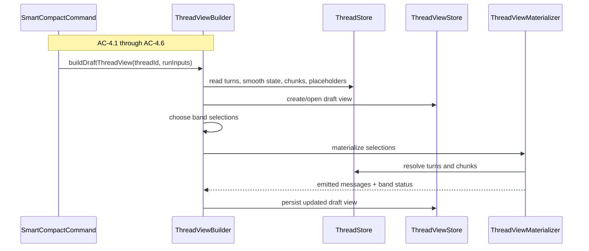
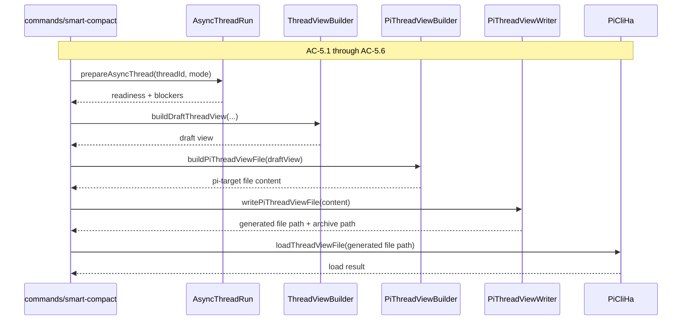

# Technical Design Companion: Thread View, PI Target Output, And Harness Adapter

## Purpose

This companion carries the implementation depth for:

- `thread-view`
- `thread-view/targets/pi`
- `harness-adapter/pi-cli-ha`
- `commands/smart-compact`
- the Feature 2 workbench seam that now needs real chunk-backed lower-band behavior

It covers the deterministic rebuild and materialization path, PI-target file
generation, atomic write and archive behavior, PI CLI load handoff, and command
sequencing over the full deterministic loop.

## Context

Feature 2 made Thread Views real, but it intentionally stopped short of making
the lower-band path fully production-backed. The workbench could reason about
lower-band concepts and draft/active/archived Thread Views, but some chunk
inputs still arrived through a seam that Feature 3 now has to close. That makes
this companion more than a rebuild design. It is also the place where
Thread View stops being a curated object with partially hypothetical lower bands
and becomes a fully usable runtime-facing object built from real persisted
chunk state.

The strongest design choice here is to keep `thread-view` separate from both
`thread` and the PI harness edge. `thread-view` owns the curated runtime-facing
object. `thread-view/targets/pi` owns turning that object into PI-target file
content. `harness-adapter/pi-cli-ha` owns telling PI to load that file. If those
three responsibilities collapse into one module, the naming and the code both
start lying.

The command path is intentionally thin but important. Smart compact crosses
surfaces. It validates operator inputs, checks deterministic readiness, rebuilds
or opens a target Thread View, materializes emitted messages, builds PI-target
file content, writes it atomically, archives the previous output, and then asks
the harness adapter to load the new file. No single domain module should hide
that whole sequence.

## Module Architecture

### Surface Layout

```text
src/thread-view/
  domain/
    thread-view-records.ts
    thread-view-errors.ts
    pi-thread-view-file.ts
  store/
    thread-view-store.ts
    file-thread-view-store.ts
  services/
    thread-view-builder.ts
    thread-view-materializer.ts
    thread-view-activation-service.ts
    thread-view-compare-service.ts
  targets/
    pi/
      pi-thread-view-builder.ts
      pi-thread-view-writer.ts
  test/
    fixtures.ts
    temp-thread-view-store.ts

src/workbench/
  domain/
    workbench-errors.ts
  services/
    workbench-query-service.ts
    workbench-search-service.ts

src/harness-adapter/
  pi-cli-ha/
    pi-cli-ha.ts
    load-thread-view-file.ts

src/commands/
  command-results.ts
  smart-compact.ts
```

### Responsibility Matrix

| Module | Status | Responsibility | Depends On | ACs |
|---|---|---|---|---|
| `thread-view/domain/thread-view-records.ts` | Move existing | Thread View, band, emitted-message, build-input, and build-result vocabulary | none | AC-4, AC-5, AC-6 |
| `thread-view/store/thread-view-store.ts` | Move existing | Persist active/draft/archived Thread Views and emitted messages | filesystem implementation | AC-4, AC-5 |
| `thread-view/services/thread-view-builder.ts` | New | Build or rebuild a draft Thread View from source and run inputs | `thread`, `thread-view` store | AC-4 |
| `thread-view/services/thread-view-materializer.ts` | Refactor existing | Resolve selected turns/chunks into emitted Thread View messages | `thread`, `thread-view` store | AC-4, AC-6 |
| `thread-view/services/thread-view-activation-service.ts` | Move existing | Activate draft and archive prior active view | `thread-view` store | AC-5.5, AC-6 |
| `thread-view/services/thread-view-compare-service.ts` | Move existing | Compare draft vs active Thread Views | `thread-view` store | AC-4, AC-5 |
| `thread-view/targets/pi/pi-thread-view-builder.ts` | New | Convert emitted Thread View messages into PI-native file content | `thread-view`, `thread` | AC-5.1, AC-5.6 |
| `thread-view/targets/pi/pi-thread-view-writer.ts` | New | Atomic write and archive of PI-target files | filesystem | AC-5.2, AC-5.3 |
| `workbench/services/workbench-query-service.ts` | Refactor existing | Read real chunk-backed lower-band readiness and minimal chunk detail | `thread`, `thread-view` | AC-6.4, Feature 2 seam closure |
| `harness-adapter/pi-cli-ha/*` | New | Load PI-target file into PI CLI harness | PI runtime seam | AC-5.4 |
| `commands/smart-compact.ts` | New | Sequence validate -> prepare -> build -> materialize -> write -> archive -> load | all above | AC-5, AC-6 |

### Sequence: Flow 4 Band Rebuild And View Materialization

Thread View rebuild starts from explicit run inputs. It does not inspect a
default stored policy. It reads source and derived Thread state, validates band
percentages and lower-bound target, fills upper bands from coherent Turn units,
fills lower bands from coherent closed Chunk units, and materializes the emitted
message sequence.



#### Rebuild Rules

- Full fidelity fills first from newest raw Turns backward.
- Smooth fills next from the next older eligible smooth Turns.
- Detailed and brief fill from closed Chunks only.
- Open chunks are never eligible for lower bands.
- Empty lower bands are explicit if there are no eligible closed Chunks.
- If the full-fidelity region alone exceeds the requested lower bound, the
  result is explicit degraded/blocked state, not silent success.
- Invalid band-percentage inputs reject before rebuild starts.

#### Lower-Band Seam Closure

Feature 2’s shallow seam is resolved here:

- `thread-view-materializer` no longer carries lower-band emitted messages
  forward blindly
- lower-band selections are validated against real persisted chunk state
- chunk existence, lifecycle status, and placeholder artifact availability are
  checked against `thread` data
- workbench lower-band readiness reads the same real chunk state instead of an
  empty fallback reader

#### Flow Test Mapping

| TC | Test File | Setup | Assert |
|---|---|---|---|
| TC-4.1a / b | `tests/thread-view/thread-view-builder.test.ts` | Explicit valid / invalid run inputs | Inputs accepted or rejected correctly |
| TC-4.2a / b / c | `tests/thread-view/thread-view-builder.test.ts` | Turns with varying size/order | Full-fidelity selection order, no split, overage explicit |
| TC-4.3a / b | `tests/thread-view/thread-view-builder.test.ts` | Smooth turns after full-fidelity boundary | Smooth band selection behavior |
| TC-4.4a / b / c | `tests/thread-view/thread-view-builder.test.ts` | Closed/open/no-chunk cases | Lower-band eligibility and emptiness |
| TC-4.5a / b | `tests/thread-view/thread-view-materializer.test.ts` | Multi-band and empty-band views | Emitted sequence order and empty-band safety |
| TC-4.6a / b / c | `tests/thread-view/thread-view-builder.test.ts` | Reach / fail / invalid run input cases | Threshold and validation outcomes explicit |

### Sequence: Flow 5 Manual Smart Compact And PI Reload

Smart compact is an application operation, not a domain noun. The command owns
the sequencing because it crosses all the important surfaces. It validates run
inputs, selects `strict` or `prepare` mode, acquires a thread-scoped mutation
lease, prepares missing deterministic artifacts when allowed, rebuilds the
Thread View, produces PI-target file content, writes it atomically, archives
the previous output, and tells PI to load the new file.



#### Smart Compact Modes

`strict`
- validate
- report blockers
- stop if required artifacts are missing

`prepare`
- validate
- run deterministic artifact preparation where possible
- continue if readiness becomes sufficient
- stop explicitly if it still does not

#### PI Target Output Split

Three separate responsibilities must stay separate:

1. `thread-view-builder`
   - chooses band selections
   - owns the draft Thread View object

2. `pi-thread-view-builder`
   - converts a materialized Thread View into PI-native file content

3. `pi-cli-ha`
   - asks PI to load the already-written file

If those are collapsed into one service, the architecture gets muddy fast.

#### Flow Test Mapping

| TC | Test File | Setup | Assert |
|---|---|---|---|
| TC-5.1a-e | `tests/commands/smart-compact.test.ts` | Valid/invalid inputs, strict/prepare, fresh-thread bootstrap | Inputs accepted, blockers explicit, bootstrap behavior correct |
| TC-5.2a / b | `tests/thread-view/pi-thread-view-writer.test.ts` | Valid write and failed write | Atomic write and no partial current target |
| TC-5.3a / b | `tests/thread-view/pi-thread-view-writer.test.ts` | Existing / missing prior output | Archive behavior correct |
| TC-5.4a / b | `tests/harness-adapter/pi-cli-ha.test.ts` and `tests/commands/smart-compact.test.ts` | Successful / failed load | PI load request sent and failure reported |
| TC-5.5a / b | `tests/commands/smart-compact.test.ts` | Successful compact | Source safety and projection identification |
| TC-5.6a / b | `tests/commands/smart-compact.test.ts` | Placeholder lower-band output present | Compact succeeds and placeholders remain explicit |

### Workbench Adjustments

`workbench-query-service` remains a consumer, but Feature 3 changes one thing
materially: chunk-backed lower-band reads must now be real.

Required changes:

- remove empty default chunk-reader behavior as the normal production path
- resolve chunk detail and lower-band readiness from persisted chunk state in
  `thread`
- preserve minimal chunk detail shape and Feature 2’s shallow workbench posture
- do not let incomplete lower-band state break upper-band inspection

This is where the Feature 2 accepted-risk seam is actually retired.

## Interface Definitions

```typescript
export interface ThreadViewBuildInputs {
  threadId: string;
  requestedLowerBound: number;
  requestedBandPercentages: {
    fullFidelity: number;
    smooth: number;
    detailed: number;
    brief: number;
  };
  mode: "strict" | "prepare";
}

export interface ThreadViewBuildResult {
  draftThreadViewId: string;
  status: "ready" | "blocked" | "degraded";
  resultingTokenCount?: number;
  blockers: StewardIssue[];
}

export interface PiThreadViewEntry {
  entryType: "message";
  role: "user" | "assistant" | "toolResult" | "system" | "custom";
  content: string | Record<string, unknown>;
  generatedSource:
    | "raw_turn_message"
    | "smooth_turn"
    | "detailed_chunk_summary"
    | "brief_chunk_summary";
  metadata?: Record<string, unknown>;
}

export interface PiThreadViewFile {
  threadId: string;
  threadViewId: string;
  fileName: string;
  entries: PiThreadViewEntry[];
  entryCount: number;
}

export interface WritePiThreadViewFileInput {
  threadId: string;
  threadViewId: string;
  file: PiThreadViewFile;
}

export interface WritePiThreadViewFileResult {
  generatedFilePath: string;
  archivePath?: string;
}

export interface PiCliHarnessAdapter {
  loadThreadViewFile(input: {
    threadId: string;
    threadViewId: string;
    filePath: string;
  }): Promise<{
    ok: true;
  } | {
    ok: false;
    issues: StewardIssue[];
  }>;
}

export interface SmartCompactCommandInput {
  threadId: string;
  requestedLowerBound: number;
  requestedBandPercentages: {
    fullFidelity: number;
    smooth: number;
    detailed: number;
    brief: number;
  };
  mode: "strict" | "prepare";
}

export interface SmartCompactCommandResult {
  threadId: string;
  threadViewId?: string;
  generatedFilePath?: string;
  archivePath?: string;
  compactStatus: "success" | "blocked" | "degraded" | "write_failed" | "reload_failed";
  blockers: StewardIssue[];
}
```

These types are the heart of the command path. A fresh implementer should be
able to read them and understand:

- what the operator provides
- what the builder produces
- what the writer emits
- what the PI harness adapter consumes

## Testing Notes

This companion owns the highest-risk integration and E2E seams:

- `tests/thread-view/thread-view-builder.test.ts`
- `tests/thread-view/thread-view-materializer.test.ts`
- `tests/thread-view/pi-thread-view-builder.test.ts`
- `tests/thread-view/pi-thread-view-writer.test.ts`
- `tests/commands/smart-compact.test.ts`
- `tests/harness-adapter/pi-cli-ha.test.ts`

Integration:

- `tests/thread-view/pi-thread-view-writer.integration.test.ts`
- `tests/commands/smart-compact.integration.test.ts`

E2E:

- command-driven deterministic loop with real temp stores and real file writes
- explicit archive/reload scenarios
- explicit blocked/degraded scenarios

The full TC mapping and the explicit E2E suite design live in the test plan.
