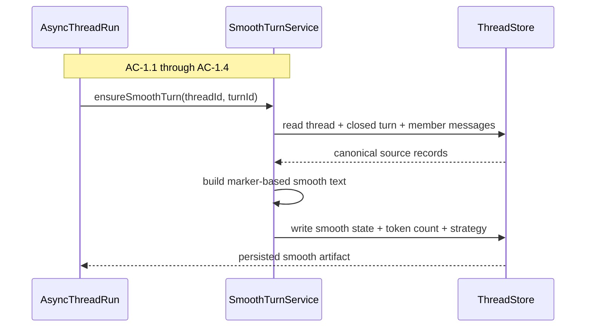
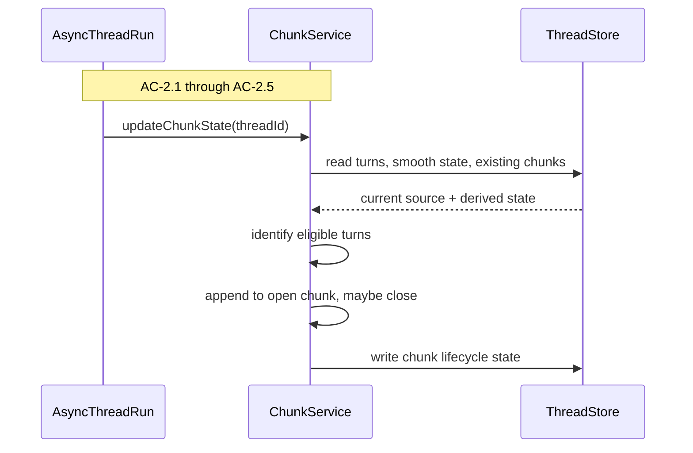
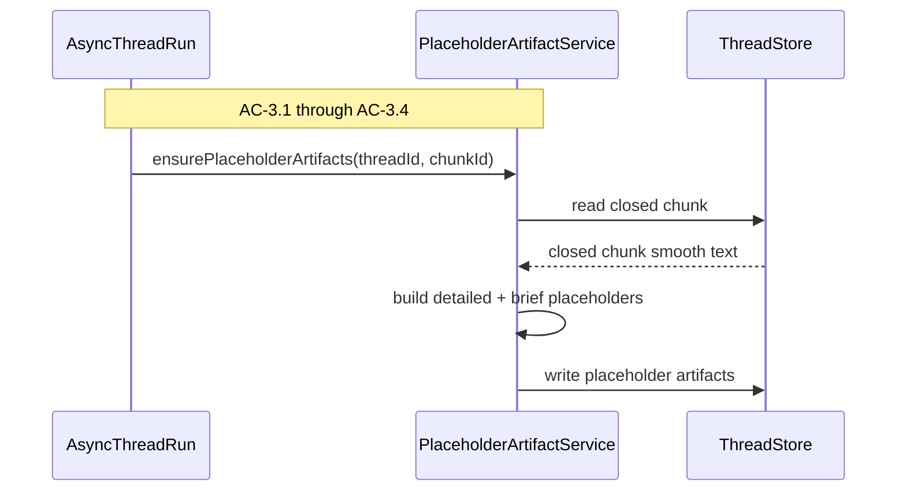
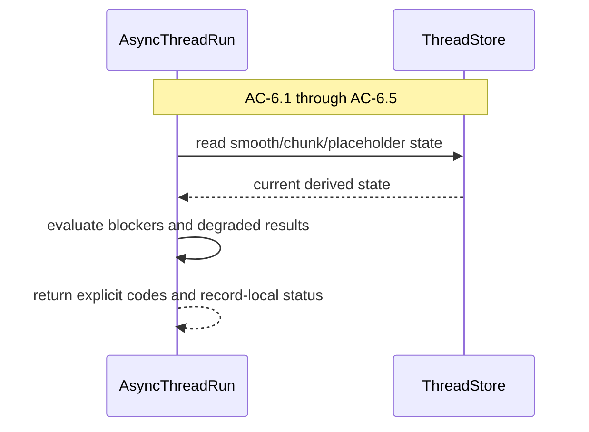

# Technical Design Companion: Thread And Async Thread

## Purpose

This companion carries the implementation depth for the `thread` surface and
its `async-thread` sub-surface. It covers:

- canonical Thread records and mutation coordination
- deterministic smooth-turn generation
- deterministic chunk lifecycle
- deterministic placeholder lower-band artifacts
- blocked and degraded derived-state reporting

These are all derived from source truth and must remain downstream of the
canonical Thread record rather than becoming their own peer domain.

## Context

Feature 3 uses the existing Feature 1 thread substrate as its source of truth,
but it extends that substrate in a meaningful new direction: the Thread now
owns persisted derived state that is no longer just “repairable turn grouping.”
It owns smooth-turn artifacts, chunk state, placeholder lower-band artifacts,
and explicit readiness or blocked status for those artifacts. This is still
Thread-derived state, not Thread View state.

That is why `async-thread` lives under `thread`. It is the place where the
system keeps a Thread’s derived state ready. It does not build curated runtime
views, and it does not know how PI loads files. Those are later surfaces.

The second crucial constraint is that async work must not undermine source
truth. Messages remain append-only. Turns remain authoritative prompt-bounded
groupings over those messages. Smooth-turn text, chunks, and placeholders can
be regenerated or repaired, but source records must remain stable while that
derived state evolves.

The third constraint is restart safety. Feature 3 cannot treat deterministic
artifacts as ephemeral in-memory conveniences. Smooth state, chunk lifecycle,
and placeholder artifacts must survive process restarts so the rebuild path and
workbench inspection path can continue from persisted state rather than
re-deriving everything blindly.

## Module Architecture

### Surface Layout

```text
src/thread/
  domain/
    records.ts
    errors.ts
    ids.ts
    output-metadata.ts
  store/
    thread-store.ts
    file-thread-store.ts
    schema-version.ts
    mutation-coordinator.ts
  services/
    thread-service.ts
    turn-service.ts
    capture-service.ts
    import-service.ts
    repair-service.ts
  async-thread/
    domain/
      smooth-turn-state.ts
      chunk-state.ts
      placeholder-artifact-state.ts
      async-thread-status.ts
      settings.ts
    services/
      smooth-turn-service.ts
      chunk-service.ts
      placeholder-artifact-service.ts
      async-thread-run-service.ts
    test/
      fixtures.ts
      temp-thread-store.ts
```

### Persisted State Layout

Feature 3 persists new derived Thread state alongside the existing Thread
record family rather than as ephemeral rebuild inputs.

Recommended file-backed layout:

```text
.context-steward/
  threads/
    <thread-id>/
      thread.json
      actors.json
      messages.jsonl
      turns.json          # extended: includes smooth-turn state per Turn
      chunks.json         # new/current-state chunk lifecycle + placeholder artifacts
      imports.json
      projections.json
      jobs.json           # optional run metadata if needed by implementation
      archives/
        pi-thread-views/
```

Feature 3 commitments:

- smooth-turn state persists on Turn records in `turns.json`
- chunk lifecycle state persists in `chunks.json`
- detailed and brief placeholder artifacts persist on chunk records in
  `chunks.json`
- per-thread output metadata remains in `thread.json` and `projections.json`

This keeps all deterministic derived Thread state under the `thread` surface
and avoids inventing a separate store just for rebuild inputs.

### Responsibility Matrix

| Module | Status | Responsibility | Depends On | ACs |
|---|---|---|---|---|
| `thread/domain/records.ts` | Move existing | Canonical Thread, Message, Part, Turn, Job, and base chunk vocabulary | none | AC-1 through AC-6 |
| `thread/store/thread-store.ts` | Extend existing | Source and derived-state persistence interface | filesystem implementation | AC-1 through AC-6 |
| `thread/store/mutation-coordinator.ts` | New | Thread-scoped mutation lease and optimistic revision enforcement | thread store | AC-1.4, AC-3.3, AC-5.1, AC-6 |
| `thread/async-thread/domain/smooth-turn-state.ts` | New | Smooth-turn artifact state and status vocabulary | thread records | AC-1 |
| `thread/async-thread/domain/chunk-state.ts` | New | Chunk lifecycle state, close reasons, token counts, and selected turn membership | thread records | AC-2 |
| `thread/async-thread/domain/placeholder-artifact-state.ts` | New | Detailed/brief placeholder artifacts, token counts, and strategy markers | chunk state | AC-3 |
| `thread/async-thread/domain/async-thread-status.ts` | New | Blocked/degraded status records and blocker codes | smooth/chunk/placeholder state | AC-6 |
| `thread/async-thread/domain/settings.ts` | New | Tunable deterministic settings for chunk closure and placeholder truncation | none | AC-2, AC-3 |
| `thread/async-thread/services/smooth-turn-service.ts` | New | Build and repair deterministic smooth-turn text | turn-service, thread store | AC-1 |
| `thread/async-thread/services/chunk-service.ts` | New | Evaluate chunk eligibility, update open chunk, close chunk | smooth-turn-service, thread store | AC-2 |
| `thread/async-thread/services/placeholder-artifact-service.ts` | New | Build or repair deterministic detailed/brief placeholders | chunk-service, thread store | AC-3 |
| `thread/async-thread/services/async-thread-run-service.ts` | New | Run `strict` or `prepare` deterministic preflight for downstream rebuild/compact | smooth/chunk/placeholder services, mutation coordinator | AC-5.1, AC-6 |

### Sequence: Flow 1 Smooth Turn Preparation

Closed Turns need a deterministic smooth representation that later code can use
without asking a model. The service receives a closed Turn id, reads its member
messages and parts in canonical order, folds them into the fixed section-marker
format, applies deterministic normalization rules, and writes the resulting
artifact back to persisted derived state.



#### Skeleton Requirements

| What | Where | Stub Signature |
|---|---|---|
| Smooth-turn domain type | `src/thread/async-thread/domain/smooth-turn-state.ts` | `export interface SmoothTurnState { /* ... */ }` |
| Smooth-turn service | `src/thread/async-thread/services/smooth-turn-service.ts` | `export async function ensureSmoothTurn(...) { throw new NotImplementedError("ensureSmoothTurn"); }` |
| Smooth formatting helper | `src/thread/async-thread/services/smooth-turn-format.ts` or inline helper | `export function buildSmoothTurnText(...) { throw new NotImplementedError("buildSmoothTurnText"); }` |

#### Flow Test Mapping

| TC | Test File | Setup | Assert |
|---|---|---|---|
| TC-1.1a | `tests/thread/smooth-turn-service.test.ts` | Closed turn without smooth state | Smooth artifact and token count written |
| TC-1.1b | `tests/thread/smooth-turn-service.test.ts` | Open turn | No final smooth artifact written |
| TC-1.2a | `tests/thread/smooth-turn-service.test.ts` | Multi-actor turn with tool and thinking parts | Marker sections preserved |
| TC-1.2b | `tests/thread/smooth-turn-service.test.ts` | Multi-message turn | One smooth text field only |
| TC-1.3a | `tests/thread/smooth-turn-service.test.ts` | Irregular whitespace | Deterministic normalization |
| TC-1.3b | `tests/thread/smooth-turn-service.test.ts` | Oversized tool output | Fixed truncation/removal policy applied |
| TC-1.4a | `tests/thread/smooth-turn-service.test.ts` | Missing smooth state | Missing status explicit |
| TC-1.4b | `tests/thread/smooth-turn-service.test.ts` | Stale or invalid smooth state | Repair path regenerates artifact |

### Sequence: Flow 2 Deterministic Chunk Formation

Chunk formation is upstream of Thread View rebuild. A closed smooth Turn becomes
chunk-eligible through deterministic readiness rules, not through band
assignment. The chunk service updates the one open chunk in source order and
closes it when the configured smooth-token-count rules say it should close.



#### Flow Rules

- eligibility requires:
  - Turn closed
  - current smooth artifact present
- open chunk invariant:
  - exactly one open chunk per thread
- close policy:
  - below `targetMinSmoothTokens` -> stay open
  - above min and next eligible turn would exceed soft max -> close before next
  - if current append reaches/exceeds hard max -> include turn, then close

These values are settings, not sacred architecture constants.

#### Flow Test Mapping

| TC | Test File | Setup | Assert |
|---|---|---|---|
| TC-2.1a | `tests/thread/chunk-service.test.ts` | Open or unsmoothed turn | Not eligible |
| TC-2.1b | `tests/thread/chunk-service.test.ts` | Closed smoothed turn | Eligible |
| TC-2.2a | `tests/thread/chunk-service.test.ts` | Normal thread state | One open chunk |
| TC-2.2b | `tests/thread/chunk-service.test.ts` | Closed chunk exists | New turns not appended |
| TC-2.3a | `tests/thread/chunk-service.test.ts` | Eligible turn + open chunk | Turn appended |
| TC-2.3b | `tests/thread/chunk-service.test.ts` | Multiple eligible turns | Source order preserved |
| TC-2.4a | `tests/thread/chunk-service.test.ts` | Chunk below threshold | Remains open |
| TC-2.4b | `tests/thread/chunk-service.test.ts` | Chunk reaches close condition | Closes and next opens |
| TC-2.4c | `tests/thread/chunk-service.test.ts` | Chunk hits hard max | Closes with `hard_max` reason |
| TC-2.5a / b | `tests/thread/chunk-service.test.ts` | Closed/open chunk inspection | Lifecycle state and token size visible |

### Sequence: Flow 3 Placeholder Lower-Fidelity Representations

Closed chunks receive deterministic placeholder artifacts so lower-band
mechanics can be exercised without pretending Feature 4 quality already exists.
The artifact service truncates normalized smooth chunk text according to the
selected placeholder strategy and records explicit strategy and token metadata.



#### Placeholder Strategy

- detailed: `deterministic_truncate_30`
- brief: `deterministic_truncate_5`

Both:

- preserve leading content
- truncate on stable boundary
- append explicit placeholder marker
- record token count

#### Flow Test Mapping

| TC | Test File | Setup | Assert |
|---|---|---|---|
| TC-3.1a / b | `tests/thread/placeholder-artifact-service.test.ts` | Closed chunk without detailed placeholder | 30 percent placeholder written with explicit marker |
| TC-3.2a / b | `tests/thread/placeholder-artifact-service.test.ts` | Closed chunk without brief placeholder | 5 percent placeholder written with explicit marker |
| TC-3.3a / b | `tests/thread/placeholder-artifact-service.test.ts` | Repeated or missing placeholder generation | Deterministic regeneration |
| TC-3.4a / b | `tests/thread/placeholder-artifact-service.test.ts` | Placeholder written | Token counts and strategy metadata persisted |

### Sequence: Flow 6 Blocked And Degraded Deterministic Maintenance State

Blocked and degraded reporting is not an afterthought bolted onto smart compact.
It is the public status model over async-thread state. The status service reads
smooth, chunk, placeholder, and rebuild readiness and produces machine-readable
codes and human-usable summaries that both the workbench and command path can
consume.



#### Interface Definitions

```typescript
export interface ThreadMutationLease {
  threadId: string;
  expectedSourceRevision: number;
  release(): Promise<void>;
}

export interface ThreadMutationCoordinator {
  acquireThreadLease(input: {
    threadId: string;
    expectedSourceRevision: number;
  }): Promise<ThreadMutationLease>;
}

export interface ChunkCloseSettings {
  targetMinSmoothTokens: number;
  targetSoftMaxSmoothTokens: number;
  hardMaxSmoothTokens: number;
}

export interface PlaceholderBuildSettings {
  detailedRatio: number;
  briefRatio: number;
  detailedStrategy: "deterministic_truncate_30";
  briefStrategy: "deterministic_truncate_5";
}

export interface EnsureSmoothTurnInput {
  threadId: string;
  turnId: string;
}

export interface EnsureSmoothTurnResult {
  turnId: string;
  smoothStatus: "ready" | "missing" | "stale" | "invalid";
  smoothTokenCount?: number;
}

export interface UpdateChunkStateInput {
  threadId: string;
}

export interface UpdateChunkStateResult {
  threadId: string;
  updatedChunkIds: string[];
  blockers: StewardIssue[];
}

export interface EnsurePlaceholderArtifactsInput {
  threadId: string;
  chunkId: string;
}

export interface EnsurePlaceholderArtifactsResult {
  chunkId: string;
  detailedReady: boolean;
  briefReady: boolean;
  blockers: StewardIssue[];
}

export interface PrepareAsyncThreadInput {
  threadId: string;
  mode: "strict" | "prepare";
}

export interface PrepareAsyncThreadResult {
  threadId: string;
  smoothReady: boolean;
  chunksReady: boolean;
  placeholdersReady: boolean;
  blockers: StewardIssue[];
}
```

These interfaces are intentionally explicit about readiness and blockers because
the command layer later depends on them to decide whether a smart compact run
can continue.

Ownership boundary:

- `commands/smart-compact.ts` chooses whether the run is `strict` or `prepare`
  based on operator input
- `async-thread-run-service.ts` owns what those modes mean during deterministic
  readiness and repair

That keeps mode selection in the command layer and mode behavior in the
async-thread surface.

## Testing Notes

This companion owns the bulk of pure mechanics testing:

- `tests/thread/foundation.test.ts`
- `tests/thread/smooth-turn-service.test.ts`
- `tests/thread/chunk-service.test.ts`
- `tests/thread/placeholder-artifact-service.test.ts`
- `tests/thread/async-thread-run-service.test.ts`

Integration tests for this side of the system should use real file-backed
threads and no test-only fake artifact readers. The key integration seam is:

- close turns
- persist smooth state
- persist chunk state
- persist placeholders
- reopen store
- verify state survives and remains usable

The full TC mapping lives in the test plan.
