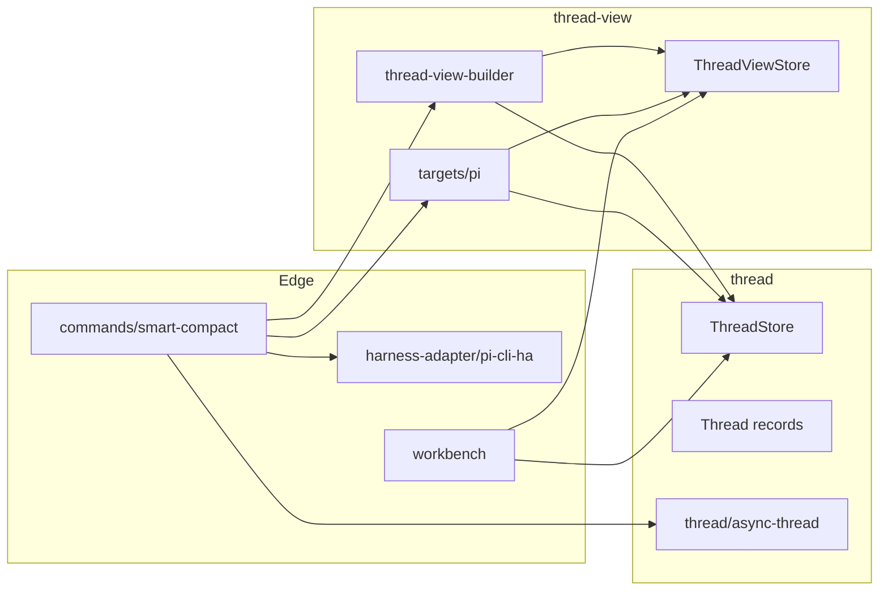

# Technical Design: Deterministic Band And Projection Mechanics

## Purpose

This document translates Epic 3, Deterministic Band And Projection Mechanics,
into implementable architecture for PI Long Horizon. It is the implementation
source of truth for deterministic smooth-turn generation, deterministic chunk
lifecycle, placeholder lower-band outputs, Thread View rebuild under explicit
run inputs, PI-target Thread View output, manual smart compact, and PI reload.

The design serves three consumers:

| Audience | Value |
|---|---|
| Reviewers | Validate that Feature 3 fits the PRD, technical architecture, and Epic before code exists. |
| Developers | Build from concrete module boundaries, interfaces, flows, and verification gates. |
| Story technical sections | Pull exact targets, test mappings, and verification commands into published stories. |

This feature uses Config B:

- `tech-design.md`: index, decisions, system view, top-level module map, work breakdown
- `tech-design-thread.md`: `thread` and `thread/async-thread` implementation depth
- `tech-design-thread-view.md`: `thread-view`, PI target output, harness adapter, and command path depth
- `test-plan.md`: complete TC-to-test mapping, mock strategy, fixture strategy, integration plan, and E2E plan

The split is necessary because Feature 3 spans multiple real surfaces:

- canonical source Thread state
- async derived Thread state
- curated Thread View rebuild and materialization
- PI-target output shaping
- PI CLI harness loading

Trying to keep all of that in one index would flatten the design.

## Spec Validation

The epic is designable. Its core mechanics are clear, its Feature 3 / Feature 4
boundary is explicit, and the deterministic loop is now concrete enough to map
to code. The main design work is not discovering what the feature does. The
main work is settling implementation ownership, replacing stale architecture
labels with clearer module names, and defining where the cross-surface seams
actually live.

### Issues Found

| Issue | Spec / Upstream Location | Resolution | Status |
|---|---|---|---|
| Technical architecture still uses older labels like `Context Steward Core`, `Background Maintenance`, `Projection Compiler`, and `PI Runtime Integration`. | Technical architecture system-shape sections | Feature 3 adopts clearer surface names: `thread`, `thread/async-thread`, `thread-view`, `thread-view/targets/pi`, and `harness-adapter/pi-cli-ha`. These are naming and ownership clarifications, not a change to the underlying architecture split. | Resolved - deviated |
| Feature 2 ended with a shallow lower-band seam: test-injected chunk reads and incomplete production validation of lower-band selections. | Epic 2 implementation review findings | Feature 3 makes chunk lifecycle, placeholder artifacts, production-backed chunk reads, and lower-band validation real. The seam is closed here rather than backported into Feature 2. | Resolved - clarified |
| The technical architecture describes smart compact bounds as a ramped default schedule. Epic 3 now uses operator-supplied per-run inputs and defers stored defaults. | Technical architecture “Smart Compact Bounds”; Epic 3 assumptions and scope | Feature 3 uses explicit per-run lower-bound and band-mix inputs. Persisted default policies remain future work after deterministic dogfooding. | Resolved - deviated |
| Epic 3’s deterministic placeholder outputs are intentionally not semantic summaries, but they must still be first-class persisted artifacts. | Epic 3 AC-3, AC-5, AC-6 | The design persists placeholder detailed and brief outputs as normal derived Thread state under `thread/async-thread`, with explicit strategy markers and token counts. | Resolved - clarified |

No blocking spec defect remains that requires returning to epic drafting before
design.

## Context

Feature 1 proved that PI Long Horizon can capture runtime activity into a
canonical Thread without treating PI’s own session file as source truth.
Feature 2 proved that the product can expose that substrate as a real working
surface through Thread Views, search, inspection, draft lifecycle, and
activation. Feature 3 is where those two worlds become operationally coupled.
It is the first time the system has to take source Thread state, turn it into
derived deterministic state, use that state to rebuild a curated Thread View,
write a PI-target file, and tell the harness to load it.

The strongest architectural distinction in the product is still the source/view
split. `thread` owns the canonical source record. `thread-view` owns curated
runtime-facing context expressions over that source record. Feature 3 adds the
derived-state loop between them through `thread/async-thread`, and adds the
target-output and harness edge through `thread-view/targets/pi` and
`harness-adapter/pi-cli-ha`. If those responsibilities blur, the system falls
back into the same confusion that older names like `projection compiler` and
`context steward core` created.

This feature also has an unusually strong testing requirement. The problem is
not just “does a service return a value.” The problem is whether a whole
interlocking lifecycle behaves correctly across process boundaries and repeated
runs: closed Turns become smooth; smooth Turns become chunk state; chunks become
placeholder lower-band artifacts; draft Thread Views rebuild under explicit
inputs; PI-target files are written atomically; prior outputs archive; PI is
told to load the new file; blocked or degraded state is explicit when the loop
cannot complete. That means the design has to deliberately provide:

- service-level confidence for isolated mechanics
- integration coverage for real persisted state transitions
- E2E coverage for the command-driven deterministic loop

The final contextual constraint is that Feature 3 is deliberately not the
quality feature. It should not invent model involvement just because model-based
behavior would look more realistic. Feature 3 proves the machine works.
Feature 4 later improves the outputs. That means the design should optimize for:

- inspectability
- deterministic replay
- repairability
- explicit state
- tunable inputs without pretending those tunables are sacred architecture

## Tech Design Questions

The Epic 3 questions are answered below and are binding for this design unless
implementation forces a documented deviation.

| # | Answer |
|---|---|
| 1 | Deterministic smoothing formats one closed Turn into one smooth text field using fixed section markers: `[user]`, `[assistant]`, `[tool]`, and `[thinking]`. It concatenates ordered canonical content, normalizes whitespace, and applies deterministic tool-output truncation markers when tool output exceeds the configured policy. |
| 2 | Chunk closure uses smooth-token-count settings, not fixed values embedded in the architecture. The structure is stable: `targetMinSmoothTokens`, `targetSoftMaxSmoothTokens`, and `hardMaxSmoothTokens`. A chunk stays open below min. Once min is reached, if appending the next eligible Turn would exceed soft max, the current chunk closes before that next Turn. If appending a Turn reaches or exceeds hard max, that Turn is included and the chunk closes immediately with `closeReason = "hard_max"`. |
| 3 | Smart compact inputs validate as follows: `requestedLowerBound > 0`; each band percentage is numeric and `>= 0`; percentages sum to exactly `100` after normalization to the configured precision; `fullFidelity` and `smooth` cannot both be `0`; and invalid inputs reject before rebuild starts. |
| 4 | Placeholder 30% and 5% outputs use deterministic token-aware truncation over the normalized smooth chunk text. They truncate on token or word boundary, then append an explicit placeholder marker. `deterministic_truncate_30` and `deterministic_truncate_5` are the Feature 3 strategy values. |
| 5 | Deterministic repair uses both direct service calls and smart-compact preparation mode. The public command path exposes `mode: "strict" | "prepare"`. `strict` reports blockers without repair. `prepare` allows the command to trigger missing smooth-turn generation, chunk state completion, and placeholder artifact generation before rebuild continues. |
| 6 | The PI-target file uses PI’s native session-file format. `pi-thread-view-builder` converts materialized emitted Thread View messages into PI-compatible session entries. Raw full-fidelity messages preserve mapped target metadata where possible. Smooth and placeholder lower-band messages become generated PI message entries with explicit generated-source markers. |
| 7 | Archive retention keeps all prior PI-target Thread View files in v1 under the thread archive path. Dogfooding and debuggability are more important than aggressive cleanup in this phase. Manual cleanup or later retention policy work can prune old outputs after Feature 3 stabilizes. |
| 8 | Async-thread writes, Thread View writes, and smart compact all run through a thread-scoped mutation coordinator. Services take expected revision inputs and fail explicitly on stale state. Smart compact never writes from partially updated derived state because the command acquires a thread-scoped operation lease before rebuild, output write, archive, and PI handoff. |

## System View

Feature 3 touches five real surfaces. The old architecture labels still point
at the same broad responsibilities, but this design uses the clearer names
below.

| Surface | Maps From Older Architecture | This Feature’s Role |
|---|---|---|
| `thread` | old canonical-core ideas | Owns authoritative source Thread records and persisted derived Thread state. |
| `thread/async-thread` | old “background maintenance” ideas | Owns deterministic smoothing, chunk growth/closure, placeholder lower-band artifacts, and derived-state readiness. |
| `thread-view` | old workbench + projection assembly ideas | Owns rebuild of curated Thread Views and emitted message materialization. |
| `thread-view/targets/pi` | old “projection compiler” ideas | Builds and writes PI-target Thread View files from a rebuilt or active Thread View. |
| `harness-adapter/pi-cli-ha` | old “PI runtime integration” ideas | Owns telling the PI CLI harness to load the newly written PI-target Thread View file. |

`workbench` remains a top-level consumer surface. It is not the primary owner
of Feature 3 logic, but Feature 3 closes a seam that the workbench was only
faking in Feature 2: real chunk-backed lower-band reads, real closed-chunk
artifact availability checks, and real lower-band validation.

`commands` remains the thin application layer that sequences cross-surface work.
The smart compact command belongs there because it coordinates `thread`,
`thread/async-thread`, `thread-view`, `thread-view/targets/pi`, and
`pi-cli-ha`. It is not a domain surface on its own.

### External / Local Boundary Contracts

Feature 3 adds no off-machine API. The important boundaries are local:

| Boundary | Direction | Contract | Feature 3 Handling |
|---|---|---|---|
| Canonical Thread store | `thread` to disk | Source Thread records plus derived smooth/chunk/placeholder state | Real file-backed reads and writes through `ThreadStore` operations |
| Thread View store | `thread-view` to disk | Draft/active/archived Thread View records and emitted messages | Real file-backed reads and writes through `ThreadViewStore` |
| PI-target file writer | `thread-view/targets/pi` to disk | PI-native target file plus archived prior outputs | Atomic write + archive |
| PI CLI harness adapter | application to PI | Load request for a PI-target Thread View file | `pi-cli-ha` tells PI to load the file through the existing session-switch path |
| Workbench lower-band inspection | `workbench` to `thread` / `thread-view` | Closed-chunk lifecycle and placeholder availability | Real production-backed chunk read path replaces injected-only seam |

### Data Flow Overview

There are two major runtime paths in Feature 3.

**1. Async Thread preparation path**

- canonical Turn closes
- deterministic smooth state is built or refreshed
- chunk eligibility is evaluated
- open Chunk updates
- chunk closes when threshold rule is met
- placeholder detailed/brief outputs are generated for closed Chunk
- readiness state is persisted for later rebuild and inspection

**2. Smart compact path**

- operator invokes smart compact with explicit run inputs
- command acquires thread-scoped mutation lease
- command chooses `strict` or `prepare` preflight mode
- command validates inputs and required state
- command rebuilds draft Thread View
- PI-target Thread View file is built
- PI-target file is written atomically
- prior PI-target file archives if present
- PI CLI harness adapter tells PI to load the new file

### Top-Level Interaction



The key rule is simple:

- `thread` never depends on `thread-view`
- `thread-view` depends on `thread`
- `harness-adapter` stays at the edge
- `commands` sequences cross-surface operations

## Architecture Decisions

The decisions below are the real structure of Feature 3. The module names only
matter if they preserve these ownership rules.

| Decision | Choice | Rationale | Epic Coverage |
|---|---|---|---|
| Source/view split | Keep `thread` and `thread-view` as separate top-level surfaces | Prevents curated runtime context from collapsing back into source truth. | AC-4, AC-5 |
| Async derived-state location | Place `async-thread` under `thread` | Smooth state, chunks, and placeholders are derived Thread state, not a separate peer domain. | AC-1, AC-2, AC-3, AC-6 |
| PI target shaping | Put PI-target building under `thread-view/targets/pi` | PI is one target-specific Thread View output, not the center of the system. | AC-5 |
| PI harness edge | Put PI load behavior under `harness-adapter/pi-cli-ha` | Keeps PI CLI handoff as an edge adapter instead of mixing it into the builder or source domain. | AC-5.4 |
| Command orchestration | Keep cross-surface sequencing in `commands/smart-compact.ts` | Smart compact crosses too many surfaces to hide inside one domain service. | AC-4, AC-5, AC-6 |
| Feature 2 seam closure | Replace empty/injected lower-band reads with production-backed chunk reads | Lower-band awareness is no longer enough; Feature 3 makes chunk-backed lower bands real. | AC-3, AC-4, AC-6 |
| Placeholder outputs | Persist placeholder detailed and brief artifacts as ordinary derived Thread state | They must survive restarts and be consumable by rebuild and workbench inspection. | AC-3, AC-6 |
| Per-run compaction inputs | Use explicit run inputs, not stored defaults | Feature 3 is about dogfooding mechanics, not pretending policy is settled. | AC-4, AC-5 |
| PI-target file retention | Archive every prior output in v1 | Dogfooding and debug visibility outweigh aggressive retention optimization here. | AC-5.3 |
| Verification strategy | Design integration and E2E as first-class suites | This feature is an interlocking mechanics seam; unit tests alone are not enough. | All flows |

## Module Boundaries

Feature 3 is also the point where the repo should stop deepening the older
`context-steward` / `context-workbench` names. This design adopts the new
surface names directly and treats compatibility shims as temporary migration
scaffolding if implementation chooses to keep them.

```text
src/
  thread/
    domain/
      records.ts
      errors.ts
      ids.ts
      output-metadata.ts
    store/
      thread-store.ts
      file-thread-store.ts
      schema-version.ts
      mutation-coordinator.ts
    services/
      thread-service.ts
      turn-service.ts
      capture-service.ts
      import-service.ts
      repair-service.ts
    async-thread/
      domain/
        smooth-turn-state.ts
        chunk-state.ts
        placeholder-artifact-state.ts
        async-thread-status.ts
        settings.ts
      services/
        smooth-turn-service.ts
        chunk-service.ts
        placeholder-artifact-service.ts
        async-thread-run-service.ts
      test/
        fixtures.ts
        temp-thread-store.ts

  thread-view/
    domain/
      thread-view-records.ts
      thread-view-errors.ts
      pi-thread-view-file.ts
    store/
      thread-view-store.ts
      file-thread-view-store.ts
    services/
      thread-view-builder.ts
      thread-view-materializer.ts
      thread-view-activation-service.ts
      thread-view-compare-service.ts
    targets/
      pi/
        pi-thread-view-builder.ts
        pi-thread-view-writer.ts
    test/
      fixtures.ts
      temp-thread-view-store.ts

  workbench/
    domain/
      workbench-errors.ts
    services/
      workbench-query-service.ts
      workbench-search-service.ts
    test/
      fixtures.ts
      temp-workbench-store.ts

  harness-adapter/
    pi-cli-ha/
      pi-cli-ha.ts
      load-thread-view-file.ts

  commands/
    command-results.ts
    smart-compact.ts
```

### Responsibility Matrix

| Module / Surface | Status | Responsibility | Dependencies | ACs Covered |
|---|---|---|---|---|
| `thread/*` | Move/extend existing | Canonical source Thread records, ordering, mutation coordination, existing capture/import/repair foundation | filesystem, PI capture data | AC-1, AC-2, AC-6 |
| `thread/async-thread/*` | New | Deterministic smooth state, chunk state, placeholder outputs, readiness reporting | `thread` store/services | AC-1, AC-2, AC-3, AC-6 |
| `thread-view/services/thread-view-builder.ts` | New | Rebuild a draft Thread View from source and run inputs | `thread`, `thread-view` store | AC-4 |
| `thread-view/services/thread-view-materializer.ts` | Move/reshape existing | Materialize emitted messages from selected turns and chunks | `thread`, `thread-view` | AC-4, AC-6 |
| `thread-view/targets/pi/pi-thread-view-builder.ts` | New | Convert rebuilt Thread View into PI-native target file content | `thread-view`, `thread` | AC-5 |
| `thread-view/targets/pi/pi-thread-view-writer.ts` | New | Atomic write and archive of PI-target Thread View files | filesystem | AC-5.2, AC-5.3 |
| `harness-adapter/pi-cli-ha/*` | New | Tell PI CLI to load the written PI-target file | PI runtime seam | AC-5.4 |
| `commands/smart-compact.ts` | New | Sequence validate -> prepare -> rebuild -> write -> archive -> load | all above | AC-4, AC-5, AC-6 |
| `workbench/*` | Move/reshape existing | Real lower-band readiness and chunk detail over persisted chunk state | `thread`, `thread-view` | AC-6, Feature 2 seam closure |

## Verification Scripts

The existing project scripts are sufficient and should be preserved:

| Gate | Command | Purpose |
|---|---|---|
| `red-verify` | `npm run red-verify` | TDD Red exit: typecheck only |
| `verify` | `npm run verify` | Standard development gate |
| `green-verify` | `npm run green-verify` | TDD Green exit with test immutability |
| `verify-all` | `npm run verify-all` | Unit + integration + E2E deep gate |

Feature 3 must add real integration and E2E suites to make `verify-all`
meaningful for this new loop. The test plan defines those suites explicitly.

## Work Breakdown Summary

The chunk structure follows the Epic 3 story breakdown with one addition:
Chunk 0 includes the surface/name migration scaffolding so the rest of the
feature can land on the cleaner top-level structure.

| Chunk | Scope | ACs |
|---|---|---|
| Chunk 0 | Foundation and surface migration (`thread`, `thread-view`, `workbench`, `harness-adapter`, `commands`) | Infrastructure only |
| Chunk 1 | Deterministic smooth turns | AC-1.1 to AC-1.4 |
| Chunk 2 | Deterministic chunk lifecycle | AC-2.1 to AC-2.5 |
| Chunk 3 | Placeholder lower-fidelity outputs | AC-3.1 to AC-3.4 |
| Chunk 4 | Deterministic Thread View rebuild | AC-4.1 to AC-4.6 |
| Chunk 5 | Manual smart compact, PI-target output, archive, and PI load | AC-5.1 to AC-5.6 |
| Chunk 6 | Blocked and degraded deterministic maintenance state | AC-6.1 to AC-6.5 |

## Open Questions

| # | Question | Owner | Blocks | Resolution |
|---|---|---|---|---|
| Q2 | Does PI-target file writing need a dedicated archive manifest file, or is path-based retention enough in v1? | Tech Lead | Chunk 5 | Pending |
| Q3 | Should `prepare` or `strict` be the default smart compact mode during early dogfooding? | Human + Tech Lead | Chunk 5 | Pending |

## Deferred Items

| Item | Related AC | Reason Deferred | Future Work |
|---|---|---|---|
| Whether `workbench` remains a top-level surface or later folds under `thread-view` | Feature 2 and Feature 3 surface organization | Does not block Feature 3 implementation and does not change any Feature 3 contract | Revisit after Feature 3 stabilizes |
| Persisted default compaction policies | AC-4, AC-5 | Feature 3 intentionally uses explicit run inputs instead of settled defaults | Feature 4 or later |
| Model-based smoothing and summaries | AC-1, AC-2, AC-3 | Feature 3 proves mechanics only | Feature 4 |
| Automatic smart compact trigger | AC-5 | Manual trigger only in Feature 3 | Later runtime automation |

## Related Documentation

- Epic: [epic.md](/Users/leemoore/code/pi-long-horizon/docs/spec-build/epics/03-deterministic-band-and-projection-mechanics/epic.md)
- Companion: [tech-design-thread.md](/Users/leemoore/code/pi-long-horizon/docs/spec-build/epics/03-deterministic-band-and-projection-mechanics/tech-design-thread.md)
- Companion: [tech-design-thread-view.md](/Users/leemoore/code/pi-long-horizon/docs/spec-build/epics/03-deterministic-band-and-projection-mechanics/tech-design-thread-view.md)
- Test Plan: [test-plan.md](/Users/leemoore/code/pi-long-horizon/docs/spec-build/epics/03-deterministic-band-and-projection-mechanics/test-plan.md)
- Technical Architecture: [technical-architecture.md](/Users/leemoore/code/pi-long-horizon/docs/spec-build/technical-architecture.md)
- Feature 3 Addendum: [prd-feature-3-addendum.md](/Users/leemoore/code/pi-long-horizon/docs/spec-build/prd-feature-3-addendum.md)
