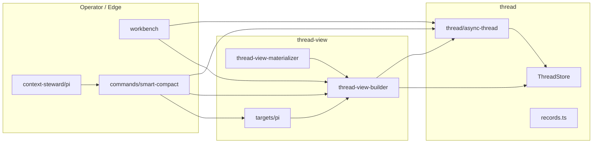
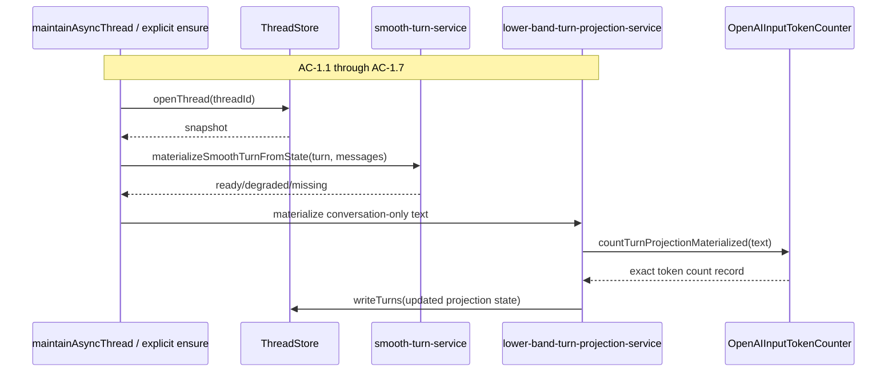
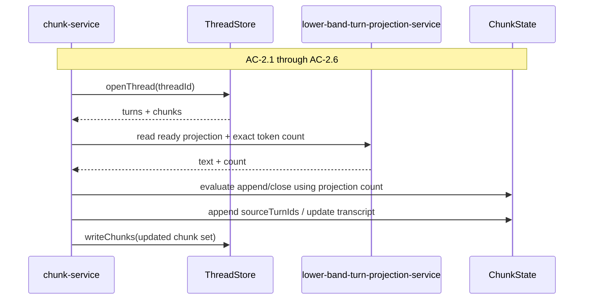
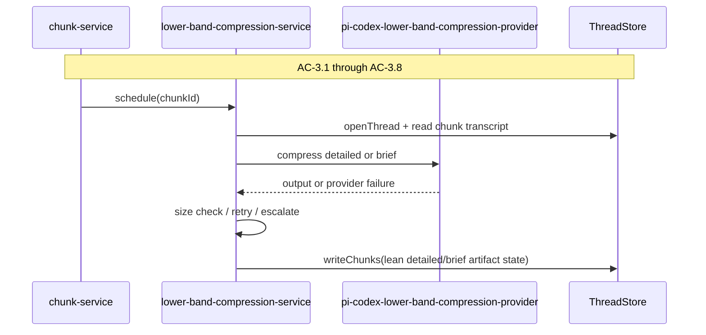
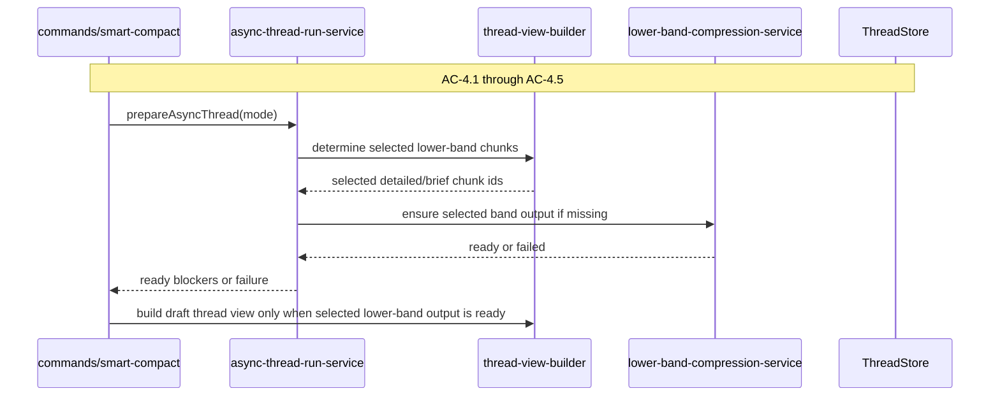
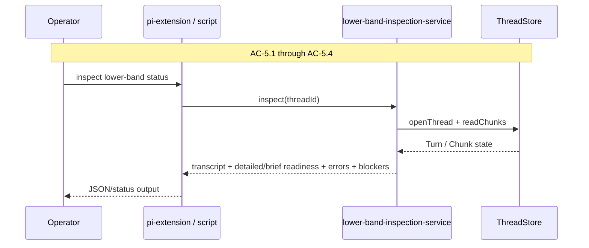
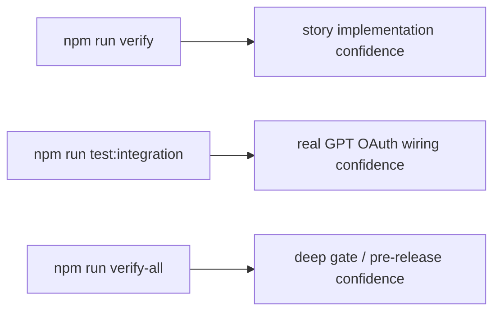

# Technical Design: Real Lower-Band Compression

## Purpose

This document translates Epic 5, Real Lower-Band Compression, into
implementable architecture for PI Long Horizon. It is the implementation source
of truth for:

- conversation-only Turn projection derived from smooth components
- lower-band-native Chunk membership using projection token counts
- persisted conversation-only Chunk transcript state
- GPT OAuth-backed detailed and brief semantic lower-band generation
- smart compact lower-band readiness, catch-up, and failure semantics
- inspection/reporting surfaces for lower-band readiness and failures
- replacement of the deterministic placeholder runtime path

The design serves three consumers:

| Audience | Value |
|---|---|
| Reviewers | Validate that Epic 5 fits the technical architecture and current repo shape before code is written. |
| Developers | Build from concrete module boundaries, state transitions, interfaces, and verification gates. |
| Story technical sections | Pull exact module targets, TC mapping, risk tests, and verification commands into published stories. |

Epic 5 uses **Config A**:

- `tech-design.md`: decisions, context, system view, module architecture, flows, interfaces, work breakdown
- `test-plan.md`: full TC-to-test mapping, mock strategy, fixture contracts, non-TC architecture-risk tests, chunk test counts

The design stays in one index because this is one local runtime/backend domain
despite touching several surfaces. The test plan remains separate because the
TC mapping and architecture-risk coverage are too dense to inline cleanly.

This is a first-pass design. Prompt wording, exact model lane quality, and
compression feel will be refined after dedicated prompt/model test runs. The
architecture, state ownership, and verification boundaries here are intended to
be stable enough to support that later calibration work.

## Spec Validation

The epic is ready for Tech Design. The lower-band scope is clear, the
placeholder-removal constraint is explicit, and the verification expectations
are concrete. The biggest design work is not discovering what the feature is;
the main work is replacing the current placeholder seam without leaving hidden
compatibility behavior, and doing so in a way that preserves deterministic
source preparation and real integration verification.

### Issues Found

| Issue | Spec / Upstream Location | Resolution | Status |
|---|---|---|---|
| Current closed Chunk maintenance refreshes `smoothText` in place and clears placeholders when the materialized smooth source changes. | `src/thread/async-thread/services/chunk-service.ts` | Epic 5 preserves one Chunk concept but changes the normal lower-band path so closed Chunk membership is not silently rewritten. Legacy/old Chunk state blocks lower-band selection until cleared or explicitly rebuilt. | Resolved - clarified |
| Current lower-band runtime path is still named and structured around placeholder artifacts. | `src/thread/async-thread/domain/placeholder-artifact-state.ts`, `src/thread/async-thread/services/placeholder-artifact-service.ts`, `src/thread-view/services/thread-view-builder.ts` | Epic 5 introduces real lower-band artifact ownership and removes placeholder runtime selection. Placeholder-era code remains only until cutover and is then removed. | Resolved - deviated |
| Current exact token-count persistence covers raw Turns, smooth Turns, smooth Chunks, placeholder detailed output, placeholder brief output, and generated sessions. It does not cover a conversation-only Turn projection because that surface does not exist yet. | `src/token-accounting/token-count-metadata.ts`, current async-thread services | Epic 5 adds a proper persisted token count for the conversation-only Turn projection because it drives Chunk boundaries. Detailed/brief runtime routing estimates remain transient and unpersisted. | Resolved - clarified |
| Technical architecture describes durable background-maintenance jobs, but the current repo does not yet expose a real Job record family in `ThreadStore`. | technical architecture “Background Maintenance”, current `ThreadStore` and async-thread services | Epic 5 does not add a new durable job store. Instead it persists lower-band artifact `pending` / `failed` status on Turn and Chunk derived state and relies on idempotent maintenance / prepare-mode catch-up to resume work. This is a deliberate temporary deviation until a first-class job record family exists. | Resolved - deviated |
| Current verification scripts exist and already match the stable `ls-tech-design` tier names, but `verify-all` can be over-read if no integration/E2E suites are meaningful yet. | `package.json`, `scripts/run-node-tests.mjs` | Epic 5 uses the existing scripts as the project truth. Story acceptance requires `verify` and `test:integration`. `verify-all` remains the deeper gate; its meaning is documented explicitly in this design and test plan. | Resolved - clarified |
| Current smoothing provider and non-blocking scheduling pattern exist for user prompts only. | `src/thread/async-thread/services/user-prompt-smoothing-service.ts`, `src/thread/async-thread/services/pi-codex-user-prompt-smoothing-provider.ts` | Epic 5 reuses the provider/auth/transport pattern but introduces a dedicated lower-band compression service and provider. Lower-band generation is not folded into user-prompt smoothing. | Resolved - clarified |

No blocking epic defect remains that requires returning to epic drafting before
design.

## Context

Feature 3 proved that PI Long Horizon can maintain a deterministic multi-band
memory substrate over a canonical Thread. Closed Turns can be smoothed,
eligible Turns can be grouped into Chunks, and smart compact can rebuild a
Thread View, write a PI-compatible generated session file, and reload PI. That
mechanical loop is real. What is still fake is the lower-band quality layer.
Detailed and brief are currently deterministic truncations over `chunk.smoothText`,
which means older memory can remain mechanically present while still giving PI
weak or misleading long-horizon recall.

Feature 4 work in flight changed the smooth substrate significantly. Smooth
state is now component-first, user prompt smoothing already has a GPT OAuth
provider path, and inspection/reporting surfaces exist for smoothing quality and
active rollout state. Epic 5 should build on that substrate rather than
recreating a separate lower-band pipeline. The correct source chain is now:
canonical messages -> smooth components -> conversation-only Turn projection ->
Chunk transcript -> detailed/brief semantic output.

The hardest boundary in this feature is not model prompting; it is state
ownership. The system must keep source truth, derived truth, and projection
truth distinct:

- canonical Messages remain append-only source truth
- smooth components and conversation-only Turn projections are derived Thread
  state
- Chunks remain groups of Turns, not parallel memory objects
- detailed and brief are derived Chunk artifacts
- generated PI session files remain disposable projection output

If those ownership lines blur, the placeholder seam will simply be replaced by
another hidden compatibility seam.

The next constraint is verification realism. This repo is file-backed, and file
behavior is part of the product contract. Restart survival, atomic writes,
archive behavior, and persisted derived-state repair are not incidental IO.
Service-mock tests therefore need to use real temp stores for the stateful
paths that matter, while mocking only true external boundaries like GPT OAuth
inference and edge adapters. Full integration verification must then prove the
real GPT OAuth lower-band path end to end.

The final contextual constraint is timing. This draft is being written before
the dedicated prompt/model calibration pass. That means the architecture should
stabilize the source chain, state model, routing hooks, retry semantics, and
verification boundaries now, while treating exact prompt wording and lane tuning
as provisional implementation details that will be refined after deliberate
dogfood runs.

## Tech Design Questions

The Epic 5 questions are answered below and are binding for this design unless
implementation forces a documented deviation.

| # | Answer |
|---|---|
| 1 | Store the conversation-only Turn projection inside `TurnSmoothRecord` as a nested derived record. It belongs to the smooth-derived state family because it is built from smooth components, not from raw messages or a separate store file. |
| 2 | Do not implement polished migration of old placeholder-era Chunk state. New sessions use the new Chunk shape. New Epic 5 Chunk records write `schemaVersion = "conversation_only_chunk_v1"`. Legacy detection uses schema version when present and falls back to legacy-field presence (`placeholders`, missing transcript state) when absent. Any legacy Chunk state encountered by Epic 5 lower-band selection is treated as blocked/not ready until cleared or explicitly rebuilt. Closed Chunk membership is never silently rewritten in the normal maintenance path. |
| 3 | Add a new token-count scope named `turn_lower_band_projection_materialized` for the persisted conversation-only Turn projection count. This is the authority for Chunk boundary decisions and should use the existing exact/provider-input counting path rather than a heuristic estimate. Semantic lower-band output accounting should reuse `detailed_chunk_materialized` and `brief_chunk_materialized`, but those scopes now count semantic artifact text under `chunk.lowerBand` rather than placeholder text under `chunk.placeholders`. |
| 4 | When a Chunk closes, persist/refresh its conversation-only Chunk transcript and schedule asynchronous detailed/brief generation through a chunk-scoped lower-band compression service. Retry counters and model/routing details stay in logs, not source-truth artifacts. |
| 5 | Write lower-band generation logs under `.context-steward/debug/`, following the existing timing and smoothing log pattern. Catch-up events also write visible standard-error warnings because the operator explicitly wants to notice them during compact preparation. |
| 6 | Reuse the existing GPT OAuth auth and `@earendil-works/pi-ai` completion pattern from user-prompt smoothing, but use a dedicated lower-band compression provider and prompt surface. Lower-band generation should not be coupled to the user-prompt smoothing provider beyond shared auth/transport patterns. |
| 7 | Use the repo’s existing scripts as the project truth: `red-verify`, `verify`, `green-verify`, `verify-all`, `test:integration`, and `test:e2e`. Story acceptance requires `verify` for every story, and `test:integration` for Story 3 and every later story. `verify-all` remains the full gate; it is meaningful for Epic 5 only after real integration coverage is added. |
| 8 | Replace placeholder generation code and tests in phases: introduce the new lower-band modules first, switch runtime selection to them, then remove placeholder-domain services, builder accounting, inspection/reporting assumptions, and tests that bless placeholder behavior. No runtime compatibility shim remains after cutover. |
| 9 | Keep detailed/brief prompt templates and model-routing defaults in the lower-band provider/service layer. Keep calibration notes, prompt variants, and comparison artifacts under docs and logs, not in source-truth Thread or Chunk state. |
| 10 | Extend smart compact blocker reporting and workbench inspection so they can identify: missing Turn projections, invalid/stale legacy Chunk state, missing Chunk transcript, failed detailed generation, failed brief generation, and whether smart compact had to perform synchronous catch-up. The canonical operator entry is the PI extension command surface; the local script remains a developer convenience that delegates to the same workbench service. |

## System View

Epic 5 touches five real surfaces from the existing architecture.

| Surface | Inherited From Technical Architecture | This Feature’s Role |
|---|---|---|
| `thread` | Context Steward Core | Owns canonical records plus persisted smooth-derived Turn state and Chunk state. |
| `thread/async-thread` | Background Maintenance | Owns conversation-only Turn projection, lower-band-native Chunk assembly, async detailed/brief generation, and readiness/catch-up behavior. |
| `thread-view` | Projection Compiler + Workbench seam | Owns lower-band selection, materialization, and generated session budgeting against the new semantic lower-band artifacts. |
| `workbench` | Context Workbench | Owns lower-band inspection, compaction reporting, and chunk/readiness visibility for operators. |
| `commands` + `context-steward/pi` | PI Runtime Integration edge | Own command/extension entry points, operator-visible warnings, and PI-facing status output over the lower-band state. |

### External / Local Boundary Contracts

Epic 5 adds no new off-machine product API. The important boundaries are local
and provider-facing:

| Boundary | Direction | Contract | Epic 5 Handling |
|---|---|---|---|
| Canonical Thread store | `thread` to disk | Turns, Chunks, and derived lower-band state persist across reopen/restart | Real file-backed reads and writes through `ThreadStore` |
| Thread View store | `thread-view` to disk | Draft/active Thread Views and emitted messages | Real file-backed reads and writes through `ThreadViewStore` |
| GPT OAuth inference | `thread/async-thread` to provider | Detailed/brief semantic compression over supplied transcript text | Dedicated provider with retry/escalation and auth failure reporting |
| Generated PI session output | `thread-view` to disk | Final generated PI session file plus archive | Existing PI writer remains the projection output boundary |
| PI extension/commands | local command surface to operator/runtime | Smart compact execution, lower-band inspection commands, stderr/log visibility | Existing command/extension shape expanded, not replaced |
| Operational logs | services to `.context-steward/debug/` | Retry, escalation, catch-up, timing, and provider failure evidence | Lower-band generation writes logs without bloating source-truth artifacts |

### Data Flow Overview

Epic 5 introduces two linked but distinct maintenance paths.

**1. Conversation-only source preparation**

- a Turn closes and smooth components become current
- the conversation-only Turn projection is derived from those smooth components
- the proper token count for that projection is computed and persisted
- Chunk membership decisions use that persisted count
- the Chunk transcript is assembled from the Turn projections contained by the Chunk

**2. Semantic lower-band generation and use**

- when a Chunk closes, the system schedules asynchronous detailed/brief generation
- the lower-band compression service chooses a lane from runtime estimates
- detailed/brief outputs are written as lean semantic artifact state
- smart compact later selects those outputs for detailed and brief bands
- if selected output is missing, smart compact performs visible synchronous catch-up or fails specifically

### Top-Level Interaction



The key rules remain:

- `thread` owns source and persisted derived state
- `thread-view` consumes `thread`
- `workbench` and `commands` stay thin consumer/orchestrator surfaces
- GPT OAuth is an external provider boundary, not a new top-tier domain

## Architecture Decisions

| Decision | Choice | Rationale | Epic Coverage |
|---|---|---|---|
| Turn projection location | Add a conversation-only derived record inside `TurnSmoothRecord` | The projection is built from smooth components and should stay coupled to the smooth-derived Turn state rather than becoming a parallel top-level record family. | AC-1, AC-2 |
| Chunk identity model | Keep one Chunk concept with `sourceTurnIds`; add separate conversation-only transcript state | The user explicitly rejected “smooth chunks vs lower-band chunks.” Chunks contain Turns; different derived texts serve different bands. | AC-2 |
| Boundary-driving counts | Persist proper token counts only for the conversation-only Turn projection under `turn_lower_band_projection_materialized` | Those counts determine Chunk boundaries and must be durable. Runtime estimates are only for routing/retry checks and remain transient. | AC-2, AC-3 |
| Chunk transcript storage | Persist a lean conversation-only transcript state on the Chunk | The transcript is a first-class lower-band source artifact used by both detailed and brief generation and needed for inspection/catch-up. | AC-2, AC-5 |
| Lower-band artifact storage | Replace placeholder artifacts with lean semantic detailed/brief artifact state on the Chunk | The user explicitly does not want placeholder compatibility shims or bulky artifact provenance in source truth. | AC-3, AC-4 |
| Detailed/brief token accounting | Reuse `detailed_chunk_materialized` and `brief_chunk_materialized` scopes for semantic lower-band artifact text during prepare/build runs; do not persist token count metadata on the detailed/brief artifact record | The user rejected storing estimated token counts and wants lean artifact state. The text itself is the source of truth; budget accounting can be recomputed per run. | AC-3, AC-4 |
| Closed Chunk mutation | Normal maintenance never silently rewrites closed Chunk membership | Current code refreshes closed Chunk smooth text in place. Epic 5 needs explicit blocking or explicit rebuild/supersession instead. | AC-2.6 |
| Legacy placeholder-era Chunk handling | Treat legacy/placeholder-era Chunk state as blocked for real lower-band selection | No polished migration is required for this phase, and the user is willing to clear PI sessions. Blocking is safer than fake compatibility. | AC-2.6, AC-4.4, AC-4.5 |
| Async generation pattern | Mirror the current user-prompt smoothing scheduling pattern at chunk scope, but with a dedicated lower-band compression service | This reuses known auth/logging patterns while keeping lower-band retry and artifact semantics separate. | AC-3 |
| Async work durability | Persist `pending` / `failed` artifact state and resume work through repeated maintenance and prepare-mode catch-up instead of introducing a new durable Job record family in this phase | This aligns with the current repo reality while preserving visible, resumable work state. | AC-3, AC-4, AC-5 |
| Compression retry policy | Attempts 1 and 2 use routed lane; attempt 3 escalates to GPT-5.5 medium and accepts first output | This comes directly from the epic and should be encoded as deterministic retry behavior. | AC-3.4, AC-3.5, AC-3.6 |
| Smart compact catch-up | Catch-up is allowed only for selected lower-band outputs and is loud | Catch-up is an abnormal repair path, not the normal steady state. The operator wants visible warnings and specific failure when catch-up fails. | AC-4 |
| Verification gates | Use repo scripts as truth, but make `test:integration` the story-level real integration gate for Story 3 and every later story | The script names already exist; the design should make their meaning explicit rather than inventing new names. | AC-6 |

## Module Boundaries

Epic 5 should keep the repo’s established ownership shape and avoid inventing a
parallel lower-band subsystem.

### Module Architecture

```text
src/thread/domain/
  records.ts                                      # MODIFIED: add conversation-only Turn projection record shape

src/thread/async-thread/domain/
  smooth-turn-state.ts                            # MODIFIED: projection helpers + materialized projection state
  chunk-state.ts                                  # MODIFIED: conversation transcript + semantic lower-band artifact state
  settings.ts                                     # MODIFIED: lower-band compression runtime defaults
  lower-band-artifact-state.ts                    # NEW: chunk transcript + detailed/brief artifact record types

src/thread/async-thread/services/
  smooth-turn-service.ts                          # MODIFIED: expose conversation-only projection materialization helpers
  lower-band-turn-projection-service.ts           # NEW: persist projection text + exact boundary-driving token count
  chunk-service.ts                                # MODIFIED: Chunk membership based on Turn projection count; transcript assembly
  lower-band-compression-service.ts               # NEW: async generation, retry, escalation, catch-up, logs
  pi-codex-lower-band-compression-provider.ts     # NEW: GPT OAuth provider for detailed/brief compression
  async-thread-run-service.ts                     # MODIFIED: readiness, catch-up, and blocker policy switch from placeholders

src/thread-view/domain/
  thread-view-records.ts                          # MODIFIED: workbench chunk reads and lower-band readiness semantics

src/thread-view/services/
  thread-view-builder.ts                          # MODIFIED: select/count semantic lower-band output instead of placeholders
  thread-view-materializer.ts                     # MODIFIED: materialize semantic lower-band messages and remove placeholder assumptions

src/workbench/services/
  lower-band-inspection-service.ts                # NEW: operator-facing lower-band readiness and failure inspection
  active-rollout-inspection-service.ts            # MODIFIED: semantic lower-band rollout awareness
  compaction-report-service.ts                    # MODIFIED: semantic lower-band freshness/blocker reporting
  compaction-report-formatter.ts                  # MODIFIED: lower-band semantic readiness formatting

src/context-steward/pi/
  pi-extension.ts                                 # MODIFIED: lower-band inspection command wiring and warning surfaces

scripts/
  inspect-lower-band-status.ts                    # NEW: local lower-band inspection script

src/token-accounting/
  token-count-metadata.ts                         # MODIFIED: add projection token-count scope
  counter-source-policy.ts                        # MODIFIED: add policy handling for projection and semantic lower-band counting scopes
  materialized-representation-counter.ts          # MODIFIED: count semantic lower-band artifact text
  openai-input-token-counter.ts                   # MODIFIED: exact/provider-input counts for projection and semantic lower-band artifact text
```

### Responsibility Matrix

| Module | Status | Responsibility | Dependencies | ACs Covered |
|---|---|---|---|---|
| `src/thread/domain/records.ts` | MODIFIED | Canonical record vocabulary for Turn projection and Chunk lower-band artifact state | token-count types | AC-1 to AC-5 |
| `src/thread/async-thread/domain/smooth-turn-state.ts` | MODIFIED | Pure helpers and state cloning/materialization support for conversation-only Turn projection | `records.ts`, token-count metadata | AC-1, AC-2 |
| `src/thread/async-thread/domain/chunk-state.ts` | MODIFIED | Chunk lifecycle state plus new transcript/artifact state | lower-band artifact state, token-count types | AC-2 to AC-5 |
| `src/thread/async-thread/domain/lower-band-artifact-state.ts` | NEW | Lean Chunk transcript and semantic artifact record shapes | token-count types only where needed for transcript/Turn counts | AC-2 to AC-5 |
| `src/thread/async-thread/services/lower-band-turn-projection-service.ts` | NEW | Persist conversation-only Turn projection text and exact boundary-driving count | `ThreadStore`, smooth-turn-service, OpenAI input counter | AC-1, AC-2 |
| `src/thread/async-thread/services/chunk-service.ts` | MODIFIED | Maintain one Chunk list from projection counts, assemble smooth text and conversation-only transcript, enforce legacy blocking | `ThreadStore`, projection service, token-count helpers | AC-2 |
| `src/thread/async-thread/services/lower-band-compression-service.ts` | NEW | Generate detailed/brief semantic outputs, retry, escalate, log, and provide sync catch-up | provider, `ThreadStore`, chunk service | AC-3, AC-4 |
| `src/thread/async-thread/services/pi-codex-lower-band-compression-provider.ts` | NEW | GPT OAuth-backed completion for detailed/brief prompts | `@earendil-works/pi-ai`, `AuthStorage` | AC-3, AC-6 |
| `src/thread/async-thread/services/async-thread-run-service.ts` | MODIFIED | Maintain artifact readiness and prepare-mode catch-up using projection/compression services | chunk service, projection service, compression service, token-count policy | AC-1.6, AC-3, AC-4 |
| `src/thread-view/services/thread-view-builder.ts` | MODIFIED | Select lower-band semantic outputs, compute per-run lower-band counts, and build draft Thread Views | thread store, async-thread services, token accounting | AC-2.4, AC-4 |
| `src/thread-view/services/thread-view-materializer.ts` | MODIFIED | Emit semantic lower-band messages and remove placeholder-explicit assumptions from normal runtime materialization | builder outputs, thread-view records | AC-4, AC-5 |
| `src/workbench/services/lower-band-inspection-service.ts` | NEW | Report transcript readiness, detailed/brief status, and error summaries | `ThreadStore` | AC-5 |
| `src/workbench/services/compaction-report-service.ts` | MODIFIED | Include semantic lower-band readiness/catch-up/blocker reporting in compact audit | thread store, builder accounting | AC-5 |
| `src/context-steward/pi/pi-extension.ts` + `scripts/inspect-lower-band-status.ts` | MODIFIED / NEW | Operator-facing command surfaces for lower-band status | workbench services | AC-5, AC-6 |
| `src/token-accounting/token-count-metadata.ts` + counters | MODIFIED | Add projection token-count scope, policy handling, and semantic lower-band artifact counting over new artifact text | existing counter source policy and provider-input counting | AC-2.2, AC-3 |

### Placeholder Cutover Inventory

The following runtime consumers must stop treating placeholder state as valid
lower-band behavior:

- `src/thread/async-thread/services/async-thread-run-service.ts`
- `src/thread-view/services/thread-view-builder.ts`
- `src/thread-view/services/thread-view-materializer.ts`
- `src/thread-view/targets/pi/pi-thread-view-builder.ts`
- `src/workbench/services/compaction-report-service.ts`
- `src/workbench/services/active-rollout-inspection-service.ts`
- `src/context-steward/pi/pi-extension.ts`
- tests and fixtures that currently assume `chunk.placeholders` is the normal
  lower-band runtime path

These surfaces may temporarily recognize legacy placeholder-era state only to
block or report it. None of them may treat it as ready lower-band output after
cutover.

### Surface Ownership / Compatibility Boundary

| Concern | Canonical Owner | Compatibility / Temporary Layer | Rule |
|---|---|---|---|
| Turn conversation-only projection | `thread` / `thread/async-thread` | none | New code reads/writes the nested Turn projection state from the canonical Thread records only. |
| Chunk semantic lower-band artifacts | `thread` / `thread/async-thread` | placeholder-era state only for rollout blocking | New runtime code does not treat `placeholders` as valid lower-band outputs. |
| Lower-band selection | `thread-view` builder | none | Builder consumes semantic lower-band artifact state only. |
| Operator inspection | `workbench` | PI extension/scripts only as edge surfaces | PI command/script surfaces delegate to workbench services. |
| Legacy placeholder services | none after cutover | temporary only until replacement stories land | New code must not deepen imports into placeholder services. |

## Flow-by-Flow Design

### Flow 1: Conversation-Only Turn Projection

**Covers:** AC-1.1 through AC-1.7, AC-2.2

This flow turns current smooth component state into the lower-band Turn source.
It is still derived Thread state, not a projection output and not a new top-level
domain. The crucial property is stability: the same smooth component state must
produce the same projection text and the same exact boundary-driving token count.



**Design Notes**

- The projection service should reuse the existing smooth component ordering and
  source-fingerprint discipline rather than inventing a second component walk.
- User prompt text must come from the smooth user prompt component.
- Assistant-visible output includes non-final assistant-visible text segments.
- The service should emit separate `●` blocks for separate assistant-visible
  segments and one `>` block for the user prompt.
- Multi-user-prompt Turns are invalid projection inputs and should be reported as
  invalid, not flattened.
- Prepare-mode lower-band work that encounters missing smooth components must run
  smooth catch-up before projection catch-up. Projection catch-up never tries to
  compensate for absent required smooth component state.

### Flow 2: Lower-Band-Native Chunk Assembly

**Covers:** AC-2.1 through AC-2.6

This flow keeps one Chunk lifecycle but changes the count authority that decides
membership. Chunks still contain Turns. The new boundary-driving count is the
exact count on the per-Turn projection. `smoothText` remains a derived Chunk
representation; the conversation-only Chunk transcript becomes a second derived
representation for lower-band use.



**Deterministic Algorithm Boundary**

- `targetMinSmoothTokens`, `targetSoftMaxSmoothTokens`, and `hardMaxSmoothTokens`
  remain the active threshold settings in `settings.ts` for the first pass.
- The count used in those rules changes from `turn.smooth.tokenCountMetadata`
  to `turn.smooth.lowerBandProjection.tokenCountMetadata`.
- Below minimum, the open Chunk stays open.
- Once minimum is reached, if appending the next eligible Turn would exceed the
  soft max, the current Chunk closes before that next Turn is appended.
- If appending a Turn reaches or exceeds hard max, that Turn is included and the
  Chunk closes immediately.
- Closed Chunk membership is never silently rewritten during normal maintenance.
- If legacy/old Chunk state is encountered, lower-band selection blocks until
  the operator clears the session or explicit rebuild tooling is introduced.

### Flow 3: Async Detailed / Brief Generation

**Covers:** AC-3.1 through AC-3.8

When a Chunk closes with a ready conversation-only transcript, the system
should start semantic lower-band generation without blocking the deterministic
close path. This flow mirrors the current user-prompt smoothing scheduling
pattern but at chunk scope and with band-specific retry/escalation behavior.



**Design Notes**

- Provisional routing lanes for the first pass are:

| Transcript Estimate | Lane |
|---|---|
| `<= 1,000` | `gpt-5.4-mini` low |
| `1,001 - 1,500` | `gpt-5.4-mini` medium |
| `1,501 - 2,000` | `gpt-5.4-mini` high |
| `2,001 - 3,000` | `gpt-5.4` medium |
| `3,001 - 4,000` | `gpt-5.4` high |

- Attempts 1 and 2 use the routed lane chosen from `ceil(charCount / 3.5)`.
- Attempt 3 uses GPT-5.5 medium and accepts the first response regardless of
  size.
- Detailed target range is `15%-50%` of the conversation-only transcript
  estimate.
- Brief target range is `1%-20%` of the conversation-only transcript estimate.
- Inputs above the `4,000` estimated-token ceiling warn and truncate for that
  attempt.
- Retry/escalation/model/routing details live in logs only.
- Artifact state stays lean: status, text, error, updatedAt.
- Detailed/brief token counts for selection are recomputed on demand later from
  the stored text.

### Flow 4: Smart Compact Lower-Band Readiness And Catch-Up

**Covers:** AC-4.1 through AC-4.5

Smart compact is the consumer gate for the new lower-band path. It should use
real lower-band outputs only. If selected output is missing, it may attempt
synchronous catch-up generation for the selected Chunk and band. If the output
still cannot be produced, compact fails specifically. Placeholder runtime
fallback is removed.



**Design Notes**

- Prepare mode is the only path allowed to do synchronous catch-up.
- Catch-up logs to stderr and operational logs with Chunk and band identifiers.
- Placeholder-era state never satisfies lower-band readiness.
- Legacy Chunk schema/state should surface as explicit blockers.
- When prepare encounters a legacy/blocked Chunk in the selected lower-band set,
  it reports the blocker before draft build/materialization continues.
- No generated output is written when selected lower-band output is missing or
  fails catch-up.

### Flow 5: Inspection And Operator Visibility

**Covers:** AC-5.1 through AC-5.4

Epic 5 needs practical operator visibility, not a formal eval product. The
inspection flow should show whether the lower-band source and outputs exist,
what failed, and whether compact had to catch up.



### Flow 6: Verification Gates

**Covers:** AC-6.1 through AC-6.4

Epic 5 replaces a fake runtime path with a real one. The test architecture is
therefore part of the design, not a later convenience.



**Design Notes**

- `verify` is the fast/default story gate: `typecheck` plus service-mock tests.
- `test:integration` is the story-level real GPT OAuth gate, and Story 3 or any
  later compression story cannot be accepted without it existing and passing.
- `verify-all` remains the full gate and includes `test:e2e`; for Epic 5, E2E
  may remain empty initially, so its lack of coverage must not be mistaken for
  deep lower-band confidence.
- Compression stories cannot be accepted before the real integration gate exists
  and passes.

## Interface Definitions

The interfaces below are the first-pass contracts for the new lower-band
surfaces. They are intentionally close to the current repo’s shape.

### Turn Projection Types

```ts
export interface TurnLowerBandProjectionRecord {
  status: "ready" | "pending" | "failed" | "invalid";
  text?: string;
  tokenCountMetadata?: TokenCountRecord;
  sourceFingerprint?: string;
  sourceRevision?: number;
  generatedAt?: string;
  errorCode?: string;
  errorMessage?: string;
}
```

**Location:** `src/thread/domain/records.ts`

**Used by:** `smooth-turn-service.ts`, `lower-band-turn-projection-service.ts`,
`chunk-service.ts`, `async-thread-run-service.ts`

**Supports:** AC-1.1 through AC-1.7, AC-2.2

**Token-count scope:** `turn_lower_band_projection_materialized`

**Status terminology:** the persisted state uses `pending` as the stored
equivalent of the epic’s broader “not ready” language.

### Chunk Transcript And Semantic Artifact Types

```ts
export interface ChunkConversationTranscriptRecord {
  status: "ready" | "pending" | "failed" | "invalid";
  text?: string;
  sourceFingerprint?: string;
  sourceRevision?: number;
  updatedAt?: string;
  errorCode?: string;
  errorMessage?: string;
}

export interface ChunkSemanticArtifactRecord {
  band: "detailed" | "brief";
  status: "ready" | "pending" | "failed";
  text?: string;
  updatedAt?: string;
  errorCode?: string;
  errorMessage?: string;
}
```

**Location:** `src/thread/async-thread/domain/lower-band-artifact-state.ts`

**Used by:** `chunk-state.ts`, `lower-band-compression-service.ts`,
`thread-view-builder.ts`, workbench inspection services

**Supports:** AC-2.3 through AC-5.4

### Chunk State Extension

```ts
export interface ChunkState {
  chunkId: string;
  threadId: string;
  lifecycleStatus: "open" | "closed";
  sourceTurnIds: string[];
  smoothText?: string;
  smoothTokenCountMetadata?: TokenCountRecord;
  openedAt?: string;
  closedAt?: string;
  closeReason?: "soft_threshold" | "hard_max" | "manual" | "repair";
  sourceRevision?: number;
  schemaVersion?: "conversation_only_chunk_v1";
  conversationTranscript?: ChunkConversationTranscriptRecord;
  lowerBand?: {
    detailed?: ChunkSemanticArtifactRecord;
    brief?: ChunkSemanticArtifactRecord;
  };
}
```

**Design choice:** `placeholders` is removed from the canonical new shape. A
transitional reader may still recognize legacy state only to block runtime use,
not to satisfy lower-band readiness.

**Legacy detection rule:** treat a Chunk as legacy/blocked when either:

- `schemaVersion !== "conversation_only_chunk_v1"` or is missing on state that
  also contains placeholder-era fields
- `placeholders` exists

A closed Chunk with `schemaVersion = "conversation_only_chunk_v1"` but missing
`conversationTranscript` is not legacy. It is a current-schema Chunk in
pending/not-ready or repairable state and should be handled by readiness/catch-up
logic rather than legacy blocking.

### Lower-Band Turn Projection Service

```ts
export interface EnsureLowerBandTurnProjectionInput {
  threadId: string;
  turnId: string;
}

export interface EnsureLowerBandTurnProjectionResult {
  turnId: string;
  projectionStatus: "ready" | "pending" | "failed" | "invalid";
  projectionTokenCount?: number;
}

export interface LowerBandTurnProjectionService {
  ensure(input: EnsureLowerBandTurnProjectionInput): Promise<EnsureLowerBandTurnProjectionResult>;
}
```

**Responsibilities**

- validate that required smooth components exist
- materialize the conversation-only text from smooth components
- compute and persist the exact boundary-driving token count
- persist failure/invalid state when projection cannot be produced

### Lower-Band Compression Provider

```ts
export interface LowerBandCompressionProviderInput {
  threadId: string;
  chunkId: string;
  band: "detailed" | "brief";
  transcriptText: string;
  promptVersion: string;
  modelId: string;
  reasoningEffort: "none" | "low" | "medium" | "high";
  retryContext?: {
    previousOutputText: string;
    previousEstimatedTokens: number;
    acceptedRange: { min: number; max: number };
  };
}

export interface LowerBandCompressionProviderOutput {
  text: string;
  generatedAt: string;
}

export interface LowerBandCompressionProvider {
  compress(input: LowerBandCompressionProviderInput): Promise<LowerBandCompressionProviderOutput>;
}
```

**Routing ownership:** the lower-band compression service owns lane selection,
retry policy, and the attempt-3 escalation rule. The provider executes the
requested lane rather than choosing the lane internally.

**Prompt intent**

- detailed prompt: produce a gentler semantic summary that preserves important
  decisions, outcomes, constraints, and unresolved context in concise readable
  prose
- brief prompt: produce a more aggressive semantic summary that preserves
  durable decisions, important constraints, and unresolved threads while
  dropping more local detail

### Lower-Band Compression Service

```ts
export interface EnsureLowerBandChunkArtifactsInput {
  threadId: string;
  chunkId: string;
  requiredBands?: Array<"detailed" | "brief">;
  mode: "async_close" | "prepare_catch_up";
}

export interface EnsureLowerBandChunkArtifactsResult {
  chunkId: string;
  transcriptReady: boolean;
  detailedReady: boolean;
  briefReady: boolean;
  blockers: StewardIssue[];
}
```

**Responsibilities**

- ensure a conversation-only Chunk transcript exists
- route detailed/brief generation lanes from runtime estimates
- retry and escalate according to the epic rules
- write lean artifact state only
- log retries, escalations, provider failures, and catch-up
- return structured blockers for prepare mode

### Thread View Builder Lower-Band Accounting

```ts
export interface SelectedTokenAccounting {
  count: number;
  record: TokenCountRecord;
  decision: TokenCountSourceDecision;
}

export function resolveChunkSemanticArtifactAccounting(input: {
  chunk: ChunkState;
  bandType: "detailed" | "brief";
  policyMode?: CounterSourcePolicyMode;
  openAIInputTokenCounter?: Pick<OpenAIInputTokenCounter, "countDetailedChunkMaterialized" | "countBriefChunkMaterialized">;
  now?: () => Date;
}): Promise<SelectedTokenAccounting | undefined>;
```

**Design choice:** this accounting is computed from the persisted lower-band
artifact text at build/prepare time and is not persisted back onto the artifact
record. It reuses `detailed_chunk_materialized` and `brief_chunk_materialized`
scopes over `chunk.lowerBand.detailed.text` and `chunk.lowerBand.brief.text`.

## Testing Strategy

Epic 5 follows the repo’s current two practical confidence layers:

- service-mock tests entering through public service/command boundaries
- full integration tests using real GPT OAuth generation

Filesystem behavior is part of the product contract here, so stateful service
tests should favor real temp stores for thread/chunk/view state. The dominant
mock boundary is GPT OAuth inference in service-mock tests.

### Mock Boundaries

| Boundary | Treatment |
|---|---|
| `ThreadStore` / `ThreadViewStore` for stateful behavior | Real temp filesystem in service-mock and integration tests where persistence/reopen behavior matters |
| GPT OAuth compression provider | Mock in service-mock tests, real in integration tests |
| `AuthStorage` / missing credential checks | Mock in service tests where auth failure path is the focus |
| PI extension command context | Test through adapter doubles / command context doubles |
| Internal projection/chunk/compression services | Do not mock across internal boundaries in service-mock tests |

### Non-TC Architecture-Risk Testing

Epic 5 needs explicit architecture-risk tests in addition to TC-derived tests.
The full matrix lives in `test-plan.md`, but the design requires tests for:

- stale writer cannot clobber fresh Turn projection or lower-band artifact state
- legacy placeholder-era Chunk state is blocked and not silently selected
- user-only Chunk transcript remains valid compression input
- real temp store reopen preserves projection and lower-band readiness
- smart compact catch-up failure does not write active generated output
- placeholder generator is unreachable in runtime lower-band selection
- integration gate fails when GPT OAuth configuration or wiring is missing

## Verification Scripts

The project already defines the required verification tiers in `package.json`.
Epic 5 should use them rather than invent new names.

| Script | Current Command | Epic 5 Role |
|---|---|---|
| `red-verify` | `npm run typecheck` | Skeleton/Red exit gate |
| `verify` | `npm run typecheck && npm run test` | Fast/default story gate |
| `green-verify` | `npm run verify && npm run guard:no-test-changes` | Green exit gate |
| `verify-all` | `npm run verify && npm run test:integration && npm run test:e2e` | Full gate |
| `test:integration` | `node scripts/run-node-tests.mjs integration` | Real GPT OAuth lower-band integration gate |
| `test:e2e` | `node scripts/run-node-tests.mjs e2e` | Optional deep gate; may remain empty initially |

**Epic 5 gate semantics**

- Story acceptance requires `npm run verify` and `npm run test:integration`
  once the integration suite is introduced.
- `test:integration` already fails if no integration tests are found, which is
  correct for Epic 5 once Story 3 lands.
- `test:e2e` currently succeeds when no E2E tests exist, so it should not be
  over-read as lower-band coverage during early Epic 5 implementation.

## Work Breakdown Summary

The chunks below are implementation chunks, not automatically final published
stories. They align closely to the epic’s story plan, but they also include
substrate maturity, risk reminders, and non-TC architecture concerns.

### Chunk To Story Mapping

| Tech Design Chunk | Expected Story Mapping | Notes |
|---|---|---|
| Chunk 0 | Story 0 | Foundation, verification rails, and fixture/runtime assumptions |
| Chunk 1 | Story 1 | Conversation-only Turn projection |
| Chunk 2 | Story 2 | Lower-band-native Chunk assembly |
| Chunk 3 | Story 3 | GPT OAuth lower-band compression |
| Chunk 4 | Story 4 | Retry, escalation, and on-demand accounting |
| Chunk 5 | Story 5 | Smart compact lower-band readiness |
| Chunk 6 | Story 6 | Placeholder runtime removal / legacy blocking |
| Chunk 7 | Story 7 | Inspection, reporting, and PI command surfaces |

The mapping is intentionally near 1:1 in this epic. If story publication later
splits a chunk, it should preserve the chunk’s semantic center and TC grouping
rather than mixing multiple authorities into one story.

### Chunk 0: Lower-Band Foundation And Verification Rails

**Scope:** record shapes, fixture contracts, verification gate semantics, and
removal scaffolding for placeholder assumptions

**Primary authority:** canonical record vocabulary and test rails

**Substrate maturity:** mature repo surfaces, but new lower-band record shapes
and verification semantics

**Build strategy:** `simple-with-risk-reminders`

**Relevant sections:** `Module Boundaries`, `Interface Definitions`,
`Verification Scripts`, `Testing Strategy`

**Acceptance risk reminders**

- confirm new lower-band record shapes do not preserve placeholder runtime
  assumptions
- confirm fixture defaults represent valid Turn and Chunk lifecycle states
- confirm story gates use actual repo scripts, not invented aliases

### Chunk 1: Conversation-Only Turn Projection

**Scope:** derive and persist the Turn projection and exact boundary-driving
count from smooth component state

**Primary authority:** Turn smooth-derived state

**Substrate maturity:** mature smooth component substrate from current work

**Build strategy:** `simple-with-risk-reminders`

**Acceptance risk reminders**

- confirm `>` / `●` marker output exactly
- confirm invalid multi-user-prompt Turn handling
- confirm same smooth state produces same projection text and count

### Chunk 2: Lower-Band-Native Chunk Assembly

**Scope:** switch Chunk membership to Turn projection counts, add Chunk
conversation transcript state, and block legacy state

**Primary authority:** Chunk lifecycle state

**Substrate maturity:** depends on Chunk 1 projection output; consumes existing
Chunk infrastructure but changes the count authority

**Build strategy:** `staged-risk-tdd`

**Acceptance risk reminders**

- confirm closed Chunk membership is not silently rewritten in normal path
- confirm old placeholder-era Chunk state is blocked, not selected
- confirm one over-budget Turn is included or deferred according to exact
  threshold rule

### Chunk 3: GPT OAuth Lower-Band Compression

**Scope:** provider integration, async scheduling on Chunk close, transcript to
detailed/brief semantic output

**Primary authority:** Chunk lower-band artifact state

**Substrate maturity:** depends on real Chunk transcript state from Chunk 2

**Build strategy:** `staged-risk-tdd`

**Acceptance risk reminders**

- confirm async chunk-close path does not block deterministic close
- confirm real GPT OAuth integration gate exists and fails when misconfigured
- confirm logs record retries/escalations/provider failures without bloating
  source-truth artifact state

### Chunk 4: Retry, Escalation, And On-Demand Accounting

**Scope:** size-range retry loop, attempt-3 escalation, on-demand detailed/brief
selection counts in builder/prepare path

**Primary authority:** lower-band compression runtime policy

**Substrate maturity:** depends on Chunk 3 provider path

**Build strategy:** `simple-with-risk-reminders`

**Acceptance risk reminders**

- confirm attempts 1 and 2 use routed lane and attempt 3 escalates
- confirm estimated size math never persists into source-truth artifacts
- confirm builder counts semantic outputs from actual artifact text

### Chunk 5: Smart Compact Lower-Band Readiness

**Scope:** selected-band readiness, synchronous catch-up, blocker reporting, and
builder/materializer integration

**Primary authority:** prepare/build command path

**Substrate maturity:** depends on mature projection, Chunk, and compression
layers

**Build strategy:** `staged-risk-tdd`

**Acceptance risk reminders**

- confirm catch-up only occurs for selected missing output
- confirm failure blocks compact before generated output write
- confirm no placeholder text can appear in generated lower-band output

### Chunk 6: Placeholder Runtime Path Removal And Legacy Blocking

**Scope:** remove placeholder services from runtime selection, builder
accounting, workbench read paths, and old tests

**Primary authority:** runtime ownership cutover

**Substrate maturity:** depends on the new lower-band path being fully real

**Build strategy:** `simple-with-risk-reminders`

**Acceptance risk reminders**

- confirm no new code imports placeholder runtime services
- confirm legacy state is still inspectable but never treated as ready
- confirm old tests that blessed placeholder behavior are removed or rewritten

### Chunk 7: Inspection, Reporting, And PI Command Surfaces

**Scope:** lower-band inspection service, compaction reporting, PI/script
commands, and rollout visibility

**Primary authority:** workbench and edge surfaces

**Substrate maturity:** depends on mature lower-band state and smart compact
blocker semantics

**Build strategy:** `simple-with-risk-reminders`

**Acceptance risk reminders**

- confirm inspection shows transcript/detailed/brief status and last error
- confirm active rollout inspection can distinguish generated semantic lower-band
  output from live tail
- confirm operator warnings are visible on stderr during catch-up

## Open Questions

No currently blocking open questions remain for the first implementation pass.
Prompt wording, model lane tuning, and later eval strategy remain refinement
topics for the post-draft calibration phase rather than architecture blockers.

## Deferred Items

| Item | Related AC | Reason Deferred | Future Work |
|---|---|---|---|
| Semantic boundary judgment for Chunk splits | AC-2 | Explicitly out of scope for the first real lower-band compression epic | Later lower-band quality epic |
| Formal eval harness / dashboard | AC-5 | User wants paired dogfood and later calibration, not a formal eval product yet | Later prompt/model evaluation work |
| Multi-assistant notation beyond `●` | AC-1 | Explicitly out of scope | Later multi-assistant support |
| Polished migration of old sessions | AC-2.6, AC-4.4 | User is willing to clear sessions; blocking legacy state is safer than rushed migration | Future migration tooling if needed |
| Persisted detailed/brief provenance beyond lean status/text/error | AC-3.7 | User explicitly rejected model/prompt/estimate metadata on artifact records | Logs and later analytics if needed |

## Related Documentation

- Epic: [epic.md](/Users/leemoore/code/pi-long-horizon/docs/spec-build/epics/05-real-lower-band-compression/epic.md)
- Technical architecture: [technical-architecture.md](/Users/leemoore/code/pi-long-horizon/docs/spec-build/technical-architecture.md)
- Existing deterministic lower-band design: [tech-design.md](/Users/leemoore/code/pi-long-horizon/docs/spec-build/epics/03-deterministic-band-and-projection-mechanics/tech-design.md)
- Epic 5 test plan: [test-plan.md](/Users/leemoore/code/pi-long-horizon/docs/spec-build/epics/05-real-lower-band-compression/test-plan.md)
