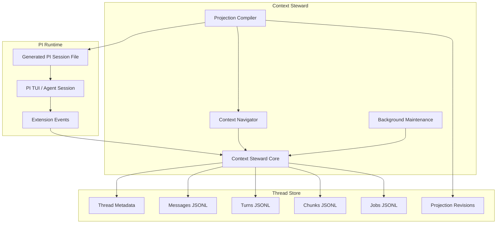
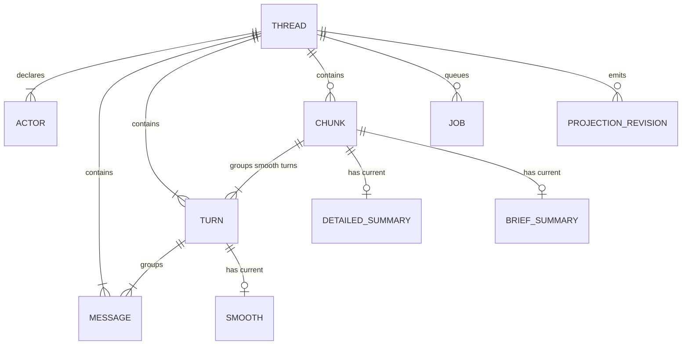
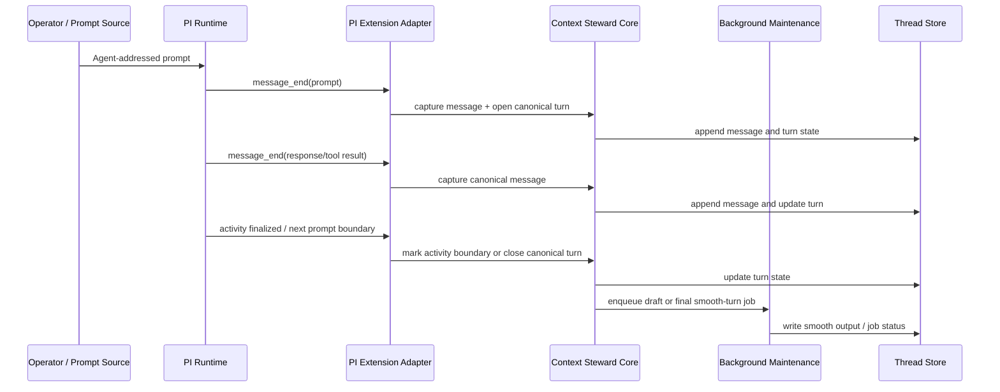
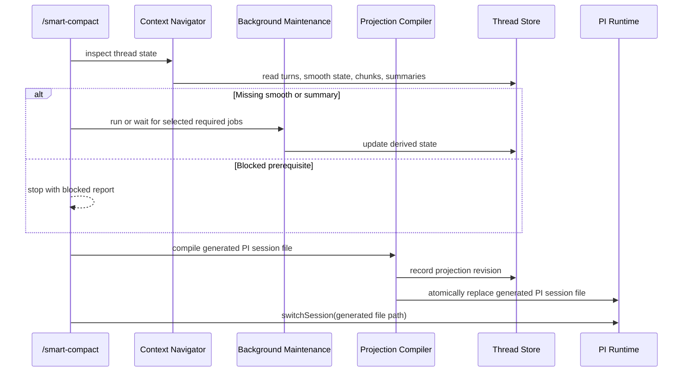

# PI Long Horizon - Technical Architecture

## Architecture Thesis

PI Long Horizon is a local, file-backed context substrate layered around PI through extensions. The Context Steward owns a target-neutral canonical Thread, derived smooth turns and chunks, async maintenance jobs, and generated session files. PI remains the first runtime target: it emits events into the steward and loads a generated PI session file when smart compact runs.

PI calls its native session JSONL files rollouts. This architecture uses generated PI session file for the PI-compatible file produced by smart compact, and projection revision for the recorded output metadata.

---

## Core Stack

| Component | Choice | Version | Rationale | Checked | Compatibility Notes |
|-----------|--------|---------|-----------|---------|---------------------|
| Runtime | Node.js | 24 LTS, latest LTS v24.15.0 | Matches PI package ecosystem and current TypeScript tooling. | 2026-05-09 | Local runtime is v24.14.0; repo has no `engines` field yet. |
| Package manager | npm | 11.9.0 | Matches the checked-in `package-lock.json` workflow. | 2026-05-09 | Local npm version. |
| Language | TypeScript | 5.9.3 | Keeps canonical models, target adapters, and extension code typed. | 2026-05-09 | Installed in project `devDependencies`. |
| Package/runtime helper | `tsx` | 4.21.0 | Runs TypeScript helper scripts without a separate build step. | 2026-05-09 | Already used by `npm run login` and `npm run models`. |
| PI packages | `@earendil-works/pi-*` | 0.74.0 | Provides PI AI, agent-core, and coding-agent extension/runtime APIs. | 2026-05-09 | Installed in project `dependencies`. |
| First provider | `openai-codex` | Via PI 0.74.0 | Uses ChatGPT OAuth-backed Codex models selected for this project. | 2026-05-09 | Current model scope includes gpt-5.4, gpt-5.4-mini, and gpt-5.5 variants. |
| V1 storage | Local filesystem | N/A | Keeps the substrate inspectable while the shape is still evolving. | 2026-05-09 | Store interface defined for future database mapping; see Store Interface. |

### Rejected Alternatives

| Considered | Why Rejected |
|------------|--------------|
| Fork PI for direct session ownership | Extension events provide enough capture and reload surface for v1. Forking would couple the project to PI internals before the context model is stable. |
| PI-native compaction entries as core projection | PI compaction/custom-message entries are useful primitives, but PI's context walker is not the owner of the multi-band memory substrate. The steward should own the source thread and compile target-specific projections. |
| PI session JSONL as source thread | PI sessions are tree-shaped runtime records. The canonical domain needs linear Threads, prompt-bounded Turns, typed Messages, and target-neutral projection state. |
| Loose ingest from PI session files | The source thread should not depend on later catch-up from PI session files. Runtime capture writes the source thread from PI extension events. Generated PI session files are target outputs and recovery inputs. |

---

## System Shape

The system has five top-tier surfaces. Context Steward Core owns canonical thread state. Context Navigator exposes legible traversal. Background Maintenance prepares derived memory. Projection Compiler emits generated session files. PI Runtime Integration captures live events and reloads the generated PI session file.



Downstream work should preserve this ownership split. PI integration is an adapter and command surface. The Context Steward owns the memory substrate. The compiler owns target format output.

### Top-Tier Domains

| Domain | Runtime Surface | Owns | Depends On | Downstream Inherits |
|--------|-----------------|------|------------|---------------------|
| Context Steward Core | Local TypeScript library + PI extension | Threads, actors, messages, turns, chunks, jobs, projections | Filesystem store, PI events | All epics treat canonical Thread as source of truth. |
| Context Navigator | Local TypeScript library + CLI/extension commands | Readable views over messages, turns, parts, chunks, jobs, projection state | Context Steward Core | Deterministic code, future agents, and UI use the same navigation concepts. |
| Background Maintenance | Local worker/job runner | Smooth turn jobs, boundary adjudication jobs, chunk summary jobs | Context Steward Core, model providers | Expensive model work does not run in the PI event capture critical path. |
| Projection Compiler | Local TypeScript library + smart compact command | Generated PI session file compilation, projection revision records, archives | Navigator, chunks, band policy | PI is a target format; other targets can be added later. |
| PI Runtime Integration | PI extension + PI session reload | Event capture, command entrypoints, generated PI session file path, `switchSession` handoff | PI coding-agent APIs, Projection Compiler | PI remains extended, not forked. PI-native sessions are target/runtime files. |

---

## Core Data Shape

This section intentionally reaches into light tech-design territory because downstream tech designs need a shared vocabulary for the interlocking pieces.



| Concept | Expected Shape | Invariant |
|---------|----------------|-----------|
| Thread | Linear canonical context record. | Forking creates a new Thread with parent metadata; active threads do not maintain PI-style branch cursors. |
| Actor | Thread-level actor definition keyed by slug/id. | Messages store `actorType` and `actorId`; actor metadata can be resolved from the thread. |
| Message | Actor + message kind + ordered typed parts. | Messages are append-only source records. Smooth/summarization never mutates them. |
| Part | Typed content inside a message. | Text, reasoning, tool call, tool result, image/file, and runtime notes are parts rather than separate top-level records unless tech design proves otherwise. |
| Turn | Prompt-bounded grouping of messages. | Any agent-addressed prompt starts a turn. A turn may contain multiple assistant responses/tool cycles. |
| Smooth | Current smoothed text representation on a Turn. | Generated asynchronously; missing smooth output is repairable from canonical messages. |
| Chunk | Stable aggregate of closed turns' smooth text. | One open chunk per thread. Closed chunks are immutable by default and remain active unless explicitly replaced. |
| Summary | Current detailed/brief representation on a Chunk. | Detailed and brief are named summary slots, not band names. |
| Job | Durable async work item. | Expensive model work is visible and resumable. |
| ProjectionRevision | Generated target context output. | Records source state, band policy, output path, stats, and reload result. |

**Downstream inherits:** Every epic and tech design uses these concept names for the context domain. New derived state composes against Thread, Message, Turn, Chunk, Job, and ProjectionRevision rather than introducing parallel domain types.

### Store Interface

The thread store should be treated as an interface, not as a file layout. The v1 implementation is file-backed, but the Context Navigator and Projection Compiler should depend on store operations with explicit ordering semantics.

| Store Capability | Required Behavior |
|------------------|-------------------|
| Append message | Writes messages while preserving stable thread order across reads. |
| Read message range | Returns messages in canonical order for turn repair, smoothing, and projection. |
| Write turn state | Creates and updates prompt-bounded turn records without mutating messages. |
| Read active chunks | Returns active chunks in source order. |
| Write job state | Records async job status, attempts, errors, timing, model, and size/cost metadata when available. |
| Write projection revision | Records the generated target path, source state, policy, size estimates, archive path, and reload result. |

File-backed storage can use JSON/JSONL files and atomic rewrites where needed. Future database storage should preserve the same ordering and active-record semantics rather than exposing file-specific assumptions to consumers.

### Actor And Message Axes

Messages use two independent axes:

- `actorType` / `actorId` identify who emitted the message.
- `messageKind` identifies what the message is.

Examples:

| Case | Actor | Message Kind |
|------|-------|--------------|
| Human prompt | `human:lee` | `prompt` |
| System prompt to agent | `system:pi-system` | `prompt` |
| Agent response | `agent:pi-main` | `response` |
| Agent tool request | `agent:pi-main` | `response` with `tool_call` part |
| Tool result | `tool:bash` | `tool_result` with `tool_result` part |
| Runtime note | `runtime:pi-runtime` | `runtime_event` |
| Generated smooth/chunk projection message | Context Steward actor | `projection_note` or target-specific generated prompt |

---

## Cross-Cutting Decisions

### Canonical Thread Ownership

**Choice:** The Context Steward owns a canonical, target-neutral Thread as source of truth.

**Rationale:** Long-horizon memory needs stable turns, chunks, summaries, jobs, and projections that are not bound to PI's tree-shaped native session file. PI is the first runtime target, not the domain model.

**Consequence:** All features write and read the canonical Thread. Generated PI session files are target output and secondary repair/import input only.

### Runtime Capture

**Choice:** PI extension events write the source thread in the sync event path.

**Rationale:** PI's `message_end` extension handlers run before PI persists native session entries. This lets the steward capture finalized messages in-process without forking PI.

**Consequence:** The initial implementation should use a PI extension as the live event adapter. Loose periodic ingest from generated PI session files is not the normal capture path.

### Canonical Turn Semantics

**Choice:** Canonical turns are prompt-bounded, not PI-core-turn-bounded.

**Rationale:** PI's internal turn means one assistant response plus tool results. The context system needs a larger unit: one initiating prompt plus all resulting agent/tool/runtime activity until the next initiating prompt.

**Consequence:** PI `turn_start` and `turn_end` can inform capture, but Context Steward constructs domain turns from prompt boundaries and runtime activity.

### Smooth Turn Timing

**Choice:** Smoothing can run after a local PI activity boundary, then refresh when the canonical turn receives more activity.

**Rationale:** A canonical turn may remain open until the next initiating prompt, but waiting that long delays smoothing by one prompt. PI `turn_end` is useful as an activity boundary even though it is not the canonical turn boundary.

**Consequence:** Smooth output should support draft and final states. A draft smooth can be generated after PI reports no more current activity for the prompt. If more messages enter the same canonical turn, the smooth output becomes stale and is regenerated. When the canonical turn closes, the current smooth output becomes final if it covers all turn messages.

### Projection Ownership

**Choice:** Smart compact produces generated session files owned by Context Steward.

**Rationale:** A generated PI session file should be disposable, inspectable, archivable, and reproducible from canonical state. PI-native compaction entries do not define the multi-band substrate.

**Consequence:** The PI projection compiler is the first target adapter. Other target compilers can later emit different CLI/session formats from the same Thread.

### Chunk Stability

**Choice:** Closed chunks are immutable by default and remain `active: true` until explicitly replaced.

**Rationale:** Constantly reshuffling chunks creates unstable derived memory. Boundary rework is closer to a Git rebase: allowed, expensive, and explicit.

**Consequence:** Normal aging changes which chunk summary is used, not chunk membership. Future rework creates replacement chunks or revisions and marks old chunks inactive.

### Smart Compact Bounds

**Choice:** Smart compact uses a ramped operating range schedule with upper trigger bounds and lower target bounds.

**Rationale:** Mature sessions may target a large range such as 220k upper / 170k lower, but early sessions should engage smart compact gradually.

**Consequence:** Band allocation is computed against the current schedule stage. Successful compacts can advance the thread toward mature operating bounds.

### Degraded Maintenance State

**Choice:** Missing model decisions or derived state blocks the affected maintenance step and produces operator-visible status.

**Rationale:** Boundary decisions, smoothing, and summaries are model-dependent. A silent deterministic fallback can produce low-quality memory state while hiding that the smart path failed.

**Consequence:** The system reports blocked states such as missing smooth turns, pending boundary decisions, missing summaries, failed jobs, or projection candidates that cannot reach the lower bound. The operator can retry, wait for jobs, manually intervene, or accept a clearly labeled degraded projection if a future command supports that path.

### Fork And Attach Posture

**Choice:** A fork creates a new canonical Thread. A late attach imports existing PI session history into a new Thread before normal event capture continues.

**Rationale:** Canonical Threads stay linear. PI's native session tree and `/fork` behavior should not turn the steward's active source record into a branch cursor structure.

**Consequence:** V1 should detect PI session replacement/fork events where PI exposes them. A child Thread records parent thread metadata and copies or imports the source history needed for the new working line. Closed chunks that fully precede the fork point may be reused or copied; uncertain derived state should be marked for repair or regeneration. A PI session that starts before Context Steward capture can be attached through explicit import, with import metadata recorded at the thread/import level.

### Concurrency Model

**Choice:** Synchronous capture, async maintenance, and smart compact use separate write phases with clear ownership.

**Rationale:** PI extension event handling, background model jobs, and smart compact can overlap if the store does not define serialization expectations.

**Consequence:** PI event capture writes source messages and turn state in the sync event path. Background jobs operate on closed turns, open chunks, or closed chunks through durable job state. Smart compact reads the current store state, verifies prerequisites using the Smart Compact Prerequisite Policy below, writes a generated PI session file atomically, records a projection revision, then reloads PI through the command path. Tech design should choose locking or optimistic revision checks so smart compact never compiles from partially updated derived state.

### Schema Versioning

**Choice:** Stored thread data includes schema version metadata.

**Rationale:** Thread, turn, chunk, job, and projection shapes will evolve while the system is dogfooded.

**Consequence:** `thread.json` or equivalent store metadata should record schema version, created version, and last migrated version. Readers should detect unsupported versions before mutation. Migrations belong in tech design, but every v1 record family should assume future schema evolution.

---

## Boundaries and Flows

### Live Capture And Background Preparation



**Downstream inherits:** Capture writes source records synchronously and keeps expensive model work outside the event critical path. Smoothing is derived state, not mutation of messages.

### Chunking And Smart Compact



**Downstream inherits:** Background jobs can prepare derived layers before pressure. The smart compact command owns prerequisite checks, final generation, atomic write, archive, and PI reload.

---

## Band And Projection Model

The projection compiler chooses representation by fidelity band. Band boundaries are budget-based and recency-ordered. The compiler starts with newest/highest-fidelity content and works backward until the current lower-bound target is met.

| Band | Source Unit | Projection Representation | Notes |
|------|-------------|---------------------------|-------|
| Full fidelity | Recent messages/turns | Target-native PI messages with raw parts/tools/thinking where valid | Budget-based, not fixed turn count. |
| Smooth | Closed turns | One generated smooth-turn message per turn | Uses `turn.smooth.text`; raw messages remain in the source thread. |
| Detailed chunk | Closed chunks | One generated message from `chunk.summaries.detailed` | Middle-fidelity compressed history. |
| Brief chunk | Older closed chunks | One generated message from `chunk.summaries.brief` | Oldest low-fidelity history. |

The compiler should not use missing derived representations silently. If smooth text or chunk summaries are missing, smart compact follows the prerequisite policy below: run or wait for selected jobs, or report blocked/degraded state.

### Smart Compact Prerequisite Policy

Smart compact starts by inspecting the current thread state:

1. Closed turns selected for smooth or chunk bands have smooth text.
2. Chunks selected for detailed or brief bands are closed and active.
3. Selected chunks have the summary level required by the projection band.
4. Pending boundary decisions do not prevent the projection from reaching the current lower bound.
5. The PI target path can be written atomically.

If prerequisites are missing, the command can run or wait for selected jobs when that is operator-approved. Otherwise it stops with a report naming the missing work and the generated context size impact.

---

## Thread Store Layout

The v1 store is local and file-backed. Exact filenames can be finalized in tech design, but the architectural shape is:

```text
.context-steward/
  threads/
    <thread-id>/
      thread.json
      actors.json
      messages.jsonl
      turns.jsonl
      chunks.jsonl
      jobs.jsonl
      projections.jsonl
      archives/
        projections/
        chunks/
```

Generated PI session files live where PI expects them, not inside the canonical store unless PI is configured that way. `thread.json` records target metadata:

```text
target runtime: pi
target session id: <pi session id>
current generated file path: <path PI loads>
```

This keeps the source store target-neutral while allowing PI to resume the generated file normally.

### PI Fork And Attach Behavior

| PI Event / Situation | Expected Context Steward Behavior |
|----------------------|-----------------------------------|
| PI starts with steward active | Create or open the matching Thread and capture new messages from extension events. |
| PI has prior messages before attach | Import existing PI messages into a new Thread, record import metadata, then switch to event capture for new activity. |
| PI forks from an earlier point | Create a child Thread with parent metadata and source content through the fork point. Reuse only derived state that is fully valid for the child Thread. |
| PI switches to another session | Open or create the Thread associated with that target session path. If no association exists, require attach/import before treating it as managed. |

---

## Constraints That Shape Epics

- **No PI fork for v1.** Epics work through PI extensions, commands, and `switchSession`.
- **Canonical Thread is linear.** Branch/fork creates a new Thread with parent metadata. Active thread storage does not become a PI-style tree.
- **Derived state can be missing.** Epics report missing smooth/chunk/summary state and provide repair paths.
- **Generated PI session file is disposable.** Epics cannot treat the PI target file as authoritative source of truth.
- **Model work is async unless explicitly command-driven.** Smoothing and summarization should not block PI event capture.
- **Chunked-band projection depends on boundary decisions.** Epics that need closed chunks should surface pending boundary work as blocked or degraded maintenance state.
- **Storage order is explicit.** Message and turn order cannot depend on filesystem line order once the store moves to a database.
- **Schema versions are visible.** Readers should detect incompatible stored data before writing.
- **Degraded state is operator-visible.** Missing model outputs, blocked boundaries, and incomplete projection prerequisites are reported instead of hidden.
- **Cost and latency are tracked.** Model jobs should record input size, output size, model, duration, and estimated cost when available.

---

## Open Questions for Tech Design

- Exact file schemas for `thread.json`, `messages.jsonl`, `turns.jsonl`, `chunks.jsonl`, `jobs.jsonl`, and `projections.jsonl`.
- Exact PI extension command names and UX for status, repair, and smart compact.
- Exact model prompts and structured output formats for smoothing, boundary decisions, detailed summaries, and brief summaries.
- Exact compact ramp schedule defaults and mature upper/lower bounds.
- Exact chunk token range defaults. Current working range: roughly 3k-7k smooth tokens.
- Exact treatment of provider reasoning parts in full-fidelity PI projection.
- Exact archive retention policy for prior generated PI session files and inactive chunk sets.
- Exact degraded-mode operator commands: retry, wait, manual close, accept degraded projection, or abort.
- Exact schema migration mechanism and compatibility policy.
- Exact store locking or optimistic revision strategy for async jobs and smart compact.
- Exact evaluation rubric for smooth turn and chunk summary quality.

---

## Assumptions

| ID | Assumption | Status | Notes |
|----|------------|--------|-------|
| A1 | PI extension events provide enough finalized message data to construct canonical messages. | Validated from source | Needs implementation confirmation with dogfooding. |
| A2 | Generated PI session files can be produced if parent chains and required PI headers are valid. | Partially validated | PI schema is known; compiler validity tests still needed. |
| A3 | A file-backed store can handle v1 thread sizes and fixture tests. | Unvalidated | Performance should be measured with expanded sessions. |
| A4 | Smooth turns are useful as the canonical substrate for chunk summaries. | Design assumption | Feature 4 evaluates summary quality. |
| A5 | Model boundary decisions improve chunk quality enough to justify async cost. | Unvalidated | Feature 4 evaluates this. |
| A6 | Draft smoothing after PI activity boundaries reduces lag without creating unstable source state. | Unvalidated | Needs dogfood validation with multi-response turns. |

---

## Relationship to Downstream

- **This document settles:** source/projection ownership, core surfaces, canonical Thread semantics, prompt-bounded turns, generated PI session file strategy, chunk stability, async maintenance posture, and PI extension/reload boundary.
- **Epic specs settle:** user-facing steward capabilities, line-level acceptance criteria, test conditions, and story breakdowns.
- **Tech designs still decide:** exact file schemas, function signatures, command UX, worker implementation, target compiler implementation, model prompts, verification scripts, and fixture generation mechanics.
